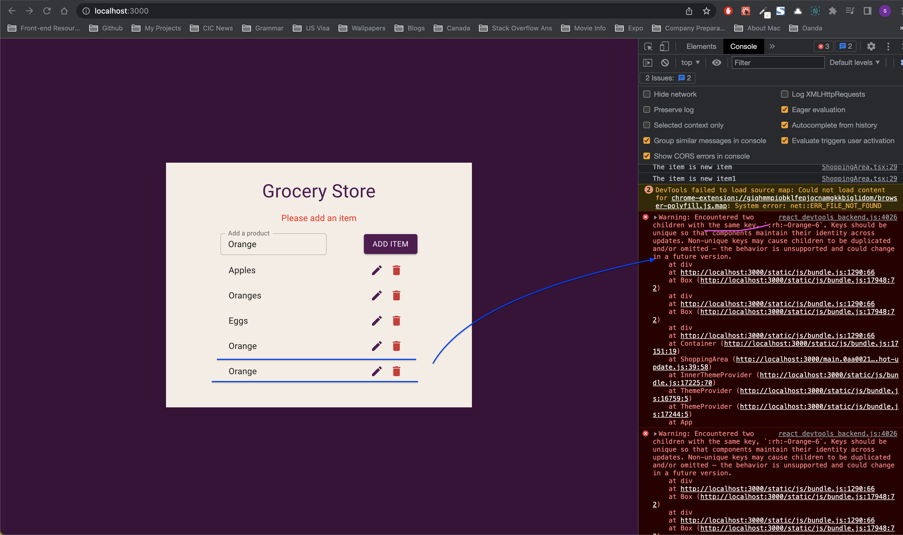
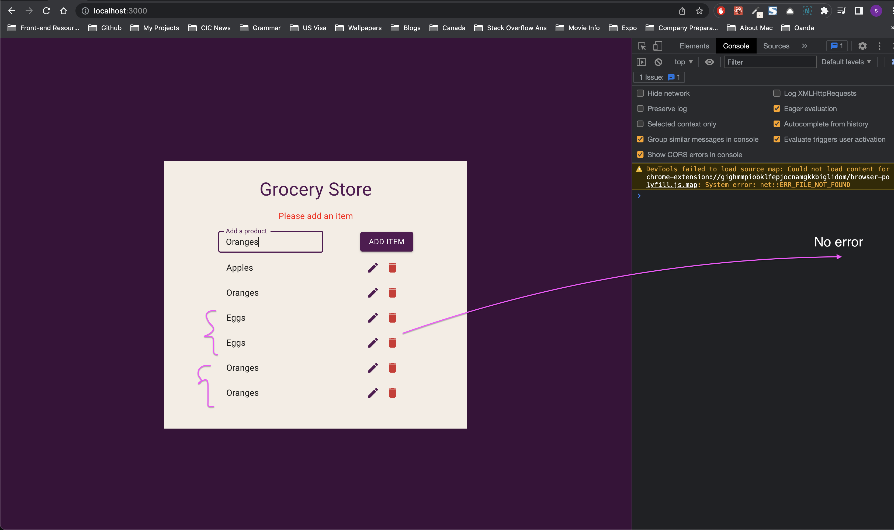
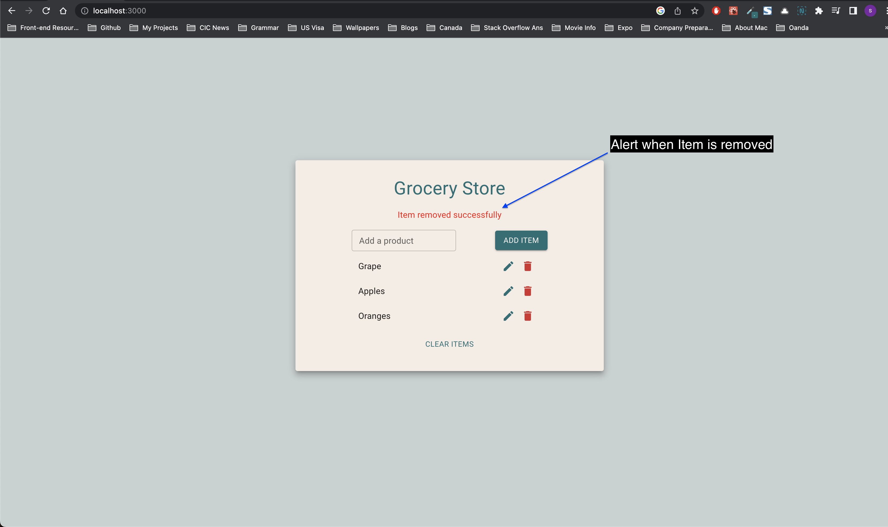
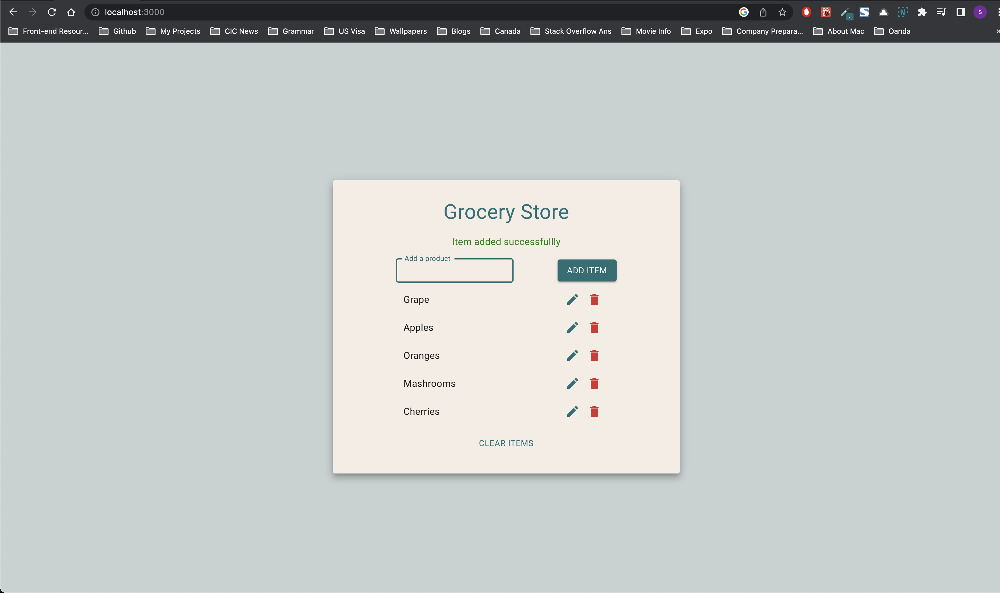

# Project details

[Grocery Store](https://10-grocery-store.netlify.app/)

## Details

This project is a good `CRUD` exercise where we have `add, remove, update delete` functionality. We will learn many things here like

We have two implementations here

- `10_grocery_shop/src/Components/ShoppingArea.tsx`
- `10_grocery_shop/src/Components/ImprovedShoppingArea.tsx` (Better version)

Initially I worked on `ShoppingArea.tsx`, but then realized I could do better in a few places. I learned from these mistakes and from John's (Udemy) implementation and improved my code in `ImprovedShoppingArea.tsx`.
Here's all the things we learn in this project.

## Things we can learn

- How to generate unique IDs in react (useId vs nanoid)
- How to set and retrieve Objects from local storage
- How to set alert programmatically based on different conditions on CRUD
- How to set state for an object based on previous state
- CRUD Functionality
- How to add an object to existing style object based on different conditions

---

### How to generate unique IDs in react

[useId hook introduced in react 18](https://reactjs.org/docs/hooks-reference.html#useid)

`useId` can be used to generate unique Ids. This is helpful when mapping the data where we can use this useId as key prop.

This works best when we are defining ids on html form, for example, on input field.

[Note from react docs](https://reactjs.org/docs/hooks-reference.html#useid): useId is not for generating keys in a list. Keys should be generated from your data.

Hence doing something like this is not good as we are generating multiple useId() calls which is bad for performance

```js
  const [items, setItems] = useState<[] | Item[]>([
    { id: useId(), name: 'Apples' },
    { id: useId(), name: 'Oranges' },
    { id: useId(), name: 'Eggs' },
  ])
```

Instead, we can do this

```js
  const id = useId()
  const [items, setItems] = useState<[] | Item[]>([
    { id: `${id}-0001`, name: 'Apples' },
    { id: `${id}-0002`, name: 'Oranges' },
    { id: `${id}-0003`, name: 'Eggs' },
  ])
```

But while adding the elements dynamically, here's what I did

```js
const handleSubmit = (e: React.FormEvent<HTMLFormElement>) => {
  e.preventDefault()
  if (item === '') {
    setError(true)
    return
  }
  const itemId = `${id}-${item}` // This line causes same key if name is same
  const newItem = { id: itemId, name: item }
  // setItems([...items, newItem]) // first way to declare state without using previous state
  setItems((prevItems) => [...prevItems, newItem]) // second way to declare state using previous state
}
```

But we have a problem here as well. For two elements having same content, we still get same key because of line **const itemId = `${id}-${item}`** above.



So let's use nano-id package for now until we get to know some better approach of using this useId for this usecase.

[Use nanoId like this](https://stackoverflow.com/a/65962066/10824697)



---

### How to set and retrieve from local storage

**PERSIST INTO LOCALSTORAGE**

To persist the data when we refresh the page, we need to have items stored in localStorage and when we reload the page, first the items should be loaded from useState of items, hence we need to load this local storage items into this useState

```js
 const [items, setItems] = useState<[] | Item[]>(
    JSON.parse(localStorage.getItem('storedItems') || '[]') // notice that JSON.parse will convert string to object
  )
```

to store the object, into localstorage, we need to convert object first to string because only strings can be stored in localstorage and not objects directly.

To stored object after converted to string we do `JSON.parse(localStorage.getItem('storedItems')`

Now TS complains that `localStorage.getItem('storedItems')` can be null, so to avoid we define like this `JSON.parse(localStorage.getItem('storedItems') || '[]')`. So the useState will be

```js
 const [items, setItems] = useState<[] | Item[]>(
    JSON.parse(localStorage.getItem('storedItems') || '[]') // notice that JSON.parse will convert string to object
  )
```

(Stackoverflow reference)[https://stackoverflow.com/a/64747306/10824697]

In `ImprovedShoppingArea`, we implement this in a function and then use it in state like this

```js
// this function can be implented outside the function as this will be used for the first time when component loads
const getLocalStorageItems = () => {
  let items = []
  if (localStorage.getItem('locallyStoredItems')) {
    items = JSON.parse(localStorage.getItem('locallyStoredItems') || '[]')
  } else {
    items = initialItems
  }
  return items
}
```

```js
// set state like this
const [items, setItems] = useState<[] | Item[]>(getLocalStorageItems())
```

**RETRIEVE FROM LOCALSTORAGE**

So when update the items state using setState (through any crud operation like when we delete the item or add an item or update an item), the below useEffect runs and hence the updated items get stored in localstorage

```js
useEffect(() => {
  // if items change anywhere - in handleSubmit/ deleteHandler/ submitHandlerOnEdit we need to update our local storage as well and make it equal to our items state
  localStorage.setItem('locallyStoredItems', JSON.stringify(items))
}, [items])
```

---

### How to set alert programmatically based on different conditions on CRUD

In this project we are setting alert based on different conditions when we `add, delete, modify` items

**Example**

- Alert when item is removed



- Alert when item is added



```js
const [alert, setAlert] = useState({
  show: false,
  msg: '',
  type: 'success', // or 'danger'
})
```

Since we need to set this alert in multiple places, we are using a function that encloses the setState for this alert and use that in multiple places

### How to set state for an object based on previous state

```js
setAlert((prev) => ({
  ...prev,
  show: false,
  added: false,
  removed: false,
  error: false,
}))
```

Without previous state,

```js
setAlert({
  ...alert,
  show: false,
  added: false,
  removed: false,
  error: false,
})
```

---

### CRUD Functionality

- We use `submitHandler` function that works for both adding an item and editting an item.
- For **editing** an item, we also use two states
  - `editId` - to keep track of item id that is currently editable
  - `editMode` - boolean to indicate if the app is in edit mode or not.
    Using this mode, we can show `Edit` or `Add` button
  - We use `editHandler` in which, we set `editMode` to `true` while editing an item

**Functions to remember in CRUD**

- `TO ADD AN ITEM` - we can use spread operator where we spread out all our ccurrent items and then add a new item to the array

```js
const newItem = { id: nanoid(), name: capitalize(item) }
setItems((prevItems) => [...prevItems, newItem]) // this line to add new item
```

- `TO UPDATE AN ITEM` - we can **`map`** through each item and change the details of one particular item which we need to update

```js
const itemsAfterEdit = items.map((myItem) => {
  if (myItem.id === editId) {
    myItem = { ...myItem, name: capitalize(item) }
  }
  return myItem
})
setItems(itemsAfterEdit)
```

- `TO DELETE AN ITEM` - we can use **`filter`** where we can just filter through items and remove the one we want to delete

```js
const updatedItems = items.filter((item) => item.id !== id)
setItems(updatedItems)
```

---

### How to add an object to existing style object based on different conditions

```js
<Typography sx={{ ...styles.alertText, ...(alert.type && styles[alert.type]) }}>
  {alert.msg}
</Typography>
```

You can see that we have common style `alertText`. `alert.type` can be `succcess` or `danger`. So we need to add `alert['success']` or `alert['danger']` based on condition, so we can do this

```js
sx={{ ...styles.alertText, ...(alert.type && styles[alert.type]) }}>
```
