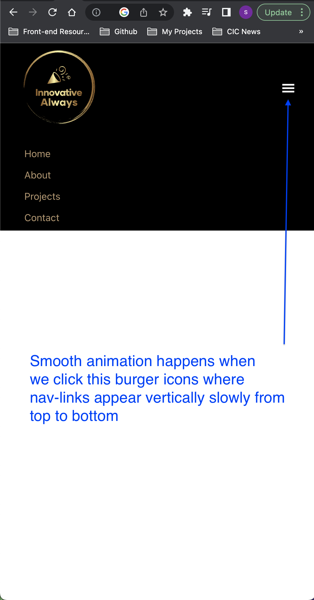
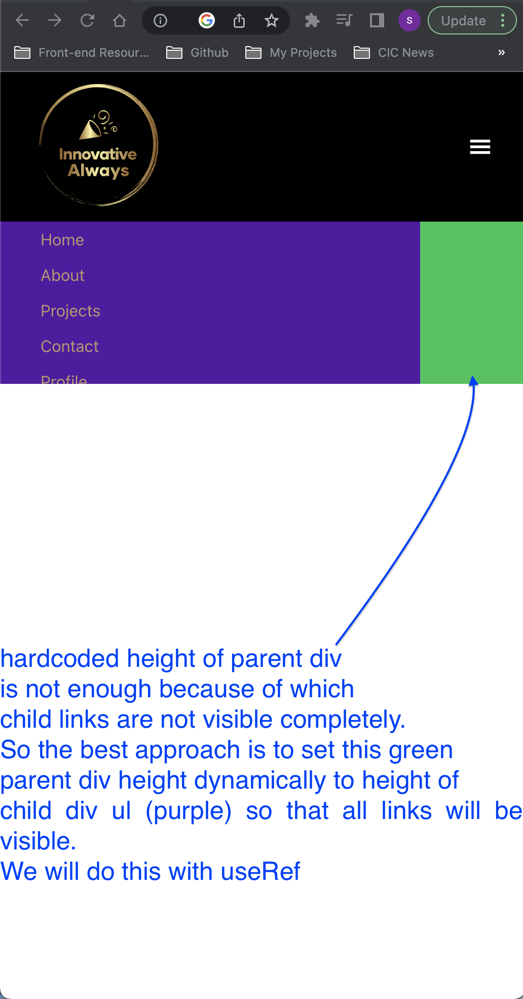
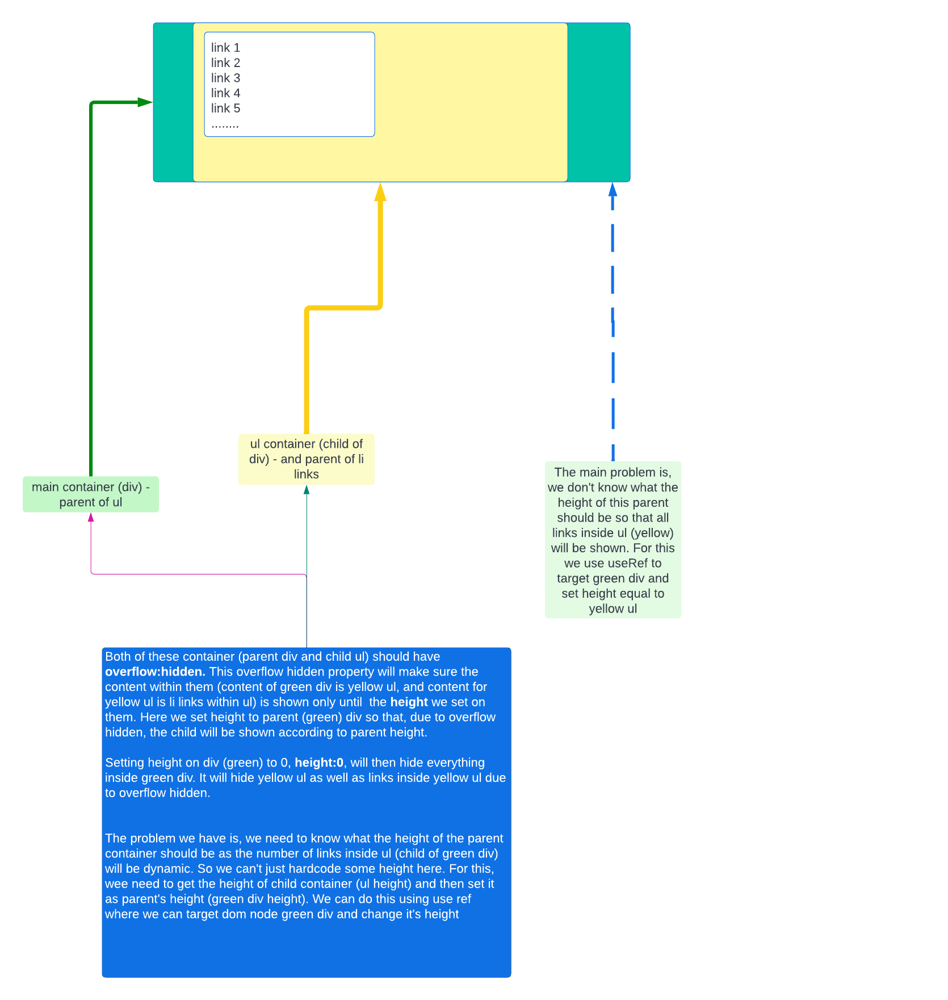
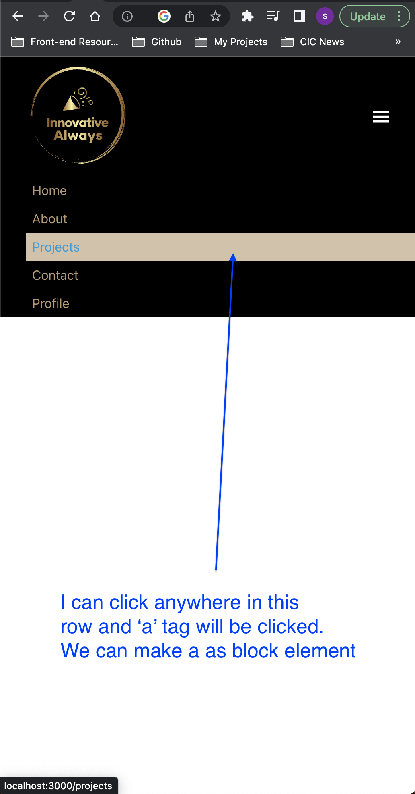

# Project details

[Responsive Navbar](https://11-responsive-navbar.netlify.app/)

## Details

This project is about designing responsive navbar. We will see how the navbar will hide itself and becomes a vertical display on small screen.

We will also hide it when the user switches from small screen to large screen.

## Things we can learn

- How to hide and show the navbar on small screen with animation effect
- Problem with using fixed height, where useRef comes into picture in this case
- How to make `<a href/>` element clickable anywhere in that row
- How to change one element when someother element is hovered

---

### How to hide and show the navbar on small screen with animation effect



When this button is clicked smooth animation happens. For this to happen, we as usual, set the state and based on that state, we show or hide this (apply css). But for this animation to happen, we can't use `display:none` as the animation won't be applied on display prop. But we can do it with `height` prop set on parent. `transition` which is responsible for animation can be applied on `height` and not on `display`.

These are the main classes on which we apply common styles

```css
.small-screen-nav-hidden {
  /* bg will be removed here. just to demo parent and child, we have it here */
  background-color: rgb(7, 198, 84);
  overflow: hidden;
  transition: height 0.5s; /* transition for smooth effect*/
}
```

Note that we need `overflow:hidden` on parent so that the child will automatically content (however large) will be visible until parent's height

**to show this parent div**

```css
/* div container - parent - show*/
.small-screen-nav-shown {
  /* We won't use display none but we will use height 0 */
  height: 10rem;
}
```

**to hide this parent div**

```css
/* div container - parent - hide*/
.small-screen-nav-hidden {
  /* We won't use display none but we will use height 0 */
  height: 0;
}
```

This parent div will have the child container which is ul and that ul will have all links.

```css
/* div container - child */
.small-screen-nav-hidden ul,
.small-screen-nav-shown ul {
  /* we will remove width - this is just to demo parent div and child ul. If this is removed, parent div will not be visible which is green color */
  width: 80%;
  padding-left: 2rem;
  list-style: none;
  /*  overflow: hidden; should be present - the max height of container is shown until the items are present. Content is only shown unitl height of this or parent container  */
  overflow: hidden;
  background-color: var(--navbar-clr);
  /* bg will be removed here. just to demo parent and child, we have it here */
  background-color: rgb(85, 7, 163);
}
```

It looks like this (we are going to remove bg color green on parent and purple on child)



---

### Problem with using fixed height, where useRef comes into picture in this case



We don't know the height of the div(parent), so we cant hardcode it. We need to set it to child ul height, so we need to dynamically get the child ul height and set that to parent.

So we will use 2 useRef. One to target parent with parentRef, and one for child ul with childRef.

We get the childRef height and set it to parent, that's the idea.
In Javascript, we can get the height of an element multiple ways, but we will use `getBoundingClientRect()` which will give you width, height. We will use only height here.

[Check more about getBoundingClientRect()](https://stackoverflow.com/a/71866311/10824697)

```js
const parentRef = useRef(null)
const childRef = useRef(null)

useEffect(() => {
  const childUlHeight = childRef.current.getBoundingClientRect().height
  if (showNav) {
    parentRef.current.style.height = `${childUlHeight}px`
  } else {
    parentRef.current.style.height = `0px`
  }
}, [showNav])
```

Setting ref to parent and child

```js
<div
  //parent
  ref={parentRef}
  className={showNav ? 'small-screen-nav-shown' : 'small-screen-nav-hidden'}
>
  <ul
    // child
    ref={childRef}
  >
    {links.map((link) => {
      const { id, text, url } = link
      return (
        <li key={id}>
          <a href={url}>{text}</a>
        </li>
      )
    })}
  </ul>
</div>
```

---

### How to make `<a href/>` element clickable anywhere in that row



```css
.small-screen-nav-shown ul li a,
.small-screen-nav-hidden ul li a {
  text-decoration: none;
  /* making a tag as display block because, when we click anywhere in that row, it should trigger the click on link */
  display: block;
  color: var(--link-clr);
}
```

---

### How to change one element when someother element is hovered

when `li` is hovered, underlying `a` tag is changed.

```css
.small-screen-nav-shown li:hover a {
  color: var(--hover-clr);
}
```
