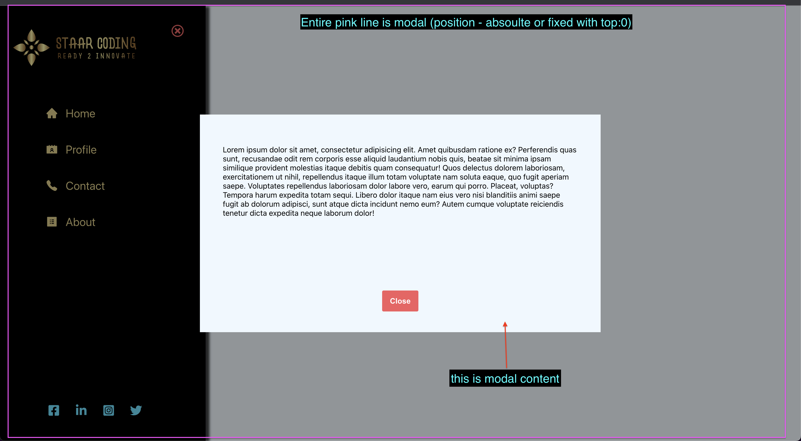
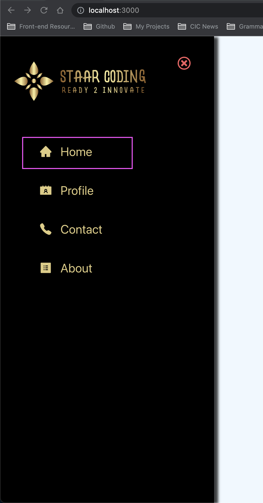
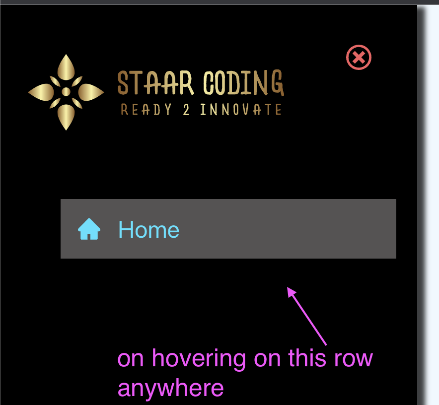

# Project details

[Sidebar & Modal](https://12-sidebar-modal-app.netlify.app/)

## Details

This project is about displaying/hiding sidebar and modal. This sidebar will be useful when designing navbar for small screens. We will also learn about how to use context to avoid prop drilling and we will also use custom hook to export useContext

## Things we can learn

- How to design Modal
- How to design Sidebar
- How to display link (li) items in sidebar especially when it contains an icon and `<a href=/>` tag
- How to have a react component in some file and use it in some other file
- Without context API
- How to use context api
- How to use useContext to consume above created context values

---

### How to design Modal



**JSX**

```jsx
<section className="modal">
  <article className="container">
    <div className="modal-content">
      <h3>Modal</h3>
      <p>Lorem ipsum dolor sit amet consectetur, adipisicing elit. Dolor aut</p>
      <p>Aliquid aspernatur deserunt qui. Lorem ipsum dolor sit amet,</p>
    </div>
    <div className="modal-btn-container">
      <button onClick={() => setIsModalOpen(false)}>Close</button>
    </div>
  </article>
</section>
```

**CSS**

```css
/* MODAL */

.modal {
  /* to place at fixed position and center it's content */
  position: fixed;
  /* top:0 is very important. Without this it won't work*/
  top: 0;
  width: 100%;
  height: 100%;
  display: grid;
  place-items: center;
  background-color: var(--modal-bg-color);
  visibility: hidden; /*modal is currently hidden*/
  z-index: -1; /*placing it underneath other elements*/
  /* Since we have already used display and set to grid, 
  we can't use display none, so using visibiltiy hidden */
}

/* show modal */
.show-modal {
  visibility: visible;
  z-index: 1;
}

.modal .container {
  background-color: var(--color-bg);
  width: 50%;
  max-height: 20rem;
  overflow: auto;
  display: flex;
  flex-direction: column;
  justify-content: space-between;
  padding: 2rem;
}

.modal-content {
  max-height: 90%;
  overflow: scroll;
}

.modal-content h3 {
  text-align: center;
}

.modal-btn-container {
  text-align: center;
}

.modal-btn-container button {
  background-color: var(--cancel);
  padding: 0.7rem 1.2rem;
  outline: none;
  border: none;
  color: white;
  font-size: 1.1rem;
  cursor: pointer;
}
```

---

### How to design Sidebar?

**JSX**

```jsx
<aside className="sidebar show-sidebar">
  {/* SIDEBAR HEADER */}
  <div className="sidebar-header">
    {/* enclosing image in div so that img doesn't move to a little right side which is strange*/}
    <div>
      
    </div>
    <button className="close-btn">
      <FaTimes />
    </button>
  </div>
  {/* SIDEBAR LINKS */}
  {/* SIDEBAR SOCIAL LINKS */}
  <article className="links">
    <ul>
      {links.map((link) => {
        const { id, url, text, icon } = link
        return (
          <li key={id}>
            <a href={url}>
              <div>
                {icon}
                {text}
              </div>
            </a>
          </li>
        )
      })}
    </ul>
  </article>
  <ul className="social-links">
    {social.map((link) => {
      const { id, url, icon } = link
      return (
        <li key={id}>
          <a href={url}>
            <div>{icon}</div>
          </a>
        </li>
      )
    })}
  </ul>
</aside>
```

**CSS**

```css
/* SIDEBAR */

.sidebar {
  position: fixed;
  top: 0;
  background-color: var(--color-dark);
  width: 100%;
  height: 100%;
  color: white;
  display: grid;
  grid-template-rows: auto 1fr auto;
  width: 30rem;
  box-shadow: 8px 2px 5px 0px rgba(0, 0, 0, 0.75);
  transform: translate(-100%);
  transition: all 0.4s;
}

.show-sidebar {
  transform: translate(0);
}

.sidebar-header {
  display: flex;
  justify-content: space-around;
  margin-top: 2rem;
}

.sidebar-header img {
  width: 20rem;
  height: 10rem;
}

.close-btn {
  color: var(--cancel);
  border-color: transparent;
  background: transparent;
  font-size: 1.75rem;
  cursor: pointer;
}

/* sidebar links */
.links a {
  text-decoration: none;
  color: var(--color-primary);
  display: block;
  transition: all 0.4s;
}

.links a div {
  display: flex;
  align-items: center;
  margin-bottom: 1rem;
  padding: 1rem;
}

li {
  list-style: none;
  font-size: 1.5rem;
  transition: all 0.3s;
  align-items: center;
  text-transform: capitalize;
}

.links li:hover {
  /* this color will not change the underlying element color, so we need to add color to underlying elements individually */
  color: var(--hover-color);
  background-color: rgb(85, 83, 83);
}

/* applying color to individual elements like below on hover on li */
.links li:hover a,
.links li:hover .icon {
  color: var(--hover-color);
}

.icon {
  font-size: 1.6rem;
  color: var(--color-primary);
  margin-right: 1rem;
}

/* Social icons */
.social-links {
  display: flex;
  width: 60%;
  margin: 5rem auto;
  margin-left: 2rem;
  justify-content: space-between;
}

.social-links li {
  cursor: pointer;
}

.social-links a {
  text-decoration: none;
  color: var(--hover-color);
  transition: all 0.4s;
}

.social-links li a:hover {
  /* this color will not change the underlying element color, so we need to add color to underlying elements individually */
  color: var(--color-primary);
}
```

---

### How to display link (li) items in sidebar especially when it contains an icon and `<a href=/>` tag



```jsx
<div className="links">
  <ul>
    <li>
      <a href="#/">
        <div>
          <AiFillHome className="icon" />
          Home
        </div>
      </a>
    </li>
  </ul>
</div>
```

enclosed `a` in a div as we need that div to be flex so that we can align items perfectly to center. Also we neeed `a` tag to be a block element so that we can click anywhere in the row and that element will be clicked. Also, when we hover on that row, all elements (icon and `a` tag) must change it's color. So the CSS will be like this

```css
.links a div {
  display: flex;
  align-items: center;
  margin-bottom: 1rem;
  padding: 1rem;
}

li:hover {
  /* this color will not change the underlying element color, so we need to add color to underlying elements individually */
  color: var(--hover-clr);
  background-color: rgb(85, 83, 83);
}

/* applying color to individual elements like below on hover on li */
li:hover a,
li:hover .icon {
  color: var(--hover-clr);
}
```



---

### How to have a react component in some file and use it in some other file

In `links.js` we have react icon component like this

```js
export const links = [
  {
    id: 1,
    url: '/',
    text: 'home',
    icon: <FaHome className="icon" /> /*REACT COMPONENT*/,
  },
  {
    id: 2,
    url: '/team',
    text: 'team',
    icon: <FaUserFriends className="icon" />,
  },
]
```

I can then use it in my JSX like this in another component

```js
<li key={id}>
  <a href={url}>
    <div>
      {icon}
      {text}
    </div>
  </a>
</li>
```

---

### Without context API

If we don't use context api, useContext hook then we need to do prop drilling like this

**APP**

```js
function App() {
  const [showSidebar, setShowSidebar] = useState(false)
  const [showModal, setShowModal] = useState(false)
  return (
    <>
      <HomePage setShowModal={setShowModal} setShowSidebar={setShowSidebar} />
      <Sidebar showSidebar={showSidebar} setShowSidebar={setShowSidebar} />
      <Modal showModal={showModal} setShowModal={setShowModal} />
    </>
  )
}
```

**HOMEPAGE**

```js
function HomePage({ setShowSidebar, setShowModal }) {
  return (
    <main>
      <button className="sidebar-toggle" onClick={() => setShowSidebar(true)}>
        <FaBars />
      </button>
      <button onClick={() => setShowModal(true)} className="btn">
        show modal
      </button>
    </main>
  )
}
```

**MODAL**

```js
function Modal({ showModal, setShowModal }) {
  return (
    <section className={`${showModal ? 'modal show-modal' : 'modal'}`}>
      <article className="container">
        <div className="modal-content">
          <h3>Modal</h3>
          <p>Lorem ipsum dolor sit amet consectetur,</p>
          <p>Aliquid aspernatur deserunt qui. Lorem</p>
        </div>
        <div className="modal-btn-container">
          <button onClick={() => setShowModal(false)}>Close</button>
        </div>
      </article>
    </section>
  )
}
```

**SIDEBAR**

```js
function Sidebar({ showSidebar, setShowSidebar }) {
  return (
    <aside className={`${showSidebar ? 'sidebar show-sidebar' : 'sidebar'}`}>
      {/* SIDEBAR HEADER */}
      <div className="sidebar-header">
        {/* enclosing image in div so that img doesn't move to a little right side which is strange*/}
        <div>
          
        </div>
        <button onClick={() => setShowSidebar(false)} className="close-btn">
          <FaTimes />
        </button>
      </div>
      {/* SIDEBAR LINKS */}
      {/* SIDEBAR SOCIAL LINKS */}
      <article className="links">
        <ul>
          {links.map((link) => {
            const { id, url, text, icon } = link
            return (
              <li key={id}>
                <a href={url}>
                  <div>
                    {icon}
                    {text}
                  </div>
                </a>
              </li>
            )
          })}
        </ul>
      </article>
      <ul className="social-links">
        {social.map((link) => {
          const { id, url, icon } = link
          return (
            <li key={id}>
              <a href={url}>
                <div>{icon}</div>
              </a>
            </li>
          )
        })}
      </ul>
    </aside>
  )
}
```

By using context API, we don't need to pass the props to children component.

---

### How to use context api

- Creat a js file for creating this context
- Define CreateContext which gives you
  Provider and Consumer. We don't use Consuemer (we used to use in old react version but not now). We will wrap whole app in Provider and it provides values which we can use in any app
- useContext can be used and we can pass this context so we can consume the values in any component

`context.js`

```jsx
import React, { createContext } from 'react'

const AppContext = createContext()

// we will wrap our whole app in AppProvider
export const AppProvider = ({ children }) => {
  return <AppContext.Provider value="5">{children}</AppContext.Provider>
}

export { AppContext } // we will pass this into useContext to use value
```

`index.js`

```jsx
root.render(
  <AppProvider>
    <App />
  </AppProvider>
)
```

---

### How to use useContext to consume above created context values

- We can use useContext in any app in two ways. One way is to use `useContext` directly in any component we want and pass above created context like this

```jsx
function Sidebar() {
  const val = useContext(AppContext)
  console.log('The val is', val) // gives 5

  return <></>
}
```

In this setup, we will have to import `useContext` from react and also import `AppContext` from `context.js`. To avoid this, we can use custom hook (a function that starts with `use` so that we can use `useContext` inside this function) and then export our `useContext` from this custom hook. With this, we can use this hook and get values in any component.

`context.js`

```jsx
// custom hook - to avoid using useContext + AppContext in other files. Instead we can directly use useGlobalContext
const useGlobalContext = () => {
  return useContext(AppContext)
}
```

We can use this in Sidebar like this

```js
function Sidebar() {
  const val = useGlobalContext()
  console.log('The val is', val)
  return <></>
}
```
