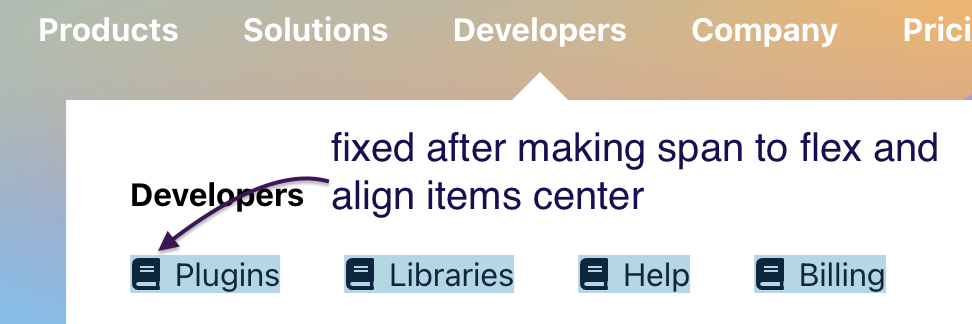

# Project details

[Stripe Header](https://13-stripe-header-clone.netlify.app/)

## Details

We will design stripe home page mainly we will focus on navbar where we have a nice drop-down for each nav link

## Things we can learn

- How to download and install a font to your mac
- How to add `Gradient animation background`
- How to make a flex-box child to have nowrap effect?
- How to center tool-tip
- How to center react icon
- How to open and close submenu

---

### How to download and install a font to your mac

I inspected stripe and saw they are using `Sohne-war`. I downloaded that fonts through some website and it downloaded a zip. I unzipped it and had `.otf` files.

I navigated to `sandeepamaranth/Library/Fonts` and pasted these `.otf` files in there.

You should then see these fonts in font book on mac. To access font book, `cmd+space` and search for Font Book, and you will see the font here.

### How to add `Gradient animation background`

I initially used [Code Sandbox Example](https://codesandbox.io/s/canvas-gradient-forked-yit2qt?file=/src/CanvasGradient.js) to generate animated gradient background,

but then I found another closely matching gradient generator so I used [this](https://codesandbox.io/s/bxnsx?file=/src/App.js:0-617)

### How to make a flex-box child to have nowrap effect?

[Codepen example](https://codepen.io/sandeepamarnath/pen/eYKMmgL)


<!-- FLEX PARENT -->

```css
/* Header container */
.header-container {
  display: flex;
  margin-left: 20%;
  /* never use justify content when u are wrapping something if your child wants to have nowrap prop*/
  /* justify-content: center; */
}
```

<!-- FLEX CHILD 2 on which we are applying flex-shrink -->

```css
/* Image  container -  iphone and stripe images  */
.img-container {
  padding-left: 6rem;
  flex-shrink: 0;
  margin-top: 3rem;

  /* flex-shrink makes image not to move to left and doesn't wrap it. we are applying it on child and parent is header-container */

  /* when using this prop flex-shrink on child, never use justify-content on parent. If u do, then flex-shrink won't work  */
}
```

---

### How to center tool-tip

[Design Tool-tips](https://blog.logrocket.com/creating-beautiful-tooltips-with-only-css/)

the tool tip arrow is designed like this

```css
/* the arrow */
border: 15px solid var(--blue-clr);
border-color: transparent transparent var(--blue-clr) transparent;
```

To center this tool-tip, the main things are

- first make `::before` as position absolute. This absolute is relative to whole body and not it's parent
- `left:50%` will make the tool tip appear to somewhat center but not exactly center. It will be a little more than center. To get to center, I tried 45% or 47% but that will not remain in center when the submenu grows in size horizontally.
- To keep the tool-tip in center, we also need to add `transform: translate(-50%);` along with `left: 50%;`

`transform: translate(-50%);` will move it perfectly to center after adding tool-tip to somewhat center using `left:50%`

```css
.submenu::before {
  content: '';
  /* absolute to the whole page and not to the parent. */
  position: absolute;
  top: -1.8rem;

  /* translte to -50% and left 50% are key things to centering the tooltip*/
  transform: translate(-50%);
  left: 50%;

  /* the arrow */
  border: 15px solid var(--dark-clr);
  border-color: transparent transparent var(--dark-clr) transparent;
}
```

Also, the other thing is, on submenu, we need `transform: translate(-50%);` so the center of the submenu block points to the link and not the beginning of submenu.

```css
.submenu {
  background-color: var(--white-clr);
  padding: 2rem;
  width: fit-content;
  position: absolute;
  top: 5rem;
  /* to center this submenu block below the link */
  transform: translate(-50%);
  display: none;
}
```

### How to center react icon


The react icon will have a small gap at the bottom and this will become annoying when there is some text like `<a href=` next to the icon, like image below. The code for the above is like this

**JSX**

```jsx
<div className="sublink-container">
  {subLinks?.map((sublink) => {
    return (
      <div className="item" key={sublink.label}>
        <span>{sublink.icon}</span>
        <a href={sublink.url}>{sublink.label}</a>
      </div>
    )
  })}
</div>
```

```css
.sublink-container {
  display: flex;
  justify-content: space-between;
  text-transform: capitalize;
}

.sublink-container .item {
  margin-right: 2rem;
  align-items: center;
  display: flex;
  color: var(--dark-grey-clr);
  background-color: lightblue;
}

.sublink-container .item span {
  margin-right: 0.4rem;
  /* align-items: center;
  display: flex; */
}

.sublink-container .item a {
  text-decoration: none;
  color: var(--dark-grey-clr);
}
```

To fix this, we can to put the icon within a `span` tag and make it flex and then align-items to center like this

<!-- this span has only the react-icon inside it -->

```css
.sublink-container .item span {
  margin-right: 0.4rem;
  align-items: center;
  display: flex;
}
```



---

### How to close submenu

Open submenu is easy, but closing it is tricky. I initially thought, just adding `onMouseLeave = {closeSubMenu}` to the `li` link elements will do the job, but no that won't. Before we see how to

#### Open Submenu


When above links are hovered as below, we display submenu. The submenu should also get its content (each link has different content)
so, we need to see which link is hovered, and get data only for that link and put in the submenu as it's content

**Header index.js**

```jsx
<ul>
  {data.map((link) => {
    return (
      <li className="submenu-link" onMouseOver={displaySubmenu} key={link.page}>
        {link.page}
      </li>
    )
  })}
  <li>Pricing</li>
</ul>
```

```js
const displaySubmenu = (e) => {
  const page = e.target.textContent // this will be one of these. products or solutions or developers or company

  // then we will get location for hovered link as below

  const location = e.target.getBoundingClientRect()
  const center = (location.left + location.right) / 2
  openSubmenu(page, center) // then we pass the coordinates where to display submenu and also the page which is hovered
}
```

In context.js, we will have this code

```js
const openSubmenu = (text, coordinates) => {
  const page = links.find((link) => link.page === text)
  setPage(page)
  setLocation(coordinates) // we will use this location to show submenu in right place
  setShowSubmenu(true) // this will open submenu
}
```

using this we will show submenu in `Submenu.js` using useRef

`Submenu.js`

```js
// this location will show submenu in right coordinates which are set in displaySubmenu() function above
const submenuRef = useRef(null)
useEffect(() => {
  submenuRef.current.style.left = `${location}px`
}, [location])
```

```jsx
return (
  <article
    ref={submenuRef}
    className={`${showSubmenu ? 'submenu show' : 'submenu'}`}
  >
    <h4>{page}</h4>
    <div className="sublink-container">
      {subLinks?.map((sublink) => {
        return (
          <div className="item" key={sublink.label}>
            <span>{sublink.icon}</span>
            <a href={sublink.url}>{sublink.label}</a>
          </div>
        )
      })}
    </div>
  </article>
)
```

#### Close Submenu

So with the above setup, when we hover on a link, submenu opens right below the link. Now let's see how to close it.

We have 3 containers in header. `nav` which is parent, and `nav-container` and `header-container`


The idea is to open the submenu when we hover on any link as we saw above and close that submenu in two places

- We need to close the submenu when we hover on `header-container`
- So when we say that we need to close the submenu when we hover on `header-container` we still have submenu open when hovered anywhere inside `nav-container`. We need to only keep it open when hovered on any link and close it anywhere else (for example when hovered on logo inside `nav-container`).

So to close when hovered on `header-container`

```jsx
<div className="header-container" onMouseOver={closeSubmenu}>
```

To close when hovered on `nav-container` but keep it open on links, we need to

- see which item is hovered and get the class of it
- only links (li) that has a specific class (`submenu-link` in this case) when hovered should open submenu. To do this, we will attach a handler function called `handleSubmit` to `nav`(parent) like this

```js
<nav onMouseOver={handleSubmenu}>
```

and track hover on each element. Then if hovered element has `submenu-link` class then only we open submenu, else we close it. To track this we do this way

```js
const handleSubmenu = (e) => {
  console.log(e.target)
  if (!e.target.classList.contains('submenu-link')) {
    closeSubmenu()
  }
}
```


**Finally the last question**

We now know that, when we hover over `header-container` or `nav-container` except links having class `submenu-link` then submenu is not shown. Submenu opens only when `submenu-link` is open.

**So what happens when submenu itself is hovered, will it close?**

No it doesn't. The question arised because I said if `submenu-link` is not hovered the submenu closes. But what if submenu is hovered, does it mean we are not hovering the `submenu-link`?

Here's the explanation

