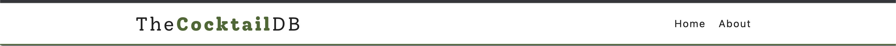

# Project details

[Cocktails Search](https://15-cocktail-search.netlify.app/)

## Details

We will design stripe home page mainly we will focus on navbar where we have a nice drop-down for each nav link

## Things we can learn

- How the components are arranged since we are using react router?
- How to design a simple navbar (with a logo to the left and links to the right)?
- Which external API are we using?
- How to fetch cocktail API?
- How to migrate from `react-router-5` to `react-router-6`?
- How to solve netlify react-router issue?

---

### How the components are arranged since we are using react router?

Since we are using react-router now, we use a pages folder and put all page components (pages) into that folder. Technically we could have added it in components folder itself, but this is a good practice so don't get confused.

**Folder structure**

- components - Have components like `Navbar`, `Loading` and so on
- pages - Have different page components like `Home`, `Error` and so on.

---

### How to design a simple navbar (with a logo to the left and links to the right)?



**JSX**

```js
<nav className="navbar">
  <div className="nav-center">
    <Link to="/">
      
    </Link>
    <ul className="nav-links">
      <li>
        <Link to="/">Home</Link>
        <Link to="/about">About</Link>
      </li>
    </ul>
  </div>
</nav>
```

**CSS**

```css
/* 
====== 
Navbar
======
*/
.navbar {
  background: var(--mainWhite);
  height: 5rem;
  display: flex;
  align-items: center;
  border-bottom: 2px solid var(--primaryColor);
  box-shadow: var(--lightShadow);
}
.nav-center {
  display: flex;
  justify-content: space-between;
  align-items: center;
  width: var(--smallWidth);
  margin: 0 auto;
  max-width: var(--fullWidth);
}
.nav-links {
  display: flex;
  align-items: center;
}
.nav-links a {
  text-transform: capitalize;
  display: inline-block;
  font-weight: bold;
  margin-right: 0.5rem;
  font-weight: 400;
  letter-spacing: 2px;
  font-size: 1.2rem;
  padding: 0.25rem 0.5rem;
  transition: var(--mainTransition);
}
.nav-links a:hover {
  color: var(--primaryColor);
}
.logo {
  width: 12rem;
}
```

---

### Which external API are we using?

- We use [Cocktail DB API](https://www.thecocktaildb.com/api.php) for this project
- This API doesn't need API key, so we can directly use it without any extra setup
- We use two API links
  - [Search cocktail by name](www.thecocktaildb.com/api/json/v1/1/search.php?s=margarita) - `www.thecocktaildb.com/api/json/v1/1/search.php?s=margarita` - to display all cocktails with the name
  - [Lookup full cocktail details by id](www.thecocktaildb.com/api/json/v1/1/lookup.php?i=11007) - `www.thecocktaildb.com/api/json/v1/1/lookup.php?i=11007` - to display details of one single cocktail once we click on a cocktail

---

### How to fetch cocktail API?

`context.js`

```js
const [loading, setLoading] = useState(true)
const [searchTerm, setSearchTerm] = useState('a') // initially it loads all the drinks that invloves 'a'
const [cocktails, setCocktails] = useState([])

const fetchDrinks = useCallback(async () => {
  // we use this function multiple times, so setting loading to true whenever we type in search
  setLoading(true)
  try {
    const response = await fetch(`${url}${searchTerm}`)
    const { drinks } = await response.json()
    if (drinks) {
      console.log(drinks)
      const newCocktails = drinks.map((drink) => {
        const { idDrink, strDrink, strDrinkThumb, strAlcoholic, strGlass } =
          drink
        return {
          id: idDrink,
          name: strDrink,
          image: strDrinkThumb,
          info: strAlcoholic,
          glass: strGlass,
        }
      })
      setCocktails(newCocktails)
    } else {
      setCocktails([])
    }
    setLoading(false)
  } catch (error) {
    console.log(error)
    setLoading(false)
  }
}, [searchTerm])

useEffect(() => {
  fetchDrinks()
}, [searchTerm, fetchDrinks])
```

---

### How to migrate from `react-router-5` to `react-router-6`?

[For react-router-6 tutorials](https://app.gitbook.com/s/-MVEiPUp08kYt33g51v7/languages-and-frameworks/react-router-6)

**react-router-5**

```jsx
return (
  <Router>
    <Navbar />
    <Switch>
      <Route exact path="/">
        <Home />
      </Route>
      <Route path="/about">
        <About />
      </Route>
      <Route path="/cocktail/:id">
        <SingleCocktail />
      </Route>
      <Route path="*">
        <Error />
      </Route>
    </Switch>
  </Router>
)
```

**react-router-6**

```jsx
return (
  <Router>
    <Navbar />
    <Routes>
      <Route path="/" element={<Home />} />
      <Route path="/about" element={<About />} />
      <Route path="/cocktail/:id" element={<SingleCocktail />} />
      <Route path="*" element={<Error />} />
    </Routes>
  </Router>
)
```

**Commit IDs**

React-router-6 - `5d64bfb791da95871df75f86a653b38c1c21f284`
React-router-5 - `da7767f4a04806d6de5572ac72bdf5d92c5ef3c3`

---

### How to solve netlify react-router issue?

This is the thing to remember when using `react-router` in our app. When we navigate to any URL that doesn't exist, netlify will show 404 page of netlify and doesn't show our error page. To solve this,

- Just create `_redirects` file in your Public folder and paste this in '\_redirects file' - `/* /index.html 200`.
