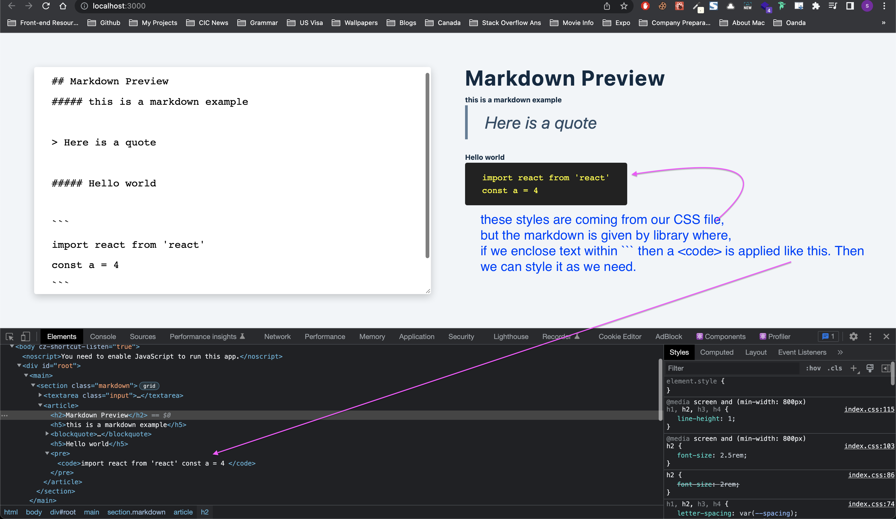

# Project details

[Markdown Preview]()

## Details

We will use `react-markdown` library to display our typed markdown as HTML. We can type our markdown on left side and instantly, we can get the corresponding HTML on the right.

## Things we can learn

- Know about markdown

---

### Know about markdown

To get markdown -> HTML, we use `react-markdown` library. We enclose state value in `<ReactMarkdown>` and then the library converts it into HTML.
Then we can use css to style the markdown as we need as shown in the above image.
