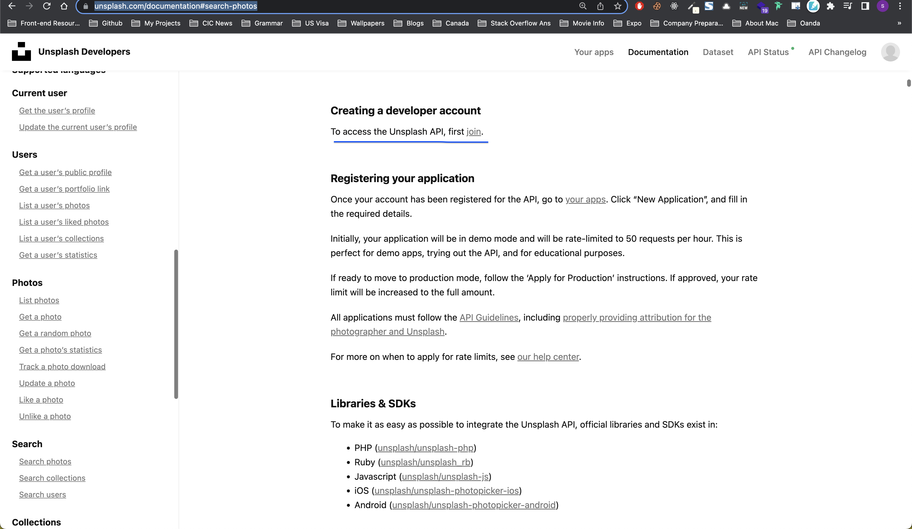
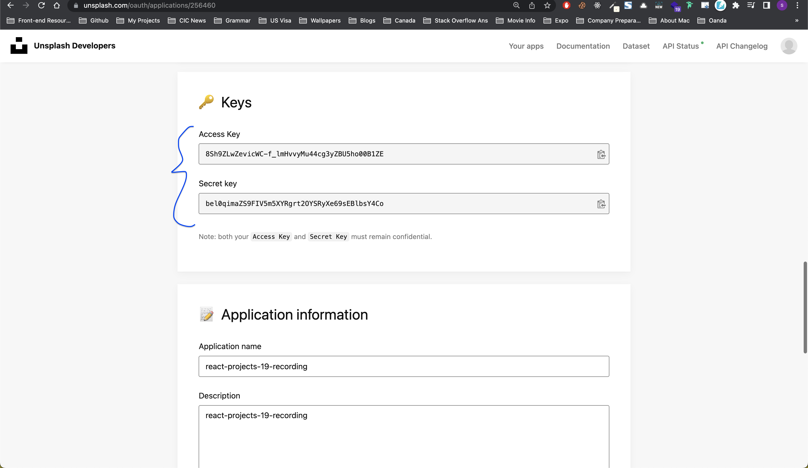
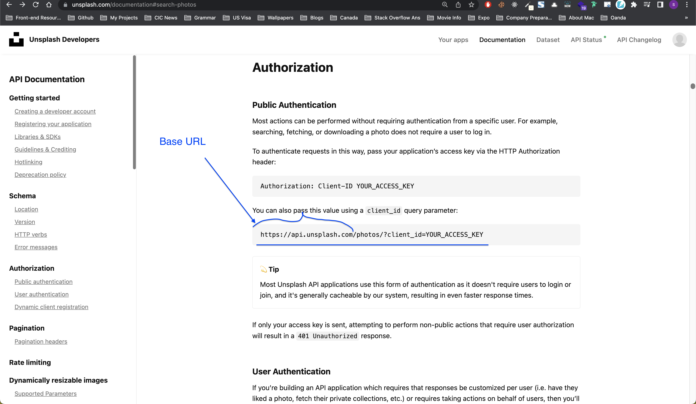
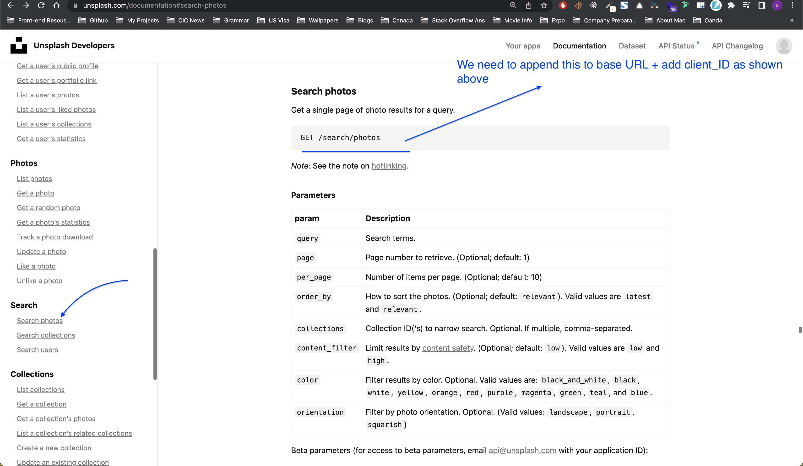

# Project details

[Pagination on Client](https://18-pagination-on-client.netlify.app/)

## Details

This app is similar to [unsplash](https://unsplash.com/) where we can search photos using search bar. Once we search the photos, we can keep scrolling and new photos get generated on scroll.

## Things we can learn

- How to read API docs of [unsplash](https://unsplash.com/documentation#search-photos)
- How to setup env variables?

---

### How to read API docs of [unsplash](https://unsplash.com/documentation#search-photos)

The key point when working with any API is its docs. Every API documentation is different. Once we figure out how to get the data using it's API key then it's easy to use that data in our APP.

**Key things to look at when working with API**

- **`Do I need an API key?`**

  - Generally, this will be somewhere at the start in the API documentation page as shown in the image below.

  - Most of the times, the API service might need you to create an account to give you the keys. Once you create an account, then you also might have to create an APP in their website so that they will give you the keys with reference to the created app.

  

  - Here I created an app, `react-projects-19-recording` in unsplash to get an API key as explained in 2nd point above

  

- **`Now I have got API keys, how to fetch the data using those keys?`**

  - So once we have the API key, our next step is to see how to use that API key to grab the data. You need to see what is the base URL and how to attach the key to it. Sometimes it might not be straight forward so you might need to do some research and read the docs thoroughly. But in this case, we can send the API key in client ID in URL

  

- **`Now I have got the data, how to get different data?`**

  - Once you get the data, now you might need to see how to get the particular data you are looking for. In the above image, you get the photos. But now you need to be able to search photos on specific query and get the photos related to that. Once you read the docs you find this

  

These are some of the guidelines when working with external API. The main takeaway is, spend some time on reading the API docs.

---

### How to setup env variables?

[My Stackoverflow answer](https://stackoverflow.com/a/68945430/10824697)

---
