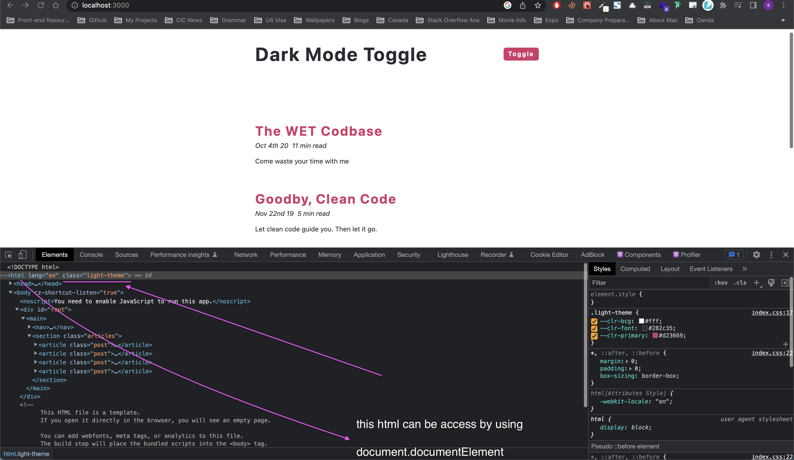

# Project details

[Dark Mode Toggle](https://20-dark-mode-toggle.netlify.app/)

## Details

This app has light and dark mode and is inspired by [Dan Abramov's blog](https://overreacted.io/). We can learn how to set dark mode and toggle between light and dark modes using `plain CSS` - `20_dark_mode_toggle/src/ToggleWithCSS.js` and also using `Material UI` - `20_dark_mode_toggle/src/ToggleWithMUI.js`.

## Things we can learn

- How to make use of max-width and width when you want?

  - a layout, in the big screen, that should have at max 600px so it should not go beyond that
  - and when screen is shrinked, in a mobile view, it should have 90vw

- How to use `moment js` to display dates in any format easily?
- How to implement dark theme and toggle using CSS?
- Once the dark theme toggle is implemented, how can we persist on page storage using local storage?
- How to use `darkmode` with `Material UI`?
- what is the difference between Material UI's `style` and `sx` prop?

---

### How to make use of max-width and width when you want

- a layout, in the big screen, that should have at max 600px so it should not go beyond that
- and when screen is shrinked, in a mobile view, it should have 90vw

To achieve this we can make use of `max-width` and `width` css properties.

```css
.nav-center {
  width: 90vw;
  max-width: 600px;
  margin: 0 auto;
  display: flex;
  justify-content: space-between;
  align-items: center;
  padding: 2rem 0;
  /* to see how it looks, enable bg color*/
  /* background-color:#000; */
}
```

It means that,

- Let the container be at max `600px` (`max-width` dictates that). So even when the screen is very big, the nav-center will not exceed 600px
- But when screen is shrinked below 600px, then it still tries to be 600px max, and we don't need this. We need it to become 90% of the screen width in that case. Hence we say `width = 90vw` which controls the width of nav-center when it becomes smaller than max-width.

So the take away is,

- when screen-size is greater than defined max-width, the max-width is applied
- when screen-size is smaller than defined max-width, width is applied

Note: Opposite of max-width is min-width

min-width is used when we want the nav-center to be minimum of some width no matter in which ever screen size.

---

### How to use `moment js` to display dates in any format easily?

Let's say we want to display date in JS. If we do `new Date()`, we get `Fri Nov 22 2019 00:00:00 GMT-0500 (Eastern Standard Time)` which is not the format we want.

We want something like `Sunday 14, 2022`. This could be done in plain JS using more lines of code, but the easiest way to do it is by using a library called [moment js](https://momentjs.com/)

Install it with the command `npm install moment --save`

**How to use it?**

Let's say we have a date like this `new Date(2019, 10, 22)` and we want to convert into `Nov 22nd 19` this format

We can do

```js
import moment from 'moment'
const myDate = new Date(2019, 10, 22)
const formattedDate = moment(myDate).format('dddd Do, YYYY')
console.log(formattedDate) // gives - Nov 22nd 19
```

---

### How to implement dark theme and toggle using CSS?

In `index.css` we have `:root` that defines the css for light theme

```css
:root {
  --clr-bcg: #fff;
  --clr-font: #282c35;
  --clr-primary: #d23669;
}
```

In our react component we need to have a state (string) to define light or dark theme. If it's dark we need to apply the dark theme css that we define as below. We need to use same keys defined in `:root` but the values are going to change. We technically don't need root here as we won't use it, but we can just let it be here.

```css
/* :root {
  --clr-bcg: #fff;
  --clr-font: #282c35;
  --clr-primary: #d23669;
} */
.dark-theme {
  --clr-bcg: #282c35;
  --clr-font: #fff;
  --clr-primary: #ffa7c4;
}
.light-theme {
  --clr-bcg: #fff;
  --clr-font: #282c35;
  --clr-primary: #d23669;
}
```

Now, we need to use a state variable and based on that, we will need to add this class to HTML.

We can access HTML using `document.documentElement`, and if we want to set `className` to this, we can do this `document.documentElement.className = 'dark-theme'`

**`App.js`**

```js
function App() {
  const [theme, setTheme] = useState('light-theme')

  useEffect(() => {
    document.documentElement.className = theme
  }, [theme])

  const handleToggle = () => {
    if (theme === 'light-theme') {
      setTheme('dark-theme')
    } else {
      setTheme('light-theme')
    }
  }

  return (
    <main>
      <nav>
        <div className="nav-center">
          <h1>Dark Mode Toggle</h1>
          <button onClick={handleToggle} className="btn">
            toggle
          </button>
        </div>
      </nav>
      <section className="articles">
        {data.map((item) => {
          return <Article key={item.id} {...item} />
        })}
      </section>
    </main>
  )
}
```



---

### Once the dark theme toggle is implemented, how can we persist on page storage using local storage?

We have used the local storage in our grocery storage app as well. You can refer it [here](https://github.com/sandeep194920/React_MUI_Express_Projects/tree/master/10_grocery_shop)

It has two parts,

- Retrieve theme from local storage
- Set theme to local storage

**Retrieve theme from local storage**

We can retrieve from local storage using

- A function

```js
// with function
const getSavedTheme = () => {
  let savedTheme = 'light-theme'
  if (localStorage.getItem('savedTheme')) {
    savedTheme = localStorage.getItem('savedTheme')
  }
  return savedTheme
}
```

- Without a function

```js
// without a function
const savedTheme = localStorage.getItem('savedTheme') || 'light-theme'
```

Then we use it in useState

```js
// const [theme, setTheme] = useState(savedTheme) //^ without function
const [theme, setTheme] = useState(getSavedTheme()) //* with a function
```

**Set theme to local storage**

```js
useEffect(() => {
  document.documentElement.className = theme
  localStorage.setItem('savedTheme', theme)
}, [theme])
```

Full code below

```js
/* We can retrieve saved theme using a function or without a function, just through a variable as shown below*/

// without a function
// const savedTheme = localStorage.getItem('savedTheme') || 'light-theme'

// with function
const getSavedTheme = () => {
  let savedTheme = 'light-theme'
  if (localStorage.getItem('savedTheme')) {
    savedTheme = localStorage.getItem('savedTheme')
  }
  return savedTheme
}

function App() {
  // const [theme, setTheme] = useState(savedTheme) //^ without function
  const [theme, setTheme] = useState(getSavedTheme()) //* with a function

  useEffect(() => {
    document.documentElement.className = theme
    localStorage.setItem('savedTheme', theme)
  }, [theme])

  const handleToggle = () => {
    if (theme === 'light-theme') {
      setTheme('dark-theme')
    } else {
      setTheme('light-theme')
    }
  }

  return (
    <main>
      <nav>
        <div className="nav-center">
          <h1>Dark Mode Toggle</h1>
          <button onClick={handleToggle} className="btn">
            toggle
          </button>
        </div>
      </nav>
      <section className="articles">
        {data.map((item) => {
          return <Article key={item.id} {...item} />
        })}
      </section>
    </main>
  )
}

export default App
```

---

### How to use darkmode with `Material UI`?

[Read the MUI docs here](https://mui.com/material-ui/customization/dark-mode/)

In the above docs, in the section [Dark mode by default](https://mui.com/material-ui/customization/dark-mode/#dark-mode-by-default), the gotcha is that you need to have default colors and this won't work if you change any colors or anything in palette. Try out with a button and it works only with default MUI provided colors.

So we need to refer [Dark mode with custom palette](https://mui.com/material-ui/customization/dark-mode/#dark-mode-with-a-custom-palette). I have referred this and used my own colors, and also simplified the given code like this below,

Full code is in `20_dark_mode_toggle/src/ToggleWithMUI.js`

```js
const colors = {
  light: {
    primary: '#d23669',
    text: '#282c35',
    bg: '#fff',
  },
  dark: {
    primary: '#ffa7c4',
    text: '#fff',
    bg: '#282c35',
  },
}
const getDesignTokens = (mode) => ({
  palette: {
    mode,
    primary: {
      main: colors[mode].primary,
    },
    background: {
      default: colors[mode].bg,
      paper: colors[mode].bg,
    },
    text: {
      primary: colors[mode].text,
    },
  },
})
```

and then inside the component I use the above function this way

```js
function ToggleWithMUI() {
  const [theme, setTheme] = React.useState(getSavedTheme())
  const muiTheme = createTheme(getDesignTokens(theme)) // when theme changes, getDesignTokens is called with updated theme and we get right values

  // when toggle button is clicked the theme is changed using handleToggle function
  const handleToggle = () => {
    setTheme((oldTheme) => {
      let newTheme
      if (oldTheme === 'light') {
        newTheme = 'dark'
      } else {
        newTheme = 'light'
      }
      localStorage.setItem('savedTheme', newTheme) // local storage to persist theme after page refresh
      return newTheme
    })
  }
}
```

---

### what is the difference between Material UI's `style` and `sx` prop?

[Refer my stackOverflow answer here](https://stackoverflow.com/a/73768249/10824697)

- `sx` prop works only on MUI components like `Grid`, `Box` and so on.
- `style` prop works on both MUI components and HTML like elements such as `span`, `article`,`h1` and so on.

There are several advantages of `sx` prop, and here are a few.

- You can nest the styles when using `sx` prop, but can't do this when using `style` prop

**With sx prop**

```js
<Box sx={styles.post}>
  <Typography variant="h4">This is the title</Typography>
</Box>
```

`Box` is a `div` of background black, and I need `h4` to be yellow OR primary color. With this requirement, I can nest my styles when I use `sx` prop like this

```js
const styles = {
  post: {
    backgroundColor: 'black',
    h4: {
      // color:'yellow' // OR
      color: (theme) => theme.palette.primary.main,
      // I cannot use theme inside style object. Since I am going to apply styles.post to sx prop,
      // I could make use of theme object here as an argument
    },
  },
}
```

**With style prop**

```js
;<Box style={styles.post}>
  <Typography variant="h4" style={style.heading}>
    This is the title
  </Typography>
</Box>

const styles = {
  post: {
    backgroundColor: 'black',
    h4: {
      // color:'yellow' // OR
      color: (theme) => theme.palette.primary.main,
      // I cannot use theme inside style object. Since I am going to apply styles.post to sx prop,
      // I could make use of theme object here as an argument
    },
  },
  heading: {
    color: 'yellow',
    // color: (theme) => theme.palette.primary.main, // THIS WON'T WORK
  },
}
```

The other place where `sx` comes to rescue is when defining breakpoints as explained in my stackoverflow answer. Please refer that.

---
