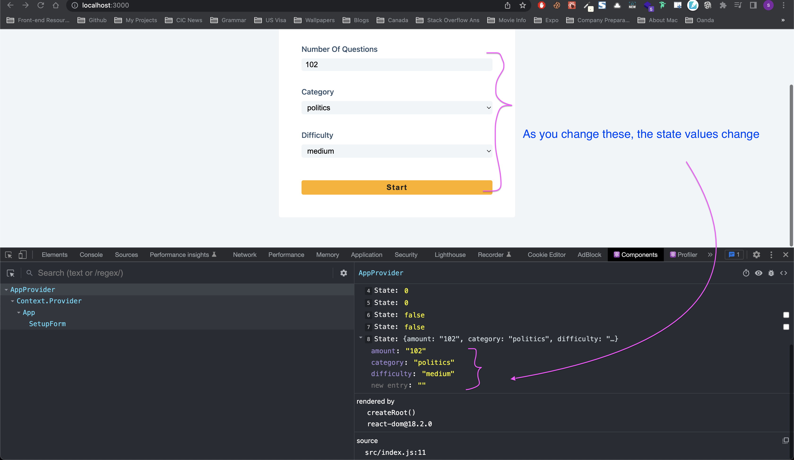

# Project details

[Quiz app]()

## Details

In this app, we can setup a quiz by defining number of questions, category, and difficulty level. Each multiple choice question will have a correct answer and if we get it right, it will be registered and we can also skip the question by clicking next button, but that will be considered a wrong answer. We have a modal at the end to show how many questions we got it right.

## Things we can learn

- Flow of this app
- How to work with axios
- How to convert HTML kind of string into normal string and display on UI?
- How to use same handler function to dynamically set state values for different `input` changes?

---

### Flow of this app

- We have `waiting` state set to `true` initially, and once that is `false`, then we need to fetch the questions
- Once the user selects the categories of Quiz (like type of questions, difficulty level and so on) and clicks start, we then set `waiting` to false and dynamically generate the questions URL based on users preferences

---

### How to work with axios

For full axios tutorials [Refer my notes](https://app.gitbook.com/s/-MVEiPUp08kYt33g51v7/languages-and-frameworks/axios)

```js
const fetchQuestions = async (url) => {
  setLoading(true)
  setWaiting(false)
  const response = await axios(url).catch((err) => console.log(err))
  console.log(response.data.results)
}
```

If there is some kind of issue with URL then response will be undefined, so we can use that to display the error

```js
const fetchQuestions = async (url) => {
  setLoading(true)
  setWaiting(false)
  const response = await axios(url).catch((err) => console.log(err)) // line 1
  if (response) {
    const data = response.data.results
    if (data.length > 0) {
      setQuestions(data)
      setLoading(false)
      setError(false)
      setWaiting(false)
    } else {
      setWaiting(true)
      setError(true)
    }
  } else {
    // response is undefined, which means we have some kind of error (we technically need to handle this here or in line1, but that's ok for now )
    setWaiting(true)
  }
}
```

---

### How to convert HTML kind of string into normal string and display on UI?

You can use `dangerouslySetInnerHTML`

```js
<h2 dangerouslySetInnerHTML={{ __html: `question&nbsp;` }} /> // this will be - question
```

---

### How to use same handler function to dynamically set state values for different `input` changes?

We have done similar thing on buttons where, we have `different buttons` but same `onMouseOver handler` for all buttons in [17_random_user_generator app](https://github.com/sandeep194920/React_MUI_Express_Projects/tree/master/17_random_user_generator#how-to-use-same-handler-function-when-for-different-input-values-this-can-also-be-done-for-form-values)]

Here, we will see how we can achieve same for `different inputs` instead of buttons like `17_random_user app`

```js
<form className="setup-form">
  <h2>Setup quiz</h2>
  {/* amount */}
  <div className="form-control">
    <label htmlFor="amount">number of questions</label>
    {/* we need to match name prop to the state value and id to label's htmlFor */}
    <input
      type="number"
      name="amount"
      id="amount"
      value={quiz.amount}
      onChange={(e) => handleChange(e)} // same handleChange function for all inputs
      className="form-input"
      min={1}
      max={50}
    />
  </div>
  {/* category */}
  <div className="form-control">
    <label htmlFor="category">category</label>
    <select
      name="category"
      id="category"
      className="form-input"
      value={quiz.category}
      onChange={(e) => handleChange(e)} // same handleChange function for all inputs
    >
      <option value="sports">sports</option>
      <option value="history">history</option>
      <option value="politics">politics</option>
    </select>
  </div>
  {/* difficulty */}
  <div className="form-control">
    <label htmlFor="difficulty">difficulty</label>
    <select
      name="difficulty"
      id="difficulty"
      className="form-input"
      value={quiz.difficulty}
      onChange={(e) => handleChange(e)} // same handleChange function for all inputs
    >
      <option value="easy">easy</option>
      <option value="medium">medium</option>
      <option value="hard ">hard </option>
    </select>
  </div>

  {error && (
    <p className="error">
      can't generate questions, please try different options
    </p>
  )}
  <button type="submit" onClick={handleSubmit} className="submit-btn">
    start
  </button>
</form>
```

Same handleChange function for all three above inputs

```js
const handleChange = (e) => {
  //* name is the name in form input. Each input will have different names like - amount, difficulty, category
  const name = e.target.name
  const value = e.target.value
  console.log(name, value)
  setQuiz((oldQuizValues) => ({
    ...oldQuizValues,
    [name]: value,
  }))
}
```

You can use react-dev-tools while development and see that the state values change for each form input change



**_You could use this setup when you have too many input values, and in that case only one handler function should be good_**
