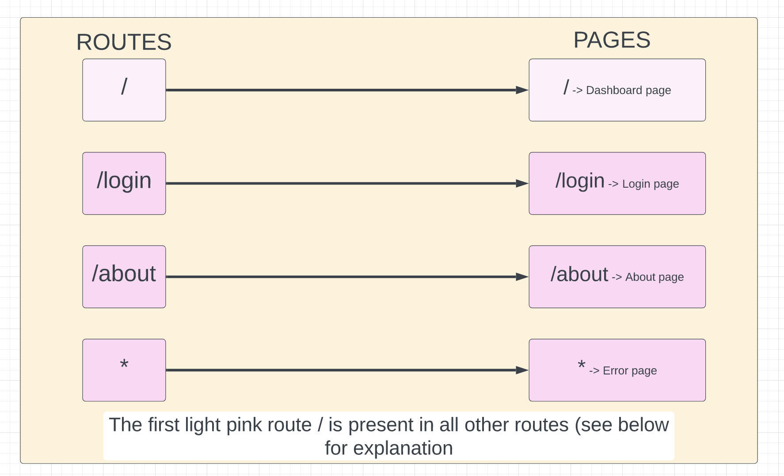
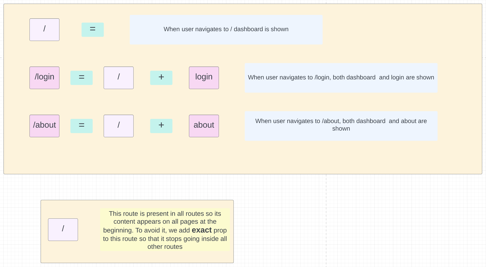
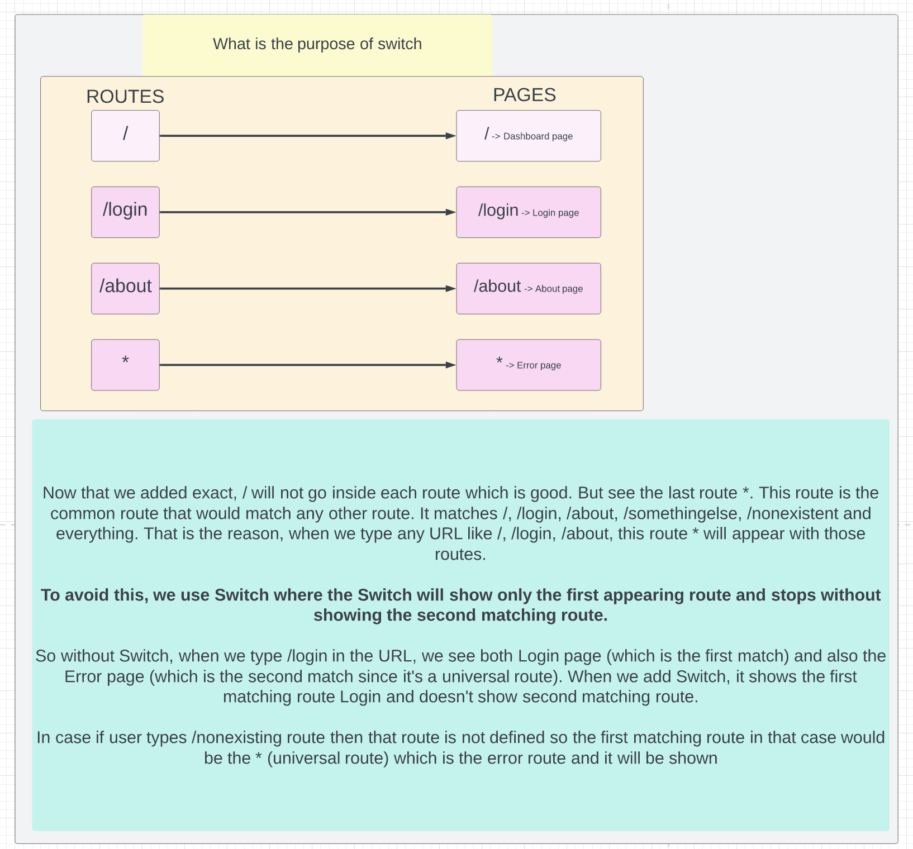
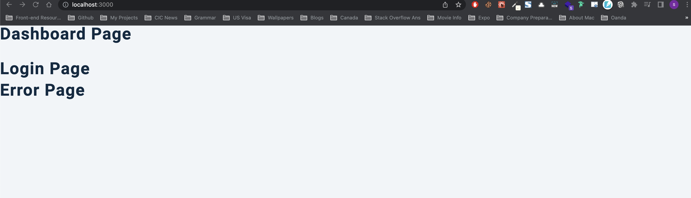
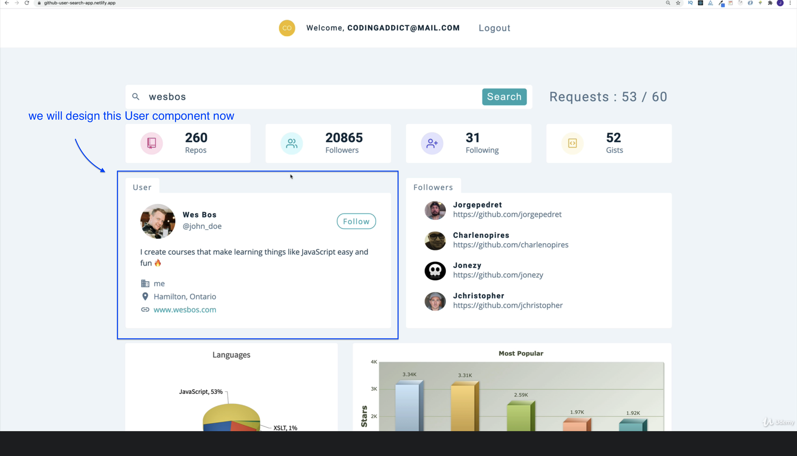
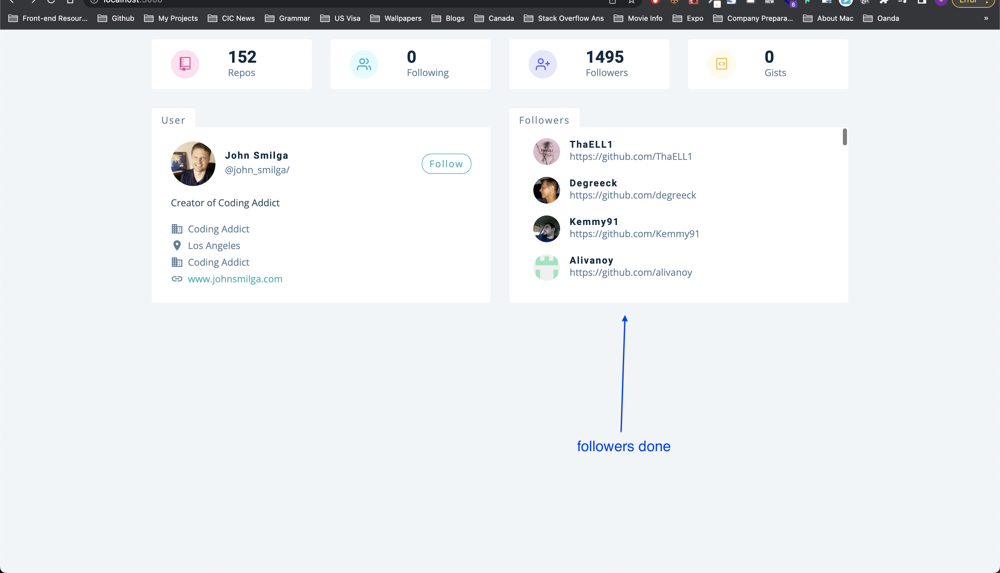
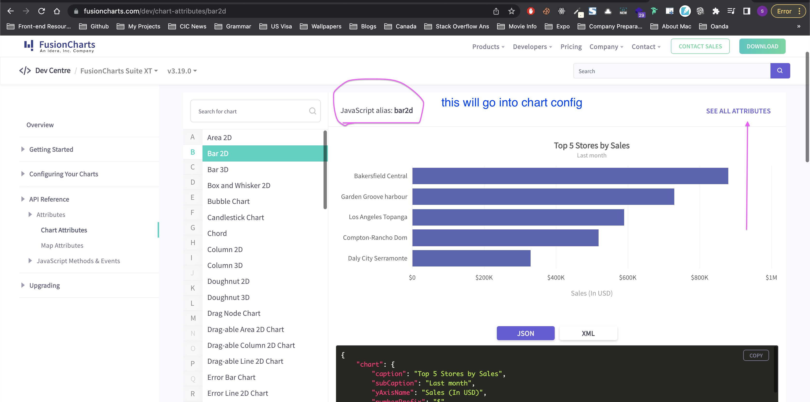
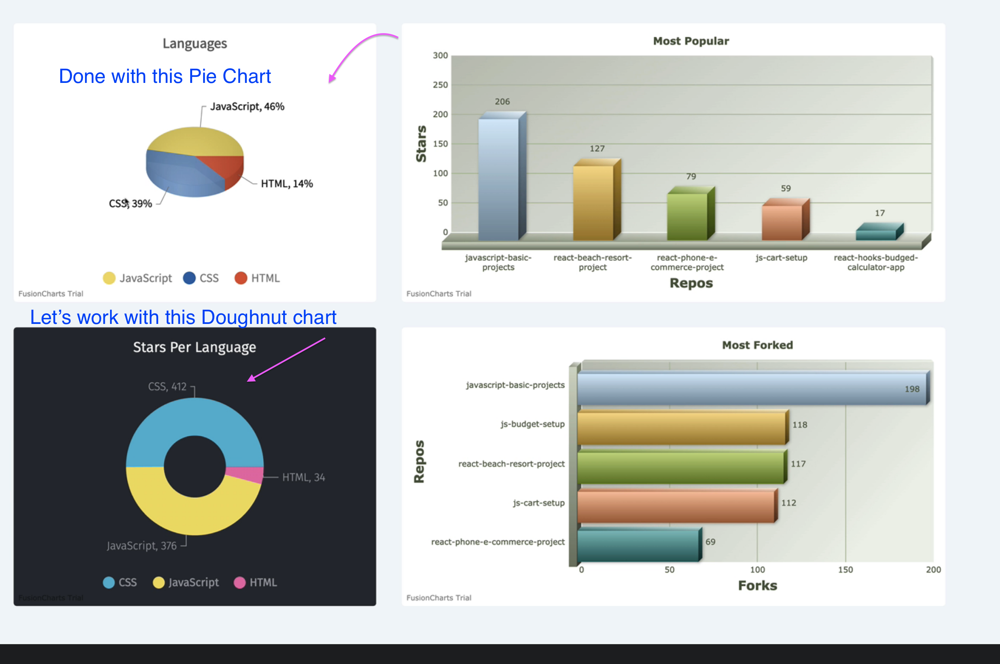

# Project details

[Github Users]()

## Details

This project contains user registration and login functionality where user can register/login using username/password, OR throguh social accounts like Google, Facebook. Once the user logs in, he can search a github profile and get all the info about a profile like number of followers, languages, most cloned repos and so on. All the data could be represented using different charts like Bar Chart, Doughnut Chart and so on. We use `auth0` library for authenticaton.

_Starter Project, Commit ID_- `a993b413d2c24f7de7669834aa6061303a016cbb`

---

---

## Things we can learn

- Difference between `exact` and `Switch` in react-router-5
- `reduce` function to calculate number of times an item occurs in an array of objects
- How to sort an object / How to convert object values into array for sorting purpose

---

### Difference between `exact` and `Switch` in react-router-5

**`exact`**




**`switch`**



---

### `reduce` function to calculate number of times an item occurs in an array of objects

We have implemented the reduce function here in [14_shopping_cart](https://github.com/sandeep194920/React_MUI_Express_Projects/tree/master/14_shopping_cart/front-end#how-to-calculate-single-numberlike-sum-from-an-array-using-reduce-function) so please refer this first.

In this case we want to achieve this: We have an array of objects called repos. Each object will have a property called language set to any language like this

```js
/*
repos = [
    {...otherProps, language:'javascript'},
    {...otherProps, language:'HTML'},
    {...otherProps, language:'HTML'},
    {...otherProps, language:'CSS'},
    {...otherProps, language:'CSS'},
  ]
```

Our motive is to convert into this

```js
/* 
  languages = [
    'javascript' : {
      label : 'javascript',
      value : 1
    },
    'HTML' : {
      label : 'HTML',
      value : 2
    },
    'CSS' : {
      label : 'CSS',
      value : 2
    },
  ]
  */
```

For this purpose, we can use a `for loop` (forEach or normal for loop) and also `reduce function`. We will see both the usages.

**Using forEach**

```js
// let langs = {}
// repos.forEach((itemObj) => {
//   const { language } = itemObj
//   if (!language) return
//   if (!langs[language]) {
//     langs[language] = { label: language, value: 1 }
//   } else {
//     langs[language] = { label: language, value: langs[language].value + 1 }
//   }
// })

// console.log(langs)
```

**Using reduce**

```js
let languages = repos.reduce((accObj, itemObj) => {
  //^ remember we need to return an object. The way to remember this is, we need to return what we defined as second param. The second param is the accumulator which is accObj

  const { language } = itemObj

  //& Sometimes the language will be null and in that case we will return same accObj without doing anything. But in anycase, we will have to return accObj
  if (!language) return accObj

  // accObj[language] = language // -> This would return - {JavaScript: 'JavaScript', CSS: 'CSS', HTML: 'HTML'}

  // accObj[language] = { language } // -> This would return the below

  /*
    {
      "JavaScript": {
          "language": "JavaScript"
      },
      "CSS": {
          "language": "CSS"
      },
      "HTML": {
          "language": "HTML"
      }
    */

  // We will tweak this a little now

  if (!accObj[language]) {
    accObj[language] = { label: language, value: 1 }
  } else {
    accObj[language] = { label: language, value: accObj[language].value + 1 }
  }

  // Now the accObj will look this this

  /*
    {
      "JavaScript": {
          "label": "JavaScript",
          "value": 45
      },
      "CSS": {
          "label": "CSS",
          "value": 38
      },
      "HTML": {
          "label": "HTML",
          "value": 14
      }
    }
  */
  return accObj
}, {})

console.log(languages)
```

**_In `reduce`, we don't define a variable externally, and instead use the accumulator, first parameter inside reducer. In `forEach`, we define the variable outside of the function unlike `reduce`_**

---

### How to sort an object / How to convert object values into array for sorting purpose

From the above result of languages, we see this

```js
languages = {
  JavaScript: {
    label: 'JavaScript',
    value: 45,
  },
  CSS: {
    label: 'CSS',
    value: 38,
  },
  HTML: {
    label: 'HTML',
    value: 14,
  },
}
```

Now, we need to sort the languages based on `value` prop of each sub-object. For that we need to convert this lanugages object into array and then sort that array based on value prop of each object

So, two steps,

- convert this lanugages object into array
- then sort that array based on value prop of each object

**step 1:** convert this lanugages object into array

```js
languages = Object.values(languages)
```

Now the languages would be

```js
languages = [
  {
    label: 'JavaScript',
    value: 45,
  },
  {
    label: 'CSS',
    value: 38,
  },
  {
    label: 'HTML',
    value: 14,
  },
]
```

This looks like it's already sorted, but it's a coincidence here. We need to sort this to be safe

**step2:** then sort that array based on value prop of each object

```js
languages = languages.sort((a, b) => b.value - a.value)
```

Now the languages will be sorted. I would like to take only first five languages (in this case it is less than 5, but not always)

```js
languages = languages.slice(0, 5)
```

I could have combined above two steps into one like this

```js
languages = languages.sort((a, b) => b.value - a.value).slice(0, 5)
```

---

---

## Flow of the app

Since this is a big app, we would note down the flow of the app.

#### 1. Initial Pages we see when app starts (after setting up the starter project)

`24_github_users/src/App.js`

- We see 3 components on the `App.js` - Dashboard Page, Login Page and Error Page



- The development idea is, we show the `Login` page (protected route) and when the user logs in then he can see `Dashboard` page. If he navigates to unknown route then the `Error` page is shown. So we put these 3 in App.js to begin with

---

#### 2. Setup React Router 5

`24_github_users/src/App.js`

- In the App.js we setup the react router v5 basic routes
- We enclose everything in `BrowserRouter (as Router)`, and use `Switch` so the first matching route is rendered. to understand better about exact and Switch and their differences, refer the _Things we can learn_ or [Watch this short video](https://www.youtube.com/watch?v=jVtxC6CKzYU&ab_channel=kudvenkat)
- At this point our `App.js` looks like this

```js
function App() {
  return (
    <Router>
      <Route path="/" exact>
        <Dashboard></Dashboard>
      </Route>
      <Route path="/login">
        <Login />
      </Route>
    </Router>
  )
}
```

- We will add `Error` later

---

#### 3. Let's add error

`24_github_users/src/App.js`

Now if the user navigates to the URL that doesn't exist then he will get a blank page. We need to avoid that using default route for `Error`

```js
function App() {
  return (
    <Router>
      <Route path="/" exact>
        <Dashboard></Dashboard>
      </Route>
      <Route path="/login">
        <Login />
      </Route>

      {/* Default route to show error page if none of the above routes match */}
      <Router path="*">
        <Error />
      </Router>
    </Router>
  )
}
```

---

#### 4. Let's add Switch

`24_github_users/src/App.js`

Now, if we navigate to unknown URL the error page is displayed. But notice one thing, when you navigate to dashboard `/`, the error page is also shown along with Dashboard


- This happens even though you have `exact` on `Dashboard`
- If we add `Switch` to all the routes, this would behave properly and show only Dashboard, so the code looks like this

```js
function App() {
  return (
    <Router>
      {/* Switch matches the first matching route. Note that * would be the second match to any route generally as it matches everything like /, /login, /about, /noroute and so on */}
      <Switch>
        <Route path="/" exact>
          <Dashboard></Dashboard>
        </Route>
        <Route path="/login">
          <Login />
        </Route>

        {/* Default route to show error page if none of the above routes match */}
        <Route path="*">
          <Error />
        </Route>
      </Switch>
    </Router>
  )
}
```

- I know it is confusing about the difference between `exact` and `Switch`, so I have explained the difference in detail in _Things we can learn section_ above

---

#### 5. Let's **style** Error page

`24_github_users/src/pages/Error.js`

For now, we will navigate back the user to the home page `/`, but later once we will setup the private route, if user isn't logged in then we will send him back to `/login` route (Login page)

```js
import React from 'react'
import styled from 'styled-components'
import { Link } from 'react-router-dom'
const Error = () => {
  return (
    <Wrapper>
      <div>
        <h1>404</h1>
        <h3>sorry, the page you tried cannot be found</h3>
        {/* btn is coming from Global CSS and not styled components */}
        <Link to="/" className="btn">
          back home
        </Link>
      </div>
    </Wrapper>
  )
}
const Wrapper = styled.section`
  min-height: 100vh;
  display: grid;
  place-items: center;
  background: var(--clr-primary-10);
  text-align: center;
  h1 {
    font-size: 10rem;
  }
  h3 {
    color: var(--clr-grey-3);
    margin-bottom: 1.5rem;
  }
`
export default Error
```

---

#### 6. Let's **style** Login page - no login functionality yet, just the UI

`24_github_users/src/pages/Login.js`

```js
import React from 'react'
import { useAuth0 } from '@auth0/auth0-react'
import styled from 'styled-components'
import loginImg from '../images/login-img.svg'
const Login = () => {
  return (
    <Wrapper>
      <div className="container">
        
        <h1>github user</h1>
        {/* TODO: We will implement the login functionality later once the button is clicked */}
        <button className="btn">Login</button>
      </div>
    </Wrapper>
  )
}
const Wrapper = styled.section`
  min-height: 100vh;
  display: grid;
  place-items: center;
  .container {
    width: 90vw;
    max-width: 600px;
    text-align: center;
  }
  img {
    margin-bottom: 2rem;
  }
  h1 {
    margin-bottom: 1.5rem;
  }
`
export default Login
```

---

#### 7. Let's **style** the Dashboard page, just basic UI

`24_github_users/src/pages/Dashboard.js`

**_intial setup_** we will come back to this later after setting up some state values in the context in next step

```js
import React from 'react'
// importing this way in single line is possible because of index.js inside /components
import { Info, Repos, User, Search, Navbar } from '../components'
import loadingImage from '../images/preloader.gif'
import { GithubContext } from '../context/context'
const Dashboard = () => {
  return (
    <main>
      <Navbar></Navbar>
      <Search />
      <Info />
      <Repos />
    </main>
  )
}

export default Dashboard
```

---

#### 8. Let's setup some context

`24_github_users/src/context/context.js` -> context Provider implemeted
`24_github_users/src/index.js` -> context Provider used
`24_github_users/src/components/Info.js` -> testing if we are able to render context value to the screen

Let's setup some state values in the context so we can use in our dashboard page.

**`context.js`**

```js
import React, { useState, useEffect, createContext, useContext } from 'react'
import mockUser from './mockData/mockUser'
import mockRepos from './mockData/mockRepos'
import mockFollowers from './mockData/mockFollowers'
import axios from 'axios'

const rootUrl = 'https://api.github.com'

const GithubContext = createContext()

const GithubProvider = ({ children }) => {
  return (
    <GithubContext.Provider value="test-value">
      {children}
    </GithubContext.Provider>
  )
}

// custom hook that starts with use
const useGlobalContext = () => {
  return useContext(GithubContext)
}

export { GithubProvider, useGlobalContext }
```

**Let's now wrap our app inside the `index.js`**

```js
import React from 'react'
import ReactDOM from 'react-dom/client'
import './index.css'
import App from './App'
import reportWebVitals from './reportWebVitals'
import { GithubProvider } from './context/context'

const root = ReactDOM.createRoot(document.getElementById('root'))
root.render(
  <React.StrictMode>
    <GithubProvider>
      <App />
    </GithubProvider>
  </React.StrictMode>
)

// If you want to start measuring performance in your app, pass a function
// to log results (for example: reportWebVitals(console.log))
// or send to an analytics endpoint. Learn more: https://bit.ly/CRA-vitals
reportWebVitals()
```

**Let's now test our context values inside `Info.js`**

```js
import React from 'react'
import { GithubContext, useGlobalContext } from '../context/context'
import styled from 'styled-components'
import { GoRepo, GoGist } from 'react-icons/go'
import { FiUsers, FiUserPlus } from 'react-icons/fi'

const UserInfo = () => {
  const data = useGlobalContext()
  // TESTING THE CONTEXT
  return <h2>user info component : {data}</h2>
}

const Wrapper = styled.section`
  display: grid;
  grid-template-columns: repeat(auto-fill, minmax(200px, 1fr));
  gap: 1rem 2rem;
  @media (min-width: 640px) {
    grid-template-columns: repeat(auto-fill, minmax(260px, 1fr));
  }
  .item {
    border-radius: var(--radius);
    padding: 1rem 2rem;
    background: var(--clr-white);
    display: grid;
    grid-template-columns: auto 1fr;
    column-gap: 3rem;
    align-items: center;
    span {
      width: 3rem;
      height: 3rem;
      display: grid;
      place-items: center;
      border-radius: 50%;
    }
    .icon {
      font-size: 1.5rem;
    }
    h3 {
      margin-bottom: 0;
      letter-spacing: 0;
    }
    p {
      margin-bottom: 0;
      text-transform: capitalize;
    }
    .pink {
      background: #ffe0f0;
      color: #da4a91;
    }
    .green {
      background: var(--clr-primary-10);
      color: var(--clr-primary-5);
    }
    .purple {
      background: #e6e6ff;
      color: #5d55fa;
    }
    .yellow {
      background: #fffbea;
      color: #f0b429;
    }
  }
`

export default UserInfo
```

---

#### 9. Info about mockData

`24_github_users/src/context/mockData`

_Why do we need mock data when the github API is free and no API key is required?_

- When you work with Github API, they have limits. Each and everytime when we search for a different user, we will run out of our requests pretty quickly (60 requests per hour).
- That's why we have static data (mockData which is copied from real data but use in our development until everything is setup). In `mockData` folder we have `mockFollowers`, `mockRepos`, `mockUsers`
- The requests to API is tracked by the IP address and not the user we search for, and that is the reason, when I search for any user, my IP address is the one that makes request and I will run out of requests very soon

**_Gihthub API_**

- [Root Endpoint](https://api.github.com)
- [Get User](https://api.github.com/users/wesbos)
- [Repos](https://api.github.com/users/john-smilga/repos?per_page=100)
- [Followers](https://api.github.com/users/john-smilga/followers)
- [Rate Limit](https://api.github.com/rate_limit)

So the key takeaway is, until we hook up everything, we will use the mock data in our context to power up our app.

---

#### 10. Setup state values of mockData in context

`24_github_users/src/context/context.js`
`24_github_users/src/components/Info.js`

We will now setup some state values to use API data, but not real API call, instead we will use mock for the reasons explained above

**`context.js`**

```js
import React, { useState, useEffect, createContext, useContext } from 'react'
import mockUser from './mockData/mockUser'
import mockRepos from './mockData/mockRepos'
import mockFollowers from './mockData/mockFollowers'
import axios from 'axios'

const rootUrl = 'https://api.github.com'

const GithubContext = createContext()

const GithubProvider = ({ children }) => {
  // github user state is the user we get from mockData / the user we search for (not the user who is logged in)
  const [githubUser, setGithubUser] = useState(mockUser)
  const [repos, setRepos] = useState(mockRepos)
  const [followers, setFollowers] = useState(mockFollowers)

  return (
    <GithubContext.Provider value={{ githubUser, repos, followers }}>
      {children}
    </GithubContext.Provider>
  )
}

// custom hook that starts with use
const useGlobalContext = () => {
  return useContext(GithubContext)
}

export { GithubProvider, useGlobalContext }
```

**`Info.js`**

```js
const UserInfo = () => {
  const data = useGlobalContext()
  // TESTING THE CONTEXT
  console.log(data) // this would give the mock repos, mock followers and mock user - placed in mockData folder
  return <h2>user info component </h2>
}
```

Now that we are getting the mock data back (of course we will hook up real data through axios calls to github api later), we can now populate the Dashboard UI

---

#### 11. Let's work on User info part that shows followers, repos and so on

`24_github_users/src/components/Info.js`

Let's work on this user info section that shows repos, followers, following and gists. We can work on Search bar once everything is setup so that we can search for real data (make API calls) instead of mocks. We can work on Navbar once the auth is hooked up. For now we will focus on this user info section.


For real data, [this would be the URL for githubUsers](https://api.github.com/users/wesbos) and the mock would be `mockUser`

```js
import React from 'react'
import { GithubContext, useGlobalContext } from '../context/context'
import styled from 'styled-components'
import { GoRepo, GoGist } from 'react-icons/go'
import { FiUsers, FiUserPlus } from 'react-icons/fi'

const UserInfo = () => {
  const { githubUser } = useGlobalContext()
  console.log(githubUser)
  const { public_repos, followers, following, public_gists } = githubUser

  // since each item (like public_repos, followers and so on) will have different icons, let's create an object
  const items = [
    {
      id: 1,
      icon: <GoRepo className="icon" />,
      label: 'repos',
      value: public_repos,
      color: 'pink',
    },
    {
      id: 2,
      icon: <FiUsers className="icon" />,
      label: 'following',
      value: following,
      color: 'green',
    },
    {
      id: 3,
      icon: <FiUserPlus className="icon" />,
      label: 'followers',
      value: followers,
      color: 'purple',
    },
    {
      id: 4,
      icon: <GoGist className="icon" />,
      label: 'gists',
      value: public_gists,
      color: 'yellow',
    },
  ]
  return (
    <section className="section">
      {/* styled component + global style added heree to Wrapper */}
      <Wrapper className="section-center">
        {items.map((item) => {
          return <Item key={item.id} {...item} />
        })}
      </Wrapper>
    </section>
  )
}

// We could have had other component for above Item, but just doing it here
const Item = ({ icon, label, color, value }) => {
  return (
    <article className="item">
      <span className={color}>{icon}</span>
      <div>
        <h3>{value}</h3>
        <p>{label}</p>
      </div>
    </article>
  )
}

const Wrapper = styled.section`
  display: grid;
  grid-template-columns: repeat(auto-fill, minmax(200px, 1fr));
  gap: 1rem 2rem;
  @media (min-width: 640px) {
    grid-template-columns: repeat(auto-fill, minmax(260px, 1fr));
  }
  .item {
    border-radius: var(--radius);
    padding: 1rem 2rem;
    background: var(--clr-white);
    display: grid;
    grid-template-columns: auto 1fr;
    column-gap: 3rem;
    align-items: center;
    span {
      width: 3rem;
      height: 3rem;
      display: grid;
      place-items: center;
      border-radius: 50%;
    }
    .icon {
      font-size: 1.5rem;
    }
    h3 {
      margin-bottom: 0;
      letter-spacing: 0;
    }
    p {
      margin-bottom: 0;
      text-transform: capitalize;
    }
    .pink {
      background: #ffe0f0;
      color: #da4a91;
    }
    .green {
      background: var(--clr-primary-10);
      color: var(--clr-primary-5);
    }
    .purple {
      background: #e6e6ff;
      color: #5d55fa;
    }
    .yellow {
      background: #fffbea;
      color: #f0b429;
    }
  }
`

export default UserInfo
```

---

#### 12. Let's now design User Component

`24_github_users/src/pages/Dashboard.js` -> Used in App.js
`24_github_users/src/components/User.js` -> Used in Dashboard
`24_github_users/src/components/Card.js` -> Used in User



**Dashboard.js**

```js
import React from 'react'
// importing this way in single line is possible because of index.js inside /components
import { Info, Repos, User, Search, Navbar } from '../components'
import loadingImage from '../images/preloader.gif'
import { GithubContext } from '../context/context'
const Dashboard = () => {
  return (
    <main>
      {/* <Navbar></Navbar>
      <Search /> */}
      <Info />
      <User />
      {/* <Repos /> */}
    </main>
  )
}

export default Dashboard
```

**User.js**

```js
import React from 'react'
import styled from 'styled-components'
import Card from './Card'
import Followers from './Followers'
const User = () => {
  return (
    <section className="section">
      <Wrapper className="section-center">
        <Card></Card>
        <Followers></Followers>
      </Wrapper>
    </section>
  )
}

const Wrapper = styled.div`
  padding-top: 2rem;
  display: grid;
  gap: 3rem 2rem;
  @media (min-width: 992px) {
    grid-template-columns: 1fr 1fr;
  }
  /* align-items: start; */
`

export default User
```

**Card.js**

```js
import React from 'react'
import { GithubContext, useGlobalContext } from '../context/context'
import styled from 'styled-components'
import { MdBusiness, MdLocationOn, MdLink } from 'react-icons/md'
const Card = () => {
  const { githubUser } = useGlobalContext()
  const {
    avatar_url,
    html_url,
    name,
    company,
    blog,
    bio,
    location,
    twitter_username,
  } = githubUser
  return (
    <Wrapper>
      <header>
        
        <div>
          <h4>{name}</h4>
          <p>@{twitter_username || 'john doe'}/</p>
        </div>
        <a href={html_url}>follow</a>
      </header>
      <p className="bio">{bio}</p>
      <div className="links">
        <p>
          <MdBusiness /> {company}
        </p>
        <p>
          <MdLocationOn /> {location || 'earth'}
        </p>
        <p>
          <MdBusiness /> {company}
        </p>
        <a href={`http://${blog}`}>
          <MdLink />
          {blog}
        </a>
      </div>
    </Wrapper>
  )
}
const Wrapper = styled.article`
  background: var(--clr-white);
  padding: 1.5rem 2rem;
  border-top-right-radius: var(--radius);
  border-bottom-left-radius: var(--radius);
  border-bottom-right-radius: var(--radius);
  position: relative;
  &::before {
    content: 'user';
    position: absolute;
    top: 0;
    left: 0;
    transform: translateY(-100%);
    background: var(--clr-white);
    color: var(--clr-grey-5);
    border-top-right-radius: var(--radius);
    border-top-left-radius: var(--radius);
    text-transform: capitalize;
    padding: 0.5rem 1rem 0 1rem;
    letter-spacing: var(--spacing);
    font-size: 1rem;
  }
  header {
    display: grid;
    grid-template-columns: auto 1fr auto;
    align-items: center;
    column-gap: 1rem;
    margin-bottom: 1rem;
    img {
      width: 75px;
      height: 75px;
      border-radius: 50%;
    }
    h4 {
      margin-bottom: 0.25rem;
    }
    p {
      margin-bottom: 0;
    }
    a {
      color: var(--clr-primary-5);
      border: 1px solid var(--clr-primary-5);
      padding: 0.25rem 0.75rem;
      border-radius: 1rem;
      text-transform: capitalize;
      letter-spacing: var(--spacing);
      transition: var(--transition);
      cursor: pointer;
      &:hover {
        background: var(--clr-primary-5);
        color: var(--clr-white);
      }
    }
  }
  .bio {
    color: var(--clr-grey-3);
  }
  .links {
    p,
    a {
      margin-bottom: 0.25rem;
      display: flex;
      align-items: center;
      svg {
        margin-right: 0.5rem;
        font-size: 1.3rem;
      }
    }
    a {
      color: var(--clr-primary-5);
      transition: var(--transition);
      svg {
        color: var(--clr-grey-5);
      }
      &:hover {
        color: var(--clr-primary-3);
      }
    }
  }
`
export default Card
```


---

#### 13. Let's now design Followers Component

`24_github_users/src/components/Followers.js`

```js
import React from 'react'
import { GithubContext, useGlobalContext } from '../context/context'
import styled from 'styled-components'

const Followers = () => {
  const { followers } = useGlobalContext()

  return (
    <Wrapper>
      <div className="followers">
        {followers.map((follower, index) => {
          const { avatar_url: img, html_url, login } = follower
          return (
            <article key={index}>
              
              <div>
                <h4>{login}</h4>
                <a href={html_url}>{html_url}</a>
              </div>
            </article>
          )
        })}
      </div>
    </Wrapper>
  )
}

const Wrapper = styled.article`
  background: var(--clr-white);
  border-top-right-radius: var(--radius);
  border-bottom-left-radius: var(--radius);
  border-bottom-right-radius: var(--radius);
  position: relative;
  &::before {
    content: ' followers';
    position: absolute;
    top: 0;
    left: 0;
    transform: translateY(-100%);
    background: var(--clr-white);
    color: var(--clr-grey-5);
    border-top-right-radius: var(--radius);
    border-top-left-radius: var(--radius);
    text-transform: capitalize;
    padding: 0.5rem 1rem 0 1rem;
    letter-spacing: var(--spacing);
    font-size: 1rem;
  }
  .followers {
    overflow: scroll;
    height: 260px;
    display: grid;
    grid-template-rows: repeat(auto-fill, minmax(45px, 1fr));
    gap: 1.25rem 1rem;
    padding: 1rem 2rem;
  }
  article {
    transition: var(--transition);
    padding: 0.15rem 0.5rem;
    border-radius: var(--radius);
    display: grid;
    grid-template-columns: auto 1fr;
    align-items: center;
    column-gap: 1rem;
    img {
      height: 100%;
      width: 45px;
      border-radius: 50%;
      object-fit: cover;
    }
    h4 {
      margin-bottom: 0;
    }
    a {
      color: var(--clr-grey-5);
    }
  }
`
export default Followers
```



---

#### 14. Let's now design Repos Component

`24_github_users/src/pages/Dashboard.js` -> Use Repos component here
`24_github_users/src/components/Repos.js`

**Dashboard.js**

```js
import React from 'react'
// importing this way in single line is possible because of index.js inside /components
import { Info, Repos, User, Search, Navbar } from '../components'
import loadingImage from '../images/preloader.gif'
import { GithubContext } from '../context/context'
const Dashboard = () => {
  return (
    <main>
      {/* <Navbar></Navbar>
      <Search /> */}
      <Info />
      <User />
      <Repos />
    </main>
  )
}

export default Dashboard
```

**Repos.js**

```js
import React from 'react'
import styled from 'styled-components'
import { GithubContext, useGlobalContext } from '../context/context'
import { ExampleChart, Pie3D, Column3D, Bar3D, Doughnut2D } from './Charts'
const Repos = () => {
  const { repos } = useGlobalContext()
  console.log(repos)
  return <h2>repos component</h2>
}

const Wrapper = styled.div`
  display: grid;
  justify-items: center;
  gap: 2rem;
  @media (min-width: 800px) {
    grid-template-columns: 1fr 1fr;
  }
  @media (min-width: 1200px) {
    grid-template-columns: 2fr 3fr;
  }
  div {
    width: 100% !important;
  }
  .fusioncharts-container {
    width: 100% !important;
  }
  svg {
    width: 100% !important;
    border-radius: var(--radius) !important;
  }
`

export default Repos
```

---

#### 15. Explore Fusion charts and get an example from Fusion charts and try in ExampleChart

`24_github_users/src/components/Repos.js`
`24_github_users/src/components/Charts/ExampleChart.js`

- We will use [Fusion Charts library](https://www.fusioncharts.com/dev/getting-started/react/your-first-chart-using-react) for integrating beautiful charts
- Install it `npm install fusioncharts react-fusioncharts --save`
- First we will navigate to [Render a chart section](https://www.fusioncharts.com/dev/getting-started/react/your-first-chart-using-react#render-the-chart) and copy the code and paste into `ExampleChart.js` and modify the code a little bit to get the first chart
- Then use this ExampleChart inside Repos and see the output

**ExampleChart.js**

```js
// STEP 1 - Include Dependencies
// Include react
import React from 'react'
import ReactDOM from 'react-dom'

// Include the react-fusioncharts component
import ReactFC from 'react-fusioncharts'

// Include the fusioncharts library
import FusionCharts from 'fusioncharts'

// Include the chart type
import Column2D from 'fusioncharts/fusioncharts.charts'

// Include the theme as fusion
import FusionTheme from 'fusioncharts/themes/fusioncharts.theme.fusion'

// Adding the chart and theme as dependency to the core fusioncharts
ReactFC.fcRoot(FusionCharts, Column2D, FusionTheme)

// STEP 2 - Chart Data
const chartData = [
  {
    label: 'Venezuela',
    value: '290',
  },
  {
    label: 'Saudi',
    value: '260',
  },
  {
    label: 'Canada',
    value: '180',
  },
  {
    label: 'Iran',
    value: '140',
  },
  {
    label: 'Russia',
    value: '115',
  },
  {
    label: 'UAE',
    value: '100',
  },
  {
    label: 'US',
    value: '30',
  },
  {
    label: 'China',
    value: '30',
  },
]

// STEP 3 - Creating the JSON object to store the chart configurations
const chartConfigs = {
  type: 'column2d', // The chart type
  width: '700', // Width of the chart
  height: '400', // Height of the chart
  dataFormat: 'json', // Data type
  dataSource: {
    // Chart Configuration
    chart: {
      //Set the chart caption
      caption: 'Countries With Most Oil Reserves [2017-18]',
      //Set the chart subcaption
      subCaption: 'In MMbbl = One Million barrels',
      //Set the x-axis name
      xAxisName: 'Country',
      //Set the y-axis name
      yAxisName: 'Reserves (MMbbl)',
      numberSuffix: 'K',
      //Set the theme for your chart
      theme: 'fusion',
    },
    // Chart Data
    data: chartData,
  },
}

const ChartComponent = () => {
  return <ReactFC {...chartConfigs} />
}

export default ChartComponent
```

**Repos.js**

```js
import React from 'react'
import styled from 'styled-components'
import { GithubContext, useGlobalContext } from '../context/context'
import { ExampleChart, Pie3D, Column3D, Bar3D, Doughnut2D } from './Charts'
const Repos = () => {
  const { repos } = useGlobalContext()
  console.log(repos)
  return <ExampleChart />
}

const Wrapper = styled.div`
  display: grid;
  justify-items: center;
  gap: 2rem;
  @media (min-width: 800px) {
    grid-template-columns: 1fr 1fr;
  }
  @media (min-width: 1200px) {
    grid-template-columns: 2fr 3fr;
  }
  div {
    width: 100% !important;
  }
  .fusioncharts-container {
    width: 100% !important;
  }
  svg {
    width: 100% !important;
    border-radius: var(--radius) !important;
  }
`

export default Repos
```

The example chart looks like this


---

#### 16. Let's now make some modifications to example chart and make it dynamic

`24_github_users/src/components/Repos.js`
`24_github_users/src/components/Charts/ExampleChart.js`

First modify the ChartConfigs like width, height and so on and play around with it in ExampleChart. Then we will make this Example Chart dynamic by passing the props by extracting some of the data from fusion charts and pass them as props from Repos

**_For more explanation of the fusion charts, take a look at video - 320. Fusion Charts API by John on Udemy_**

So here, I have taken out the `ChartData` from `ExampleChart` and placed it inside `Repos`, and we pass it to `ExampleChart` as props as shown below.

**Repos.js**

```js
import React from 'react'
import styled from 'styled-components'
import { GithubContext, useGlobalContext } from '../context/context'
import { ExampleChart, Pie3D, Column3D, Bar3D, Doughnut2D } from './Charts'
const Repos = () => {
  const { repos } = useGlobalContext()
  console.log(repos)

  // STEP 2 - Chart Data
  const chartData = [
    {
      label: 'HTML',
      value: '13',
    },
    {
      label: 'CSS',
      value: '23',
    },
    {
      label: 'Javascript',
      value: '80',
    },
  ]
  return (
    <section className="section">
      <Wrapper className="section-center">
        <ExampleChart data={chartData} />
      </Wrapper>
    </section>
  )
}

const Wrapper = styled.div`
  display: grid;
  justify-items: center;
  gap: 2rem;
  @media (min-width: 800px) {
    grid-template-columns: 1fr 1fr;
  }
  @media (min-width: 1200px) {
    grid-template-columns: 2fr 3fr;
  }
  div {
    width: 100% !important;
  }
  .fusioncharts-container {
    width: 100% !important;
  }
  svg {
    width: 100% !important;
    border-radius: var(--radius) !important;
  }
`

export default Repos
```

**ExampleChart.js**

```js
// Include react
import React from 'react'

// Include the react-fusioncharts component
import ReactFC from 'react-fusioncharts'

// Include the fusioncharts library
import FusionCharts from 'fusioncharts'

// Include the chart type
import Chart from 'fusioncharts/fusioncharts.charts'

// Include the theme as fusion
import FusionTheme from 'fusioncharts/themes/fusioncharts.theme.fusion'

// Adding the chart and theme as dependency to the core fusioncharts
ReactFC.fcRoot(FusionCharts, Chart, FusionTheme)

const ChartComponent = ({ data }) => {
  const chartConfigs = {
    type: 'column2d', // The chart type
    width: '400', // Width of the chart
    height: '400', // Height of the chart
    dataFormat: 'json', // Data type
    dataSource: {
      // Chart Configuration
      chart: {
        //Set the chart caption
        caption: 'Countries With Most Oil Reserves [2017-18]',
        //Set the chart subcaption
        subCaption: 'In MMbbl = One Million barrels',
        //Set the x-axis name
        xAxisName: 'Country',
        //Set the y-axis name
        yAxisName: 'Reserves (MMbbl)',
        numberSuffix: 'K',
        //Set the theme for your chart
        theme: 'fusion',
      },
      // Chart Data
      data,
    },
  }
  return <ReactFC {...chartConfigs} />
}

export default ChartComponent
```

---

#### 17. Where to get more configuration options for the charts




```js
const chartConfigs = {
    type: 'column2d', // The chart type <------------ javascript alias name in the doc
    width: '400', // Width of the chart
    height: '400', // Height of the chart
    dataFormat: 'json', // Data type
    dataSource: {
      // Chart Configuration
      chart: {
        //Set the chart caption
        caption: 'Countries With Most Oil Reserves [2017-18]',
        //Set the chart subcaption
        subCaption: 'In MMbbl = One Million barrels',
        //Set the x-axis name
        xAxisName: 'Country',
        //Set the y-axis name
        yAxisName: 'Reserves (MMbbl)',
        numberSuffix: 'K',
        //Set the theme for your chart
        theme: 'fusion',
      },
      // Chart Data
      data,
    },
```

---

#### 17. Use Pie chart inside Repos component

`24_github_users/src/components/Repos.js`
`24_github_users/src/components/Charts/Pie3D.js`

**Pie3D.js**

```js
// Include react
import React from 'react'

// Include the react-fusioncharts component
import ReactFC from 'react-fusioncharts'

// Include the fusioncharts library
import FusionCharts from 'fusioncharts'

// Include the chart type
import Chart from 'fusioncharts/fusioncharts.charts'

// Include the theme as fusion
import FusionTheme from 'fusioncharts/themes/fusioncharts.theme.fusion'

// Adding the chart and theme as dependency to the core fusioncharts
ReactFC.fcRoot(FusionCharts, Chart, FusionTheme)

const Pie3D = ({ data }) => {
  const chartConfigs = {
    type: 'pie3d', // The chart type
    width: '400', // Width of the chart
    height: '400', // Height of the chart
    dataFormat: 'json', // Data type
    dataSource: {
      // Chart Configuration
      chart: {
        caption: 'Languages',
        theme: 'fusion',
        decimals: 0,
        pieRadius: '55%',
      },
      // Chart Data
      data,
    },
  }
  return <ReactFC {...chartConfigs} />
}

export default Pie3D
```

**Repos.js**

```js
import React from 'react'
import styled from 'styled-components'
import { GithubContext, useGlobalContext } from '../context/context'
import { ExampleChart, Pie3D, Column3D, Bar3D, Doughnut2D } from './Charts'
const Repos = () => {
  const { repos } = useGlobalContext()
  console.log(repos)

  // STEP 2 - Chart Data
  const chartData = [
    {
      label: 'HTML',
      value: '13',
    },
    {
      label: 'CSS',
      value: '23',
    },
    {
      label: 'Javascript',
      value: '80',
    },
  ]
  return (
    <section className="section">
      <Wrapper className="section-center">
        {/* <ExampleChart data={chartData} /> */}
        <Pie3D data={chartData} />
      </Wrapper>
    </section>
  )
}

const Wrapper = styled.div`
  display: grid;
  justify-items: center;
  gap: 2rem;
  @media (min-width: 800px) {
    grid-template-columns: 1fr 1fr;
  }
  @media (min-width: 1200px) {
    grid-template-columns: 2fr 3fr;
  }
  div {
    width: 100% !important;
  }
  .fusioncharts-container {
    width: 100% !important;
  }
  svg {
    width: 100% !important;
    border-radius: var(--radius) !important;
  }
`

export default Repos
```

---

#### 18. Now in the Pie chart, let's calculate most used languages

`24_github_users/src/components/Repos.js`

Currently we are passing this hardcoded chartData from Repos as props to Pie3D chart

```js
const chartData = [
  {
    label: 'HTML',
    value: '13',
  },
  {
    label: 'CSS',
    value: '23',
  },
  {
    label: 'Javascript',
    value: '80',
  },
]
```

Let's now actually get this chartData from `mockRepos`. `mockRepos` is an array of object, and each object in the array has `language` prop. This language could be `html` , `python` and so on. We need to calculate how many times each language appears and populate the `chartData` so that we can generate the Pie chart.

We will use `reduce` method for this. The code inside contains all the explanation. For the detailed explanation see above - Things to learn section.

```js
import React from 'react'
import styled from 'styled-components'
import { GithubContext, useGlobalContext } from '../context/context'
import { ExampleChart, Pie3D, Column3D, Bar3D, Doughnut2D } from './Charts'
const Repos = () => {
  const { repos } = useGlobalContext()

  /* repos is an array of objects. Each object will have a property called language set to any language like this 
  
  repos = [
    {...otherProps, language:'javascript'},
    {...otherProps, language:'HTML'},
    {...otherProps, language:'HTML'},
    {...otherProps, language:'CSS'},
    {...otherProps, language:'CSS'},
  ]

  Our motive is to convert into this

  languages = [
    'javascript' : {
      label : 'javascript',
      value : 1
    },
    'HTML' : {
      label : 'HTML',
      value : 2
    },
    'CSS' : {
      label : 'CSS',
      value : 2
    },
  ]

  */

  let languages = repos.reduce((accObj, itemObj) => {
    //^ remember we need to return an object. The way to remember this is, we need to return what we defined as second param. The second param is the accumulator which is accObj

    const { language } = itemObj

    //& Sometimes the language will be null and in that case we will return same accObj without doing anything. But in anycase, we will have to return accObj
    if (!language) return accObj

    // accObj[language] = language // -> This would return - {JavaScript: 'JavaScript', CSS: 'CSS', HTML: 'HTML'}

    // accObj[language] = { language } // -> This would return the below

    /*
    {
      "JavaScript": {
          "language": "JavaScript"
      },
      "CSS": {
          "language": "CSS"
      },
      "HTML": {
          "language": "HTML"
      }
    */

    // We will tweak this a little now

    if (!accObj[language]) {
      accObj[language] = { label: language, value: 1 }
    } else {
      accObj[language] = { label: language, value: accObj[language].value + 1 }
    }

    // Now the accObj will look this this

    /*
    {
      "JavaScript": {
          "label": "JavaScript",
          "value": 45
      },
      "CSS": {
          "label": "CSS",
          "value": 38
      },
      "HTML": {
          "label": "HTML",
          "value": 14
      }
    }
  */
    return accObj
  }, {})

  console.log(languages)

  //* Alternative Solution using forEach
  /*
  let langs = {}
  repos.forEach((itemObj) => {
    const { language } = itemObj
    if (!language) return
    if (!langs[language]) {
      langs[language] = { label: language, value: 1 }
    } else {
      langs[language] = { label: language, value: langs[language].value + 1 }
    }
  })
  console.log(langs)
*/

  // ^ Now we have an object of object (same as hardcoded chartData below), let's sort the values of object languages and find the top 5 highest values. To to this, first we will have to get the values alone from languages

  languages = Object.values(languages)
  console.log('Values of languages', languages)
  /*
  [
    {
        "label": "JavaScript",
        "value": 45
    },
    {
        "label": "CSS",
        "value": 38
    },
    {
        "label": "HTML",
        "value": 14
    }
 ]
 */

  //^ Once we got this, we could now sort the values like this

  languages = languages.sort((a, b) => b.value - a.value)
  console.log('Sorted languages are', languages)

  languages = languages.slice(0, 5) // we could now pass this into PieChart rather than passing hardcoded chartData

  /*
  The above two steps could be combined into one like this
  languages = languages.sort((a, b) => b.value - a.value).slice(0,5)
  */

  // -------------------------
  /*
  HARDCODED DATA
  const chartData = [
    {
      label: 'HTML',
      value: '13',
    },
    {
      label: 'CSS',
      value: '23',
    },
    {
      label: 'Javascript',
      value: '80',
    },
  ]
  */
  // -------------------------

  return (
    <section className="section">
      <Wrapper className="section-center">
        {/* <ExampleChart data={chartData} /> */}
        {/* <Pie3D data={chartData} /> */}
        <Pie3D data={languages} />
      </Wrapper>
    </section>
  )
}

const Wrapper = styled.div`
  display: grid;
  justify-items: center;
  gap: 2rem;
  @media (min-width: 800px) {
    grid-template-columns: 1fr 1fr;
  }
  @media (min-width: 1200px) {
    grid-template-columns: 2fr 3fr;
  }
  div {
    width: 100% !important;
  }
  .fusioncharts-container {
    width: 100% !important;
  }
  svg {
    width: 100% !important;
    border-radius: var(--radius) !important;
  }
`

export default Repos
```

---

#### 19. Now let's make the chart responsive

For making the chart responsive, please watch John's udemy video. It's just adding some CSS values there. One more thing to do is make chart width 100%

---

#### 20. Create Dougnut chart which is same as Pie chart to calculate most popular languages used - Stars Per Language

`24_github_users/src/components/Repos.js`
`24_github_users/src/components/Charts/Doughnut2d.js`



- Since the Doughnut chart is same as PieChart, first copy PieChart into Doughnut file and rename the component name to Doughnut
- We can avoid showing percentage values on chart by adding this prop `showPercentValues: 0` inside `chartConfigs`
- For changing the theme, refer documentation. [Here you can find available themes](https://www.fusioncharts.com/dev/themes/introduction-to-themes)

```js
// Include react
import React from 'react'

// Include the react-fusioncharts component
import ReactFC from 'react-fusioncharts'

// Include the fusioncharts library
import FusionCharts from 'fusioncharts'

// Include the chart type
import Chart from 'fusioncharts/fusioncharts.charts'

// Include the theme as fusion
import FusionTheme from 'fusioncharts/themes/fusioncharts.theme.candy'

// Adding the chart and theme as dependency to the core fusioncharts
ReactFC.fcRoot(FusionCharts, Chart, FusionTheme)

const Doughnut2D = ({ data }) => {
  const chartConfigs = {
    type: 'doughnut2D', // The chart type
    width: '100%', // Width of the chart
    height: '400', // Height of the chart
    dataFormat: 'json', // Data type
    dataSource: {
      // Chart Configuration
      chart: {
        caption: 'Stars Per Language',
        // theme: 'fusion',
        decimals: 0,
        doughnutRadius: '45%',
        showPercentValues: 0,
        theme: 'candy',
      },
      // Chart Data
      data,
    },
  }
  return <ReactFC {...chartConfigs} />
}

export default Doughnut2D
```

At the moment we are using hardcoded `chartData`. Later we will see how we can use data from `mockRepos` to get this data.

---

#### 21. Calculate most popular languages used - Stars Per Language (mostPopularLanguages) - dynamic data from mockRepos

`24_github_users/src/components/Repos.js`

_What are we calculating here?_

In previous task 19 we had a language in each repo, so we could combine all and calculate - a single language used in how many repos. First five most used languages are displayed on the chart. In this task 21, we will same thing with stars. Each repo will have certain stars given to it. We will use that to calculate (based on language) how many stars given to per language in all the repos.

In previous task 20, we showed the Doughnut chart using hardcoded data. Let's now get that data from mockRepos and show most popular languages used. The prop we are looking in at is `stargazers_count` which tells me how many stars that repo got.

We can extend our logic from task 19 here like this

```js
const languages = repos.reduce((accObj, itemObj) => {
  //^ remember we need to return an object. The way to remember this is, we need to return what we defined as second param. The second param is the accumulator which is accObj

  const { language, stargazers_count } = itemObj

  //& Sometimes the language will be null and in that case we will return same accObj without doing anything. But in anycase, we will have to return accObj
  if (!language) return accObj

  // accObj[language] = language // -> This would return - {JavaScript: 'JavaScript', CSS: 'CSS', HTML: 'HTML'}

  // accObj[language] = { language } // -> This would return the below

  /*
    {
      "JavaScript": {
          "language": "JavaScript"
      },
      "CSS": {
          "language": "CSS"
      },
      "HTML": {
          "language": "HTML"
      }
    */

  // We will tweak this a little now

  if (!accObj[language]) {
    accObj[language] = {
      label: language,
      value: 1,
      stars: stargazers_count,
    }
  } else {
    accObj[language] = {
      label: language,
      value: accObj[language].value + 1,
      stars: accObj[language].stars + stargazers_count, // ADDED THIS HERE
    }
  }

  // Now the accObj will look this this

  /*
    {
      "JavaScript": {
          "label": "JavaScript",
          "value": 45,
          "stars": 12
      },
      "CSS": {
          "label": "CSS",
          "value": 38,
          "stars": 14
      },
      "HTML": {
          "label": "HTML",
          "value": 14,
          "stars": 29
      }
    }
  */
  return accObj
}, {})
```

Most used languages was like this (for our Piechart)

```js
const mostUsedLanguages = Object.values(languages)
  .sort((a, b) => b.value - a.value)
  .slice(0, 5)
/*
  The mostUsedLanguages would be
  [
    {
        "label": "JavaScript",
        "value": 45
    },
    {
        "label": "CSS",
        "value": 38
    },
    {
        "label": "HTML",
        "value": 14
    }
 ]
 */
```

Most popular languages we are doing now for (Doughnut chart)

```js
// Since the chart is looking for values, we need to put stars back into value prop, so we will do a map
const mostPopularLanguages = Object.values(languages)
  .sort((a, b) => b.stars - a.stars)
  .slice(0, 5)
  .map((item) => {
    return { ...item, value: item.stars }
  })

console.log(mostPopularLanguages)

//* mostPopularLanguages looks like this now. NOTE: Chart will look for value prop so we put stars is in values using map above
/*
[
    {
        "label": "CSS",
        "value": 412,
        "stars": 412
    },
    {
        "label": "JavaScript",
        "value": 376,
        "stars": 376
    },
    {
        "label": "HTML",
        "value": 34,
        "stars": 34
    }
]
  */
```

Full code for **Repos.js**

```js
import React from 'react'
import styled from 'styled-components'
import { GithubContext, useGlobalContext } from '../context/context'
import { ExampleChart, Pie3D, Column3D, Bar3D, Doughnut2D } from './Charts'
const Repos = () => {
  const { repos } = useGlobalContext()
  /* repos is an array of objects. Each object will have a property called language set to any language like this 
  
  repos = [
    {...otherProps, language:'javascript'},
    {...otherProps, language:'HTML'},
    {...otherProps, language:'HTML'},
    {...otherProps, language:'CSS'},
    {...otherProps, language:'CSS'},
  ]

  Our motive is to convert into this

  languages = [
    'javascript' : {
      label : 'javascript',
      value : 1
    },
    'HTML' : {
      label : 'HTML',
      value : 2
    },
    'CSS' : {
      label : 'CSS',
      value : 2
    },
  ]

  */

  const languages = repos.reduce((accObj, itemObj) => {
    //^ remember we need to return an object. The way to remember this is, we need to return what we defined as second param. The second param is the accumulator which is accObj

    const { language, stargazers_count } = itemObj

    //& Sometimes the language will be null and in that case we will return same accObj without doing anything. But in anycase, we will have to return accObj
    if (!language) return accObj

    // accObj[language] = language // -> This would return - {JavaScript: 'JavaScript', CSS: 'CSS', HTML: 'HTML'}

    // accObj[language] = { language } // -> This would return the below

    /*
    {
      "JavaScript": {
          "language": "JavaScript"
      },
      "CSS": {
          "language": "CSS"
      },
      "HTML": {
          "language": "HTML"
      }
    */

    // We will tweak this a little now

    if (!accObj[language]) {
      accObj[language] = {
        label: language,
        value: 1,
        stars: stargazers_count,
      }
    } else {
      accObj[language] = {
        label: language,
        value: accObj[language].value + 1,
        stars: accObj[language].stars + stargazers_count,
      }
    }

    // Now the accObj will look this this

    /*
    {
      "JavaScript": {
          "label": "JavaScript",
          "value": 45,
          "stars": 12
      },
      "CSS": {
          "label": "CSS",
          "value": 38,
          "stars": 14
      },
      "HTML": {
          "label": "HTML",
          "value": 14,
          "stars": 29
      }
    }
  */
    return accObj
  }, {})

  const mostUsedLanguages = Object.values(languages)
    .sort((a, b) => b.value - a.value)
    .slice(0, 5)
  /*
  The mostUsedLanguages would be
  [
    {
        "label": "JavaScript",
        "value": 45
    },
    {
        "label": "CSS",
        "value": 38
    },
    {
        "label": "HTML",
        "value": 14
    }
 ]
 */

  // Since the chart is looking for values, we need to put stars back into value prop, so we will do a map
  const mostPopularLanguages = Object.values(languages)
    .sort((a, b) => b.stars - a.stars)
    .slice(0, 5)
    .map((item) => {
      return { ...item, value: item.stars }
    })

  console.log(mostPopularLanguages)

  //* mostPopularLanguages looks like this now. NOTE: Chart will look for value prop so we put stars is in values using map above
  /*
[
    {
        "label": "CSS",
        "value": 412,
        "stars": 412
    },
    {
        "label": "JavaScript",
        "value": 376,
        "stars": 376
    },
    {
        "label": "HTML",
        "value": 34,
        "stars": 34
    }
]
  */

  // -------------------------

  // HARDCODED DATA

  const chartData = [
    {
      label: 'HTML',
      value: '13',
    },
    {
      label: 'CSS',
      value: '23',
    },
    {
      label: 'Javascript',
      value: '80',
    },
  ]

  return (
    <section className="section">
      <Wrapper className="section-center">
        {/* <ExampleChart data={chartData} /> */}
        {/* <Pie3D data={chartData} /> */}

        <Pie3D data={mostUsedLanguages} />
        {/* this below div is for Column Chart */}
        <div></div>

        <Doughnut2D data={mostPopularLanguages} />
        {/* this below div is for Bar Chart */}
        <div></div>
      </Wrapper>
    </section>
  )
}

const Wrapper = styled.div`
  display: grid;
  justify-items: center;
  gap: 2rem;
  @media (min-width: 800px) {
    grid-template-columns: 1fr 1fr;
  }
  @media (min-width: 1200px) {
    grid-template-columns: 2fr 3fr;
  }
  div {
    width: 100% !important;
  }
  .fusioncharts-container {
    width: 100% !important;
  }
  svg {
    width: 100% !important;
    border-radius: var(--radius) !important;
  }
`

export default Repos
```

---

#### 22. We will setup Bar Chart (for most popular repos) and Column Chart (for most forked repos)

`24_github_users/src/components/Repos.js` -> use `Column3D` and `Bar3D` inside `Repos`
`24_github_users/src/components/Charts/Column3D.js`
`24_github_users/src/components/Charts/Bar3D.js`

Copy from `Pie3D` chart and place in both of these files and modify the chartConfig
**Note:** that we are still using the `chartData` (hardcoded data) and in next step we will use `mockRepos` data

**Repos.js**

```js
import React from 'react'
import styled from 'styled-components'
import { GithubContext, useGlobalContext } from '../context/context'
import { ExampleChart, Pie3D, Column3D, Bar3D, Doughnut2D } from './Charts'
const Repos = () => {
  const { repos } = useGlobalContext()
  /* repos is an array of objects. Each object will have a property called language set to any language like this 
  
  repos = [
    {...otherProps, language:'javascript'},
    {...otherProps, language:'HTML'},
    {...otherProps, language:'HTML'},
    {...otherProps, language:'CSS'},
    {...otherProps, language:'CSS'},
  ]

  Our motive is to convert into this

  languages = [
    'javascript' : {
      label : 'javascript',
      value : 1
    },
    'HTML' : {
      label : 'HTML',
      value : 2
    },
    'CSS' : {
      label : 'CSS',
      value : 2
    },
  ]

  */

  const languages = repos.reduce((accObj, itemObj) => {
    //^ remember we need to return an object. The way to remember this is, we need to return what we defined as second param. The second param is the accumulator which is accObj

    const { language, stargazers_count } = itemObj

    //& Sometimes the language will be null and in that case we will return same accObj without doing anything. But in anycase, we will have to return accObj
    if (!language) return accObj

    // accObj[language] = language // -> This would return - {JavaScript: 'JavaScript', CSS: 'CSS', HTML: 'HTML'}

    // accObj[language] = { language } // -> This would return the below

    /*
    {
      "JavaScript": {
          "language": "JavaScript"
      },
      "CSS": {
          "language": "CSS"
      },
      "HTML": {
          "language": "HTML"
      }
    */

    // We will tweak this a little now

    if (!accObj[language]) {
      accObj[language] = {
        label: language,
        value: 1,
        stars: stargazers_count,
      }
    } else {
      accObj[language] = {
        label: language,
        value: accObj[language].value + 1,
        stars: accObj[language].stars + stargazers_count,
      }
    }

    // Now the accObj will look this this

    /*
    {
      "JavaScript": {
          "label": "JavaScript",
          "value": 45,
          "stars": 12
      },
      "CSS": {
          "label": "CSS",
          "value": 38,
          "stars": 14
      },
      "HTML": {
          "label": "HTML",
          "value": 14,
          "stars": 29
      }
    }
  */
    return accObj
  }, {})

  const mostUsedLanguages = Object.values(languages)
    .sort((a, b) => b.value - a.value)
    .slice(0, 5)
  /*
  The mostUsedLanguages would be
  [
    {
        "label": "JavaScript",
        "value": 45
    },
    {
        "label": "CSS",
        "value": 38
    },
    {
        "label": "HTML",
        "value": 14
    }
 ]
 */

  // Since the chart is looking for values, we need to put stars back into value prop, so we will do a map
  const mostPopularLanguages = Object.values(languages)
    .sort((a, b) => b.stars - a.stars)
    .slice(0, 5)
    .map((item) => {
      return { ...item, value: item.stars }
    })

  console.log(mostPopularLanguages)

  //* mostPopularLanguages looks like this now. NOTE: Chart will look for value prop so we put stars is in values using map above
  /*
[
    {
        "label": "CSS",
        "value": 412,
        "stars": 412
    },
    {
        "label": "JavaScript",
        "value": 376,
        "stars": 376
    },
    {
        "label": "HTML",
        "value": 34,
        "stars": 34
    }
]
  */

  // -------------------------

  // HARDCODED DATA

  const chartData = [
    {
      label: 'HTML',
      value: '13',
    },
    {
      label: 'CSS',
      value: '23',
    },
    {
      label: 'Javascript',
      value: '80',
    },
  ]

  return (
    <section className="section">
      <Wrapper className="section-center">
        {/* <ExampleChart data={chartData} /> */}
        <Pie3D data={mostUsedLanguages} />
        <Column3D data={chartData} /> {/* chartData - hardCoded data */}
        <Doughnut2D data={mostPopularLanguages} />
        <Bar3D data={chartData} /> {/* chartData - hardCoded data */}
      </Wrapper>
    </section>
  )
}

const Wrapper = styled.div`
  display: grid;
  justify-items: center;
  gap: 2rem;
  @media (min-width: 800px) {
    grid-template-columns: 1fr 1fr;
  }
  @media (min-width: 1200px) {
    grid-template-columns: 2fr 3fr;
  }
  div {
    width: 100% !important;
  }
  .fusioncharts-container {
    width: 100% !important;
  }
  svg {
    width: 100% !important;
    border-radius: var(--radius) !important;
  }
`

export default Repos
```

**Column3D.js**

```js
// Include react
import React from 'react'

// Include the react-fusioncharts component
import ReactFC from 'react-fusioncharts'

// Include the fusioncharts library
import FusionCharts from 'fusioncharts'

// Include the chart type
import Chart from 'fusioncharts/fusioncharts.charts'

// Include the theme as fusion
import FusionTheme from 'fusioncharts/themes/fusioncharts.theme.fusion'

// Adding the chart and theme as dependency to the core fusioncharts
ReactFC.fcRoot(FusionCharts, Chart, FusionTheme)

const Column3D = ({ data }) => {
  const chartConfigs = {
    type: 'column3d', // The chart type
    width: '100%', // Width of the chart
    height: '400', // Height of the chart
    dataFormat: 'json', // Data type
    dataSource: {
      // Chart Configuration
      chart: {
        caption: 'Most Popular Repos',
        yAxisName: 'Stars',
        xAxisName: 'Repos',
        xAxisNameFontSize: '16px',
        yAxisNameFontSize: '16px',
      },
      // Chart Data
      data,
    },
  }
  return <ReactFC {...chartConfigs} />
}

export default Column3D
```

**Bar3D.js**

```js
// Include react
import React from 'react'

// Include the react-fusioncharts component
import ReactFC from 'react-fusioncharts'

// Include the fusioncharts library
import FusionCharts from 'fusioncharts'

// Include the chart type
import Chart from 'fusioncharts/fusioncharts.charts'

// Include the theme as fusion
import FusionTheme from 'fusioncharts/themes/fusioncharts.theme.fusion'

// Adding the chart and theme as dependency to the core fusioncharts
ReactFC.fcRoot(FusionCharts, Chart, FusionTheme)

const Bar3D = ({ data }) => {
  const chartConfigs = {
    type: 'bar3d', // The chart type
    width: '100%', // Width of the chart
    height: '400', // Height of the chart
    dataFormat: 'json', // Data type
    dataSource: {
      // Chart Configuration
      chart: {
        caption: 'Most Forked Repos',
        yAxisName: 'Forks',
        xAxisName: 'Repos',
        xAxisNameFontSize: '16px',
        yAxisNameFontSize: '16px',
      },
      // Chart Data
      data,
    },
  }
  return <ReactFC {...chartConfigs} />
}

export default Bar3D
```

---
