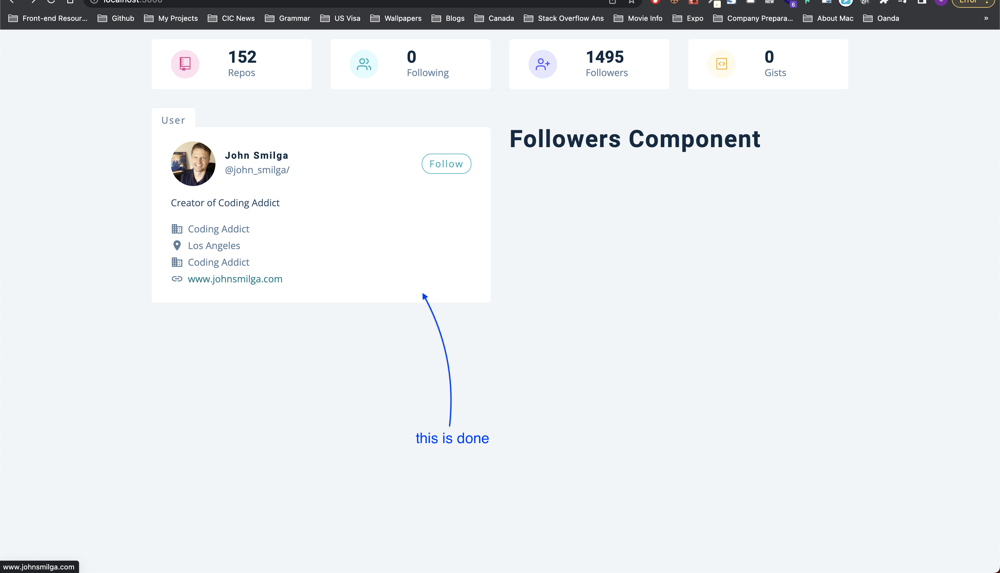

# Project details

[Github Users]()

## Details

This project contains user registration and login functionality where user can register/login using username/password, OR throguh social accounts like Google, Facebook. Once the user logs in, he can search a github profile and get all the info about a profile like number of followers, languages, most cloned repos and so on. All the data could be represented using different charts like Bar Chart, Doughnut Chart and so on. We use `auth0` library for authenticaton.

_Starter Project, Commit ID_- `a993b413d2c24f7de7669834aa6061303a016cbb`

---

---

## Things we can learn

- Difference between `exact` and `Switch` in react-router-5

---

### Difference between `exact` and `Switch` in react-router-5

**`exact`**


**`switch`**


---

---

---

## Flow of the app

Since this is a big app, we would note down the flow of the app.

#### 1. Initial Pages we see when app starts (after setting up the starter project)

`24_github_users/src/App.js`

- We see 3 components on the `App.js` - Dashboard Page, Login Page and Error Page


- The development idea is, we show the `Login` page (protected route) and when the user logs in then he can see `Dashboard` page. If he navigates to unknown route then the `Error` page is shown. So we put these 3 in App.js to begin with

---

#### 2. Setup React Router 5

`24_github_users/src/App.js`

- In the App.js we setup the react router v5 basic routes
- We enclose everything in `BrowserRouter (as Router)`, and use `Switch` so the first matching route is rendered. to understand better about exact and Switch and their differences, refer the _Things we can learn_ or [Watch this short video](https://www.youtube.com/watch?v=jVtxC6CKzYU&ab_channel=kudvenkat)
- At this point our `App.js` looks like this

```js
function App() {
  return (
    <Router>
      <Route path="/" exact>
        <Dashboard></Dashboard>
      </Route>
      <Route path="/login">
        <Login />
      </Route>
    </Router>
  )
}
```

- We will add `Error` later

---

#### 3. Let's add error

`24_github_users/src/App.js`

Now if the user navigates to the URL that doesn't exist then he will get a blank page. We need to avoid that using default route for `Error`

```js
function App() {
  return (
    <Router>
      <Route path="/" exact>
        <Dashboard></Dashboard>
      </Route>
      <Route path="/login">
        <Login />
      </Route>

      {/* Default route to show error page if none of the above routes match */}
      <Router path="*">
        <Error />
      </Router>
    </Router>
  )
}
```

---

#### 4. Let's add Switch

`24_github_users/src/App.js`

Now, if we navigate to unknown URL the error page is displayed. But notice one thing, when you navigate to dashboard `/`, the error page is also shown along with Dashboard


- This happens even though you have `exact` on `Dashboard`
- If we add `Switch` to all the routes, this would behave properly and show only Dashboard, so the code looks like this

```js
function App() {
  return (
    <Router>
      {/* Switch matches the first matching route. Note that * would be the second match to any route generally as it matches everything like /, /login, /about, /noroute and so on */}
      <Switch>
        <Route path="/" exact>
          <Dashboard></Dashboard>
        </Route>
        <Route path="/login">
          <Login />
        </Route>

        {/* Default route to show error page if none of the above routes match */}
        <Route path="*">
          <Error />
        </Route>
      </Switch>
    </Router>
  )
}
```

- I know it is confusing about the difference between `exact` and `Switch`, so I have explained the difference in detail in _Things we can learn section_ above

---

#### 5. Let's **style** Error page

`24_github_users/src/pages/Error.js`

For now, we will navigate back the user to the home page `/`, but later once we will setup the private route, if user isn't logged in then we will send him back to `/login` route (Login page)

```js
import React from 'react'
import styled from 'styled-components'
import { Link } from 'react-router-dom'
const Error = () => {
  return (
    <Wrapper>
      <div>
        <h1>404</h1>
        <h3>sorry, the page you tried cannot be found</h3>
        {/* btn is coming from Global CSS and not styled components */}
        <Link to="/" className="btn">
          back home
        </Link>
      </div>
    </Wrapper>
  )
}
const Wrapper = styled.section`
  min-height: 100vh;
  display: grid;
  place-items: center;
  background: var(--clr-primary-10);
  text-align: center;
  h1 {
    font-size: 10rem;
  }
  h3 {
    color: var(--clr-grey-3);
    margin-bottom: 1.5rem;
  }
`
export default Error
```

---

#### 6. Let's **style** Login page - no login functionality yet, just the UI

`24_github_users/src/pages/Login.js`

```js
import React from 'react'
import { useAuth0 } from '@auth0/auth0-react'
import styled from 'styled-components'
import loginImg from '../images/login-img.svg'
const Login = () => {
  return (
    <Wrapper>
      <div className="container">
        
        <h1>github user</h1>
        {/* TODO: We will implement the login functionality later once the button is clicked */}
        <button className="btn">Login</button>
      </div>
    </Wrapper>
  )
}
const Wrapper = styled.section`
  min-height: 100vh;
  display: grid;
  place-items: center;
  .container {
    width: 90vw;
    max-width: 600px;
    text-align: center;
  }
  img {
    margin-bottom: 2rem;
  }
  h1 {
    margin-bottom: 1.5rem;
  }
`
export default Login
```

---

#### 7. Let's **style** the Dashboard page, just basic UI

`24_github_users/src/pages/Dashboard.js`

**_intial setup_** we will come back to this later after setting up some state values in the context in next step

```js
import React from 'react'
// importing this way in single line is possible because of index.js inside /components
import { Info, Repos, User, Search, Navbar } from '../components'
import loadingImage from '../images/preloader.gif'
import { GithubContext } from '../context/context'
const Dashboard = () => {
  return (
    <main>
      <Navbar></Navbar>
      <Search />
      <Info />
      <Repos />
    </main>
  )
}

export default Dashboard
```

---

#### 8. Let's setup some context

`24_github_users/src/context/context.js` -> context Provider implemeted
`24_github_users/src/index.js` -> context Provider used
`24_github_users/src/components/Info.js` -> testing if we are able to render context value to the screen

Let's setup some state values in the context so we can use in our dashboard page.

**`context.js`**

```js
import React, { useState, useEffect, createContext, useContext } from 'react'
import mockUser from './mockData/mockUser'
import mockRepos from './mockData/mockRepos'
import mockFollowers from './mockData/mockFollowers'
import axios from 'axios'

const rootUrl = 'https://api.github.com'

const GithubContext = createContext()

const GithubProvider = ({ children }) => {
  return (
    <GithubContext.Provider value="test-value">
      {children}
    </GithubContext.Provider>
  )
}

// custom hook that starts with use
const useGlobalContext = () => {
  return useContext(GithubContext)
}

export { GithubProvider, useGlobalContext }
```

**Let's now wrap our app inside the `index.js`**

```js
import React from 'react'
import ReactDOM from 'react-dom/client'
import './index.css'
import App from './App'
import reportWebVitals from './reportWebVitals'
import { GithubProvider } from './context/context'

const root = ReactDOM.createRoot(document.getElementById('root'))
root.render(
  <React.StrictMode>
    <GithubProvider>
      <App />
    </GithubProvider>
  </React.StrictMode>
)

// If you want to start measuring performance in your app, pass a function
// to log results (for example: reportWebVitals(console.log))
// or send to an analytics endpoint. Learn more: https://bit.ly/CRA-vitals
reportWebVitals()
```

**Let's now test our context values inside `Info.js`**

```js
import React from 'react'
import { GithubContext, useGlobalContext } from '../context/context'
import styled from 'styled-components'
import { GoRepo, GoGist } from 'react-icons/go'
import { FiUsers, FiUserPlus } from 'react-icons/fi'

const UserInfo = () => {
  const data = useGlobalContext()
  // TESTING THE CONTEXT
  return <h2>user info component : {data}</h2>
}

const Wrapper = styled.section`
  display: grid;
  grid-template-columns: repeat(auto-fill, minmax(200px, 1fr));
  gap: 1rem 2rem;
  @media (min-width: 640px) {
    grid-template-columns: repeat(auto-fill, minmax(260px, 1fr));
  }
  .item {
    border-radius: var(--radius);
    padding: 1rem 2rem;
    background: var(--clr-white);
    display: grid;
    grid-template-columns: auto 1fr;
    column-gap: 3rem;
    align-items: center;
    span {
      width: 3rem;
      height: 3rem;
      display: grid;
      place-items: center;
      border-radius: 50%;
    }
    .icon {
      font-size: 1.5rem;
    }
    h3 {
      margin-bottom: 0;
      letter-spacing: 0;
    }
    p {
      margin-bottom: 0;
      text-transform: capitalize;
    }
    .pink {
      background: #ffe0f0;
      color: #da4a91;
    }
    .green {
      background: var(--clr-primary-10);
      color: var(--clr-primary-5);
    }
    .purple {
      background: #e6e6ff;
      color: #5d55fa;
    }
    .yellow {
      background: #fffbea;
      color: #f0b429;
    }
  }
`

export default UserInfo
```

---

#### 9. Info about mockData

`24_github_users/src/context/mockData`

_Why do we need mock data when the github API is free and no API key is required?_

- When you work with Github API, they have limits. Each and everytime when we search for a different user, we will run out of our requests pretty quickly (60 requests per hour).
- That's why we have static data (mockData which is copied from real data but use in our development until everything is setup). In `mockData` folder we have `mockFollowers`, `mockRepos`, `mockUsers`
- The requests to API is tracked by the IP address and not the user we search for, and that is the reason, when I search for any user, my IP address is the one that makes request and I will run out of requests very soon

**_Gihthub API_**

- [Root Endpoint](https://api.github.com)
- [Get User](https://api.github.com/users/wesbos)
- [Repos](https://api.github.com/users/john-smilga/repos?per_page=100)
- [Followers](https://api.github.com/users/john-smilga/followers)
- [Rate Limit](https://api.github.com/rate_limit)

So the key takeaway is, until we hook up everything, we will use the mock data in our context to power up our app.

---

#### 10. Setup state values of mockData in context

`24_github_users/src/context/context.js`
`24_github_users/src/components/Info.js`

We will now setup some state values to use API data, but not real API call, instead we will use mock for the reasons explained above

**`context.js`**

```js
import React, { useState, useEffect, createContext, useContext } from 'react'
import mockUser from './mockData/mockUser'
import mockRepos from './mockData/mockRepos'
import mockFollowers from './mockData/mockFollowers'
import axios from 'axios'

const rootUrl = 'https://api.github.com'

const GithubContext = createContext()

const GithubProvider = ({ children }) => {
  // github user state is the user we get from mockData / the user we search for (not the user who is logged in)
  const [githubUser, setGithubUser] = useState(mockUser)
  const [repos, setRepos] = useState(mockRepos)
  const [followers, setFollowers] = useState(mockFollowers)

  return (
    <GithubContext.Provider value={{ githubUser, repos, followers }}>
      {children}
    </GithubContext.Provider>
  )
}

// custom hook that starts with use
const useGlobalContext = () => {
  return useContext(GithubContext)
}

export { GithubProvider, useGlobalContext }
```

**`Info.js`**

```js
const UserInfo = () => {
  const data = useGlobalContext()
  // TESTING THE CONTEXT
  console.log(data) // this would give the mock repos, mock followers and mock user - placed in mockData folder
  return <h2>user info component </h2>
}
```

Now that we are getting the mock data back (of course we will hook up real data through axios calls to github api later), we can now populate the Dashboard UI

---

#### 11. Let's work on User info part that shows followers, repos and so on

`24_github_users/src/components/Info.js`

Let's work on this user info section that shows repos, followers, following and gists. We can work on Search bar once everything is setup so that we can search for real data (make API calls) instead of mocks. We can work on Navbar once the auth is hooked up. For now we will focus on this user info section.


For real data, [this would be the URL for githubUsers](https://api.github.com/users/wesbos) and the mock would be `mockUser`

```js
import React from 'react'
import { GithubContext, useGlobalContext } from '../context/context'
import styled from 'styled-components'
import { GoRepo, GoGist } from 'react-icons/go'
import { FiUsers, FiUserPlus } from 'react-icons/fi'

const UserInfo = () => {
  const { githubUser } = useGlobalContext()
  console.log(githubUser)
  const { public_repos, followers, following, public_gists } = githubUser

  // since each item (like public_repos, followers and so on) will have different icons, let's create an object
  const items = [
    {
      id: 1,
      icon: <GoRepo className="icon" />,
      label: 'repos',
      value: public_repos,
      color: 'pink',
    },
    {
      id: 2,
      icon: <FiUsers className="icon" />,
      label: 'following',
      value: following,
      color: 'green',
    },
    {
      id: 3,
      icon: <FiUserPlus className="icon" />,
      label: 'followers',
      value: followers,
      color: 'purple',
    },
    {
      id: 4,
      icon: <GoGist className="icon" />,
      label: 'gists',
      value: public_gists,
      color: 'yellow',
    },
  ]
  return (
    <section className="section">
      {/* styled component + global style added heree to Wrapper */}
      <Wrapper className="section-center">
        {items.map((item) => {
          return <Item key={item.id} {...item} />
        })}
      </Wrapper>
    </section>
  )
}

// We could have had other component for above Item, but just doing it here
const Item = ({ icon, label, color, value }) => {
  return (
    <article className="item">
      <span className={color}>{icon}</span>
      <div>
        <h3>{value}</h3>
        <p>{label}</p>
      </div>
    </article>
  )
}

const Wrapper = styled.section`
  display: grid;
  grid-template-columns: repeat(auto-fill, minmax(200px, 1fr));
  gap: 1rem 2rem;
  @media (min-width: 640px) {
    grid-template-columns: repeat(auto-fill, minmax(260px, 1fr));
  }
  .item {
    border-radius: var(--radius);
    padding: 1rem 2rem;
    background: var(--clr-white);
    display: grid;
    grid-template-columns: auto 1fr;
    column-gap: 3rem;
    align-items: center;
    span {
      width: 3rem;
      height: 3rem;
      display: grid;
      place-items: center;
      border-radius: 50%;
    }
    .icon {
      font-size: 1.5rem;
    }
    h3 {
      margin-bottom: 0;
      letter-spacing: 0;
    }
    p {
      margin-bottom: 0;
      text-transform: capitalize;
    }
    .pink {
      background: #ffe0f0;
      color: #da4a91;
    }
    .green {
      background: var(--clr-primary-10);
      color: var(--clr-primary-5);
    }
    .purple {
      background: #e6e6ff;
      color: #5d55fa;
    }
    .yellow {
      background: #fffbea;
      color: #f0b429;
    }
  }
`

export default UserInfo
```

---

#### 12. Let's now design User Component now

`24_github_users/src/pages/Dashboard.js` -> Used in App.js
`24_github_users/src/components/User.js` -> Used in Dashboard
`24_github_users/src/components/Card.js` -> Used in User


**Dashboard.js**

```js
import React from 'react'
// importing this way in single line is possible because of index.js inside /components
import { Info, Repos, User, Search, Navbar } from '../components'
import loadingImage from '../images/preloader.gif'
import { GithubContext } from '../context/context'
const Dashboard = () => {
  return (
    <main>
      {/* <Navbar></Navbar>
      <Search /> */}
      <Info />
      <User />
      {/* <Repos /> */}
    </main>
  )
}

export default Dashboard
```



**User.js**

```js
import React from 'react'
import styled from 'styled-components'
import Card from './Card'
import Followers from './Followers'
const User = () => {
  return (
    <section className="section">
      <Wrapper className="section-center">
        <Card></Card>
        <Followers></Followers>
      </Wrapper>
    </section>
  )
}

const Wrapper = styled.div`
  padding-top: 2rem;
  display: grid;
  gap: 3rem 2rem;
  @media (min-width: 992px) {
    grid-template-columns: 1fr 1fr;
  }
  /* align-items: start; */
`

export default User
```

**Card.js**

```js
import React from 'react'
import { GithubContext, useGlobalContext } from '../context/context'
import styled from 'styled-components'
import { MdBusiness, MdLocationOn, MdLink } from 'react-icons/md'
const Card = () => {
  const { githubUser } = useGlobalContext()
  const {
    avatar_url,
    html_url,
    name,
    company,
    blog,
    bio,
    location,
    twitter_username,
  } = githubUser
  return (
    <Wrapper>
      <header>
        
        <div>
          <h4>{name}</h4>
          <p>@{twitter_username || 'john doe'}/</p>
        </div>
        <a href={html_url}>follow</a>
      </header>
      <p className="bio">{bio}</p>
      <div className="links">
        <p>
          <MdBusiness /> {company}
        </p>
        <p>
          <MdLocationOn /> {location || 'earth'}
        </p>
        <p>
          <MdBusiness /> {company}
        </p>
        <a href={`http://${blog}`}>
          <MdLink />
          {blog}
        </a>
      </div>
    </Wrapper>
  )
}
const Wrapper = styled.article`
  background: var(--clr-white);
  padding: 1.5rem 2rem;
  border-top-right-radius: var(--radius);
  border-bottom-left-radius: var(--radius);
  border-bottom-right-radius: var(--radius);
  position: relative;
  &::before {
    content: 'user';
    position: absolute;
    top: 0;
    left: 0;
    transform: translateY(-100%);
    background: var(--clr-white);
    color: var(--clr-grey-5);
    border-top-right-radius: var(--radius);
    border-top-left-radius: var(--radius);
    text-transform: capitalize;
    padding: 0.5rem 1rem 0 1rem;
    letter-spacing: var(--spacing);
    font-size: 1rem;
  }
  header {
    display: grid;
    grid-template-columns: auto 1fr auto;
    align-items: center;
    column-gap: 1rem;
    margin-bottom: 1rem;
    img {
      width: 75px;
      height: 75px;
      border-radius: 50%;
    }
    h4 {
      margin-bottom: 0.25rem;
    }
    p {
      margin-bottom: 0;
    }
    a {
      color: var(--clr-primary-5);
      border: 1px solid var(--clr-primary-5);
      padding: 0.25rem 0.75rem;
      border-radius: 1rem;
      text-transform: capitalize;
      letter-spacing: var(--spacing);
      transition: var(--transition);
      cursor: pointer;
      &:hover {
        background: var(--clr-primary-5);
        color: var(--clr-white);
      }
    }
  }
  .bio {
    color: var(--clr-grey-3);
  }
  .links {
    p,
    a {
      margin-bottom: 0.25rem;
      display: flex;
      align-items: center;
      svg {
        margin-right: 0.5rem;
        font-size: 1.3rem;
      }
    }
    a {
      color: var(--clr-primary-5);
      transition: var(--transition);
      svg {
        color: var(--clr-grey-5);
      }
      &:hover {
        color: var(--clr-primary-3);
      }
    }
  }
`
export default Card
```

---
