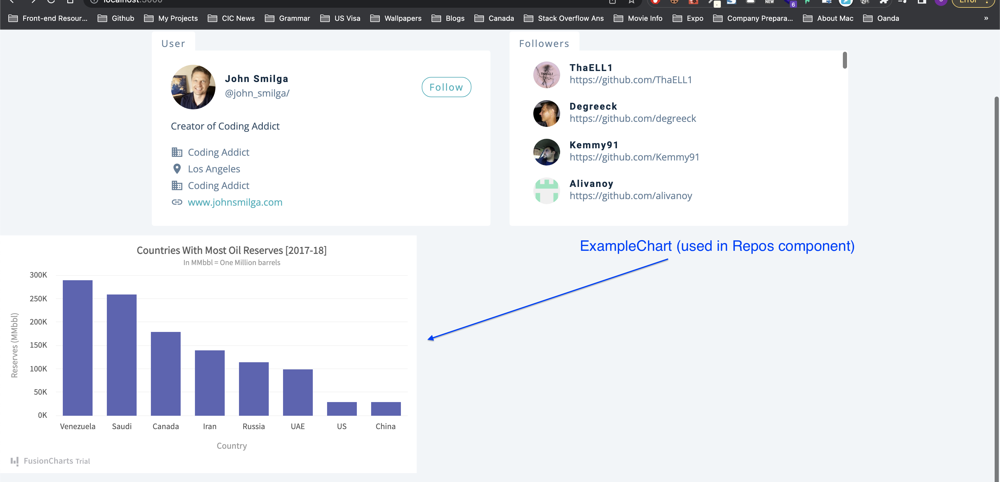
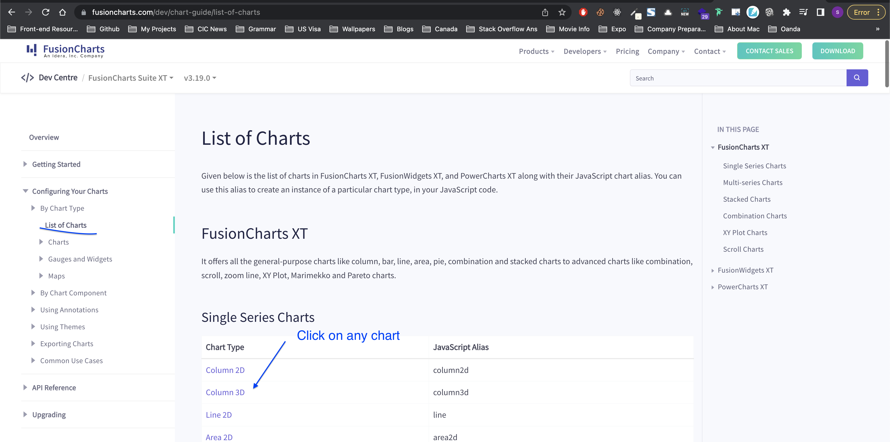

# Project details

[Github Users]()

## Details

This project contains user registration and login functionality where user can register/login using username/password, OR throguh social accounts like Google, Facebook. Once the user logs in, he can search a github profile and get all the info about a profile like number of followers, languages, most cloned repos and so on. All the data could be represented using different charts like Bar Chart, Doughnut Chart and so on. We use `auth0` library for authenticaton.

_Starter Project, Commit ID_- `a993b413d2c24f7de7669834aa6061303a016cbb`

---

---

## Things we can learn

- Difference between `exact` and `Switch` in react-router-5
- `reduce` function to calculate number of times an item occurs in an array of objects
- How to sort an object / How to convert object values into array for sorting purpose
- Alternative setup of useEffect - `useEffect(cbFunction, dependencyArray)`
- How to use `gif` as loading spinner?
- React-router `render` prop and `Redirect` - an alternative way to display underlying route, especially for protected route

---

### Difference between `exact` and `Switch` in react-router-5

**`exact`**


**`switch`**


---

### `reduce` function to calculate number of times an item occurs in an array of objects

We have implemented the reduce function here in [14_shopping_cart](https://github.com/sandeep194920/React_MUI_Express_Projects/tree/master/14_shopping_cart/front-end#how-to-calculate-single-numberlike-sum-from-an-array-using-reduce-function) so please refer this first.

In this case we want to achieve this: We have an array of objects called repos. Each object will have a property called language set to any language like this

```js
/*
repos = [
    {...otherProps, language:'javascript'},
    {...otherProps, language:'HTML'},
    {...otherProps, language:'HTML'},
    {...otherProps, language:'CSS'},
    {...otherProps, language:'CSS'},
  ]
```

Our motive is to convert into this

```js
/* 
  languages = [
    'javascript' : {
      label : 'javascript',
      value : 1
    },
    'HTML' : {
      label : 'HTML',
      value : 2
    },
    'CSS' : {
      label : 'CSS',
      value : 2
    },
  ]
  */
```

For this purpose, we can use a `for loop` (forEach or normal for loop) and also `reduce function`. We will see both the usages.

**Using forEach**

```js
// let langs = {}
// repos.forEach((itemObj) => {
//   const { language } = itemObj
//   if (!language) return
//   if (!langs[language]) {
//     langs[language] = { label: language, value: 1 }
//   } else {
//     langs[language] = { label: language, value: langs[language].value + 1 }
//   }
// })

// console.log(langs)
```

**Using reduce**

```js
let languages = repos.reduce((accObj, itemObj) => {
  //^ remember we need to return an object. The way to remember this is, we need to return what we defined as second param. The second param is the accumulator which is accObj

  const { language } = itemObj

  //& Sometimes the language will be null and in that case we will return same accObj without doing anything. But in anycase, we will have to return accObj
  if (!language) return accObj

  // accObj[language] = language // -> This would return - {JavaScript: 'JavaScript', CSS: 'CSS', HTML: 'HTML'}

  // accObj[language] = { language } // -> This would return the below

  /*
    {
      "JavaScript": {
          "language": "JavaScript"
      },
      "CSS": {
          "language": "CSS"
      },
      "HTML": {
          "language": "HTML"
      }
    */

  // We will tweak this a little now

  if (!accObj[language]) {
    accObj[language] = { label: language, value: 1 }
  } else {
    accObj[language] = { label: language, value: accObj[language].value + 1 }
  }

  // Now the accObj will look this this

  /*
    {
      "JavaScript": {
          "label": "JavaScript",
          "value": 45
      },
      "CSS": {
          "label": "CSS",
          "value": 38
      },
      "HTML": {
          "label": "HTML",
          "value": 14
      }
    }
  */
  return accObj
}, {})

console.log(languages)
```

**_In `reduce`, we don't define a variable externally, and instead use the accumulator, first parameter inside reducer. In `forEach`, we define the variable outside of the function unlike `reduce`_**

---

### How to sort an object / How to convert object values into array for sorting purpose

From the above result of languages, we see this

```js
languages = {
  JavaScript: {
    label: 'JavaScript',
    value: 45,
  },
  CSS: {
    label: 'CSS',
    value: 38,
  },
  HTML: {
    label: 'HTML',
    value: 14,
  },
}
```

Now, we need to sort the languages based on `value` prop of each sub-object. For that we need to convert this lanugages object into array and then sort that array based on value prop of each object

So, two steps,

- convert this lanugages object into array
- then sort that array based on value prop of each object

**step 1:** convert this lanugages object into array

```js
languages = Object.values(languages)
```

Now the languages would be

```js
languages = [
  {
    label: 'JavaScript',
    value: 45,
  },
  {
    label: 'CSS',
    value: 38,
  },
  {
    label: 'HTML',
    value: 14,
  },
]
```

This looks like it's already sorted, but it's a coincidence here. We need to sort this to be safe

**_Note from the future:_** Hmm, may not be coincidence. [Read this](https://stackoverflow.com/questions/5525795/does-javascript-guarantee-object-property-order). There is a question in udemy about same this, [refer this](https://www.udemy.com/course/react-tutorial-and-projects-course/learn/lecture/21054980#questions/13962286).

By these articles, we understand that the modern browsers and modern JS arrange the keys in order, but still it's safe to sort them just in case


**step2:** then sort that array based on value prop of each object

```js
languages = languages.sort((a, b) => b.value - a.value)
```

Now the languages will be sorted. I would like to take only first five languages (in this case it is less than 5, but not always)

```js
languages = languages.slice(0, 5)
```

I could have combined above two steps into one like this

```js
languages = languages.sort((a, b) => b.value - a.value).slice(0, 5)
```

---

### Alternative setup of useEffect - `useEffect(cbFunction, dependencyArray)`

We can write useEffect in 4 flavours. We have seen first three, but let's learn about the fourth one as well. All these are in `context.js` if you want to take a look

**1. Using async await as we know**

```js
const checkRateLimit = async () => {
  try {
    const result = await axios(`${rootUrl}/rate_limit`)
    console.log(result)
  } catch (e) {
    console.log(e)
  }
}
useEffect(() => {
  console.log('hey app loaded')
  checkRateLimit()
}, [])
```

**2. Using then catch as we know**

```js
// check rate limit (remaining requests)
const checkRateLimit = () => {
  axios(`${rootUrl}/rate_limit`)
    .then((result) => {
      console.log(result)
    })
    .catch((error) => {
      console.log(error)
    })
}

useEffect(() => {
  checkRateLimit()
}, [])
```

**3. Using then catch as we know inside the useEffect itself**

```js
useEffect(() => {
  axios(`${rootUrl}/rate_limit`)
    .then((result) => {
      console.log(result)
    })
    .catch((error) => {
      console.log(error)
    })
}, [])
```

Now, if you observe the above useEffect, our `checkRateLimit` function is directly written inside the useEffect -> this part I mean

```js
;() => {
  axios(`${rootUrl}/rate_limit`)
    .then((result) => {
      console.log(result)
    })
    .catch((error) => {
      console.log(error)
    })
}
```

so we can write our 4th type based on this

**4. Putting the callback function outside the useEffect in type 3 becomes type 4**

```js
const checkRateLimit = () => {
  axios(`${rootUrl}/rate_limit`)
    .then((result) => {
      console.log(result)
    })
    .catch((error) => {
      console.log(error)
    })
}

useEffect(checkRateLimit, [])
```

---

### How to use `gif` as loading spinner?

```js
import loadingImage from '../images/preloader.gif'

// ...jsx
;
// ...jsx
```

---

### React-router `render` prop and `Redirect` - an alternative way to display underlying route, especially for protected route

Let's say we have a route like this

```js
<Route path="/testingRenderprop">
  <div>
    <h1>This is render prop route</h1>
  </div>
</Route>
```

and when you visit `/testingRenderprop` you will see this


Using `render prop` we could write the above route like this

```js
<Route
  path="/testingRenderprop"
  // we are returning the route
  render={() => (
    <div>
      <h1>This is render prop route</h1>
    </div>
  )}
/>
```

OR with return statement like this

```js
<Route
  path="/testingRenderprop"
  render={() => {
    return (
      <div>
        <h1>This is render prop route</h1>
      </div>
    )
  }}
/>
```

Now, why do we need to use `render` prop? To conditionally show some route. If `condition A` show `route A` else show or `redirect` to `route B` like below

```js

const day='monday'

// ....
<Route
  path="/testingRenderprop"
  render={() => {
    return day === 'monday' ? (
      <h1>Today is Monday</h1>
    ) : (
      <h3>Today is not Monday</h3>
    )
  }}
/>

```

Let's say we need to redirect to /monday if the day is monday

```js
const day='monday'
// ....
<Route
  path="/testingRenderprop"
  render={() => {
    return day === 'monday' ? (
      <Redirect to="/monday" />
    ) : (
      <h3>Today is not Monday</h3>
    )
  }}
/>
```

---

---

## Flow of the app

Since this is a big app, we would note down the flow of the app.

#### 1. Initial Pages we see when app starts (after setting up the starter project)

`24_github_users/src/App.js`

- We see 3 components on the `App.js` - Dashboard Page, Login Page and Error Page


- The development idea is, we show the `Login` page (protected route) and when the user logs in then he can see `Dashboard` page. If he navigates to unknown route then the `Error` page is shown. So we put these 3 in App.js to begin with

---

#### 2. Setup React Router 5

`24_github_users/src/App.js`

- In the App.js we setup the react router v5 basic routes
- We enclose everything in `BrowserRouter (as Router)`, and use `Switch` so the first matching route is rendered. to understand better about exact and Switch and their differences, refer the _Things we can learn_ or [Watch this short video](https://www.youtube.com/watch?v=jVtxC6CKzYU&ab_channel=kudvenkat)
- At this point our `App.js` looks like this

```js
function App() {
  return (
    <Router>
      <Route path="/" exact>
        <Dashboard></Dashboard>
      </Route>
      <Route path="/login">
        <Login />
      </Route>
    </Router>
  )
}
```

- We will add `Error` later

---

#### 3. Let's add error

`24_github_users/src/App.js`

Now if the user navigates to the URL that doesn't exist then he will get a blank page. We need to avoid that using default route for `Error`

```js
function App() {
  return (
    <Router>
      <Route path="/" exact>
        <Dashboard></Dashboard>
      </Route>
      <Route path="/login">
        <Login />
      </Route>

      {/* Default route to show error page if none of the above routes match */}
      <Router path="*">
        <Error />
      </Router>
    </Router>
  )
}
```

---

#### 4. Let's add Switch

`24_github_users/src/App.js`

Now, if we navigate to unknown URL the error page is displayed. But notice one thing, when you navigate to dashboard `/`, the error page is also shown along with Dashboard


- This happens even though you have `exact` on `Dashboard`
- If we add `Switch` to all the routes, this would behave properly and show only Dashboard, so the code looks like this

```js
function App() {
  return (
    <Router>
      {/* Switch matches the first matching route. Note that * would be the second match to any route generally as it matches everything like /, /login, /about, /noroute and so on */}
      <Switch>
        <Route path="/" exact>
          <Dashboard></Dashboard>
        </Route>
        <Route path="/login">
          <Login />
        </Route>

        {/* Default route to show error page if none of the above routes match */}
        <Route path="*">
          <Error />
        </Route>
      </Switch>
    </Router>
  )
}
```

- I know it is confusing about the difference between `exact` and `Switch`, so I have explained the difference in detail in _Things we can learn section_ above

---

#### 5. Let's **style** Error page

`24_github_users/src/pages/Error.js`

For now, we will navigate back the user to the home page `/`, but later once we will setup the private route, if user isn't logged in then we will send him back to `/login` route (Login page)

```js
import React from 'react'
import styled from 'styled-components'
import { Link } from 'react-router-dom'
const Error = () => {
  return (
    <Wrapper>
      <div>
        <h1>404</h1>
        <h3>sorry, the page you tried cannot be found</h3>
        {/* btn is coming from Global CSS and not styled components */}
        <Link to="/" className="btn">
          back home
        </Link>
      </div>
    </Wrapper>
  )
}
const Wrapper = styled.section`
  min-height: 100vh;
  display: grid;
  place-items: center;
  background: var(--clr-primary-10);
  text-align: center;
  h1 {
    font-size: 10rem;
  }
  h3 {
    color: var(--clr-grey-3);
    margin-bottom: 1.5rem;
  }
`
export default Error
```

---

#### 6. Let's **style** Login page - no login functionality yet, just the UI

`24_github_users/src/pages/Login.js`

```js
import React from 'react'
import { useAuth0 } from '@auth0/auth0-react'
import styled from 'styled-components'
import loginImg from '../images/login-img.svg'
const Login = () => {
  return (
    <Wrapper>
      <div className="container">
        
        <h1>github user</h1>
        {/* TODO: We will implement the login functionality later once the button is clicked */}
        <button className="btn">Login</button>
      </div>
    </Wrapper>
  )
}
const Wrapper = styled.section`
  min-height: 100vh;
  display: grid;
  place-items: center;
  .container {
    width: 90vw;
    max-width: 600px;
    text-align: center;
  }
  img {
    margin-bottom: 2rem;
  }
  h1 {
    margin-bottom: 1.5rem;
  }
`
export default Login
```

---

#### 7. Let's **style** the Dashboard page, just basic UI

`24_github_users/src/pages/Dashboard.js`

**_intial setup_** we will come back to this later after setting up some state values in the context in next step

```js
import React from 'react'
// importing this way in single line is possible because of index.js inside /components
import { Info, Repos, User, Search, Navbar } from '../components'
import loadingImage from '../images/preloader.gif'
import { GithubContext } from '../context/context'
const Dashboard = () => {
  return (
    <main>
      <Navbar></Navbar>
      <Search />
      <Info />
      <Repos />
    </main>
  )
}

export default Dashboard
```

---

#### 8. Let's setup some context

`24_github_users/src/context/context.js` -> context Provider implemeted
`24_github_users/src/index.js` -> context Provider used
`24_github_users/src/components/Info.js` -> testing if we are able to render context value to the screen

Let's setup some state values in the context so we can use in our dashboard page.

**`context.js`**

```js
import React, { useState, useEffect, createContext, useContext } from 'react'
import mockUser from './mockData/mockUser'
import mockRepos from './mockData/mockRepos'
import mockFollowers from './mockData/mockFollowers'
import axios from 'axios'

const rootUrl = 'https://api.github.com'

const GithubContext = createContext()

const GithubProvider = ({ children }) => {
  return (
    <GithubContext.Provider value="test-value">
      {children}
    </GithubContext.Provider>
  )
}

// custom hook that starts with use
const useGlobalContext = () => {
  return useContext(GithubContext)
}

export { GithubProvider, useGlobalContext }
```

**Let's now wrap our app inside the `index.js`**

```js
import React from 'react'
import ReactDOM from 'react-dom/client'
import './index.css'
import App from './App'
import reportWebVitals from './reportWebVitals'
import { GithubProvider } from './context/context'

const root = ReactDOM.createRoot(document.getElementById('root'))
root.render(
  <React.StrictMode>
    <GithubProvider>
      <App />
    </GithubProvider>
  </React.StrictMode>
)

// If you want to start measuring performance in your app, pass a function
// to log results (for example: reportWebVitals(console.log))
// or send to an analytics endpoint. Learn more: https://bit.ly/CRA-vitals
reportWebVitals()
```

**Let's now test our context values inside `Info.js`**

```js
import React from 'react'
import { GithubContext, useGlobalContext } from '../context/context'
import styled from 'styled-components'
import { GoRepo, GoGist } from 'react-icons/go'
import { FiUsers, FiUserPlus } from 'react-icons/fi'

const UserInfo = () => {
  const data = useGlobalContext()
  // TESTING THE CONTEXT
  return <h2>user info component : {data}</h2>
}

const Wrapper = styled.section`
  display: grid;
  grid-template-columns: repeat(auto-fill, minmax(200px, 1fr));
  gap: 1rem 2rem;
  @media (min-width: 640px) {
    grid-template-columns: repeat(auto-fill, minmax(260px, 1fr));
  }
  .item {
    border-radius: var(--radius);
    padding: 1rem 2rem;
    background: var(--clr-white);
    display: grid;
    grid-template-columns: auto 1fr;
    column-gap: 3rem;
    align-items: center;
    span {
      width: 3rem;
      height: 3rem;
      display: grid;
      place-items: center;
      border-radius: 50%;
    }
    .icon {
      font-size: 1.5rem;
    }
    h3 {
      margin-bottom: 0;
      letter-spacing: 0;
    }
    p {
      margin-bottom: 0;
      text-transform: capitalize;
    }
    .pink {
      background: #ffe0f0;
      color: #da4a91;
    }
    .green {
      background: var(--clr-primary-10);
      color: var(--clr-primary-5);
    }
    .purple {
      background: #e6e6ff;
      color: #5d55fa;
    }
    .yellow {
      background: #fffbea;
      color: #f0b429;
    }
  }
`

export default UserInfo
```

---

#### 9. Info about mockData

`24_github_users/src/context/mockData`

_Why do we need mock data when the github API is free and no API key is required?_

- When you work with Github API, they have limits. Each and everytime when we search for a different user, we will run out of our requests pretty quickly (60 requests per hour).
- That's why we have static data (mockData which is copied from real data but use in our development until everything is setup). In `mockData` folder we have `mockFollowers`, `mockRepos`, `mockUsers`
- The requests to API is tracked by the IP address and not the user we search for, and that is the reason, when I search for any user, my IP address is the one that makes request and I will run out of requests very soon

**_Gihthub API_**

- [Root Endpoint](https://api.github.com)
- [Get User](https://api.github.com/users/wesbos)
- [Repos](https://api.github.com/users/john-smilga/repos?per_page=100)
- [Followers](https://api.github.com/users/john-smilga/followers)
- [Rate Limit](https://api.github.com/rate_limit)

So the key takeaway is, until we hook up everything, we will use the mock data in our context to power up our app.

---

#### 10. Setup state values of mockData in context

`24_github_users/src/context/context.js`
`24_github_users/src/components/Info.js`

We will now setup some state values to use API data, but not real API call, instead we will use mock for the reasons explained above

**`context.js`**

```js
import React, { useState, useEffect, createContext, useContext } from 'react'
import mockUser from './mockData/mockUser'
import mockRepos from './mockData/mockRepos'
import mockFollowers from './mockData/mockFollowers'
import axios from 'axios'

const rootUrl = 'https://api.github.com'

const GithubContext = createContext()

const GithubProvider = ({ children }) => {
  // github user state is the user we get from mockData / the user we search for (not the user who is logged in)
  const [githubUser, setGithubUser] = useState(mockUser)
  const [repos, setRepos] = useState(mockRepos)
  const [followers, setFollowers] = useState(mockFollowers)

  return (
    <GithubContext.Provider value={{ githubUser, repos, followers }}>
      {children}
    </GithubContext.Provider>
  )
}

// custom hook that starts with use
const useGlobalContext = () => {
  return useContext(GithubContext)
}

export { GithubProvider, useGlobalContext }
```

**`Info.js`**

```js
const UserInfo = () => {
  const data = useGlobalContext()
  // TESTING THE CONTEXT
  console.log(data) // this would give the mock repos, mock followers and mock user - placed in mockData folder
  return <h2>user info component </h2>
}
```

Now that we are getting the mock data back (of course we will hook up real data through axios calls to github api later), we can now populate the Dashboard UI

---

#### 11. Let's work on User info part that shows followers, repos and so on

`24_github_users/src/components/Info.js`

Let's work on this user info section that shows repos, followers, following and gists. We can work on Search bar once everything is setup so that we can search for real data (make API calls) instead of mocks. We can work on Navbar once the auth is hooked up. For now we will focus on this user info section.


For real data, [this would be the URL for githubUsers](https://api.github.com/users/wesbos) and the mock would be `mockUser`

```js
import React from 'react'
import { GithubContext, useGlobalContext } from '../context/context'
import styled from 'styled-components'
import { GoRepo, GoGist } from 'react-icons/go'
import { FiUsers, FiUserPlus } from 'react-icons/fi'

const UserInfo = () => {
  const { githubUser } = useGlobalContext()
  console.log(githubUser)
  const { public_repos, followers, following, public_gists } = githubUser

  // since each item (like public_repos, followers and so on) will have different icons, let's create an object
  const items = [
    {
      id: 1,
      icon: <GoRepo className="icon" />,
      label: 'repos',
      value: public_repos,
      color: 'pink',
    },
    {
      id: 2,
      icon: <FiUsers className="icon" />,
      label: 'following',
      value: following,
      color: 'green',
    },
    {
      id: 3,
      icon: <FiUserPlus className="icon" />,
      label: 'followers',
      value: followers,
      color: 'purple',
    },
    {
      id: 4,
      icon: <GoGist className="icon" />,
      label: 'gists',
      value: public_gists,
      color: 'yellow',
    },
  ]
  return (
    <section className="section">
      {/* styled component + global style added heree to Wrapper */}
      <Wrapper className="section-center">
        {items.map((item) => {
          return <Item key={item.id} {...item} />
        })}
      </Wrapper>
    </section>
  )
}

// We could have had other component for above Item, but just doing it here
const Item = ({ icon, label, color, value }) => {
  return (
    <article className="item">
      <span className={color}>{icon}</span>
      <div>
        <h3>{value}</h3>
        <p>{label}</p>
      </div>
    </article>
  )
}

const Wrapper = styled.section`
  display: grid;
  grid-template-columns: repeat(auto-fill, minmax(200px, 1fr));
  gap: 1rem 2rem;
  @media (min-width: 640px) {
    grid-template-columns: repeat(auto-fill, minmax(260px, 1fr));
  }
  .item {
    border-radius: var(--radius);
    padding: 1rem 2rem;
    background: var(--clr-white);
    display: grid;
    grid-template-columns: auto 1fr;
    column-gap: 3rem;
    align-items: center;
    span {
      width: 3rem;
      height: 3rem;
      display: grid;
      place-items: center;
      border-radius: 50%;
    }
    .icon {
      font-size: 1.5rem;
    }
    h3 {
      margin-bottom: 0;
      letter-spacing: 0;
    }
    p {
      margin-bottom: 0;
      text-transform: capitalize;
    }
    .pink {
      background: #ffe0f0;
      color: #da4a91;
    }
    .green {
      background: var(--clr-primary-10);
      color: var(--clr-primary-5);
    }
    .purple {
      background: #e6e6ff;
      color: #5d55fa;
    }
    .yellow {
      background: #fffbea;
      color: #f0b429;
    }
  }
`

export default UserInfo
```

---

#### 12. Let's now design User Component

`24_github_users/src/pages/Dashboard.js` -> Used in App.js
`24_github_users/src/components/User.js` -> Used in Dashboard
`24_github_users/src/components/Card.js` -> Used in User


**Dashboard.js**

```js
import React from 'react'
// importing this way in single line is possible because of index.js inside /components
import { Info, Repos, User, Search, Navbar } from '../components'
import loadingImage from '../images/preloader.gif'
import { GithubContext } from '../context/context'
const Dashboard = () => {
  return (
    <main>
      {/* <Navbar></Navbar>
      <Search /> */}
      <Info />
      <User />
      {/* <Repos /> */}
    </main>
  )
}

export default Dashboard
```

**User.js**

```js
import React from 'react'
import styled from 'styled-components'
import Card from './Card'
import Followers from './Followers'
const User = () => {
  return (
    <section className="section">
      <Wrapper className="section-center">
        <Card></Card>
        <Followers></Followers>
      </Wrapper>
    </section>
  )
}

const Wrapper = styled.div`
  padding-top: 2rem;
  display: grid;
  gap: 3rem 2rem;
  @media (min-width: 992px) {
    grid-template-columns: 1fr 1fr;
  }
  /* align-items: start; */
`

export default User
```

**Card.js**

```js
import React from 'react'
import { GithubContext, useGlobalContext } from '../context/context'
import styled from 'styled-components'
import { MdBusiness, MdLocationOn, MdLink } from 'react-icons/md'
const Card = () => {
  const { githubUser } = useGlobalContext()
  const {
    avatar_url,
    html_url,
    name,
    company,
    blog,
    bio,
    location,
    twitter_username,
  } = githubUser
  return (
    <Wrapper>
      <header>
        
        <div>
          <h4>{name}</h4>
          <p>@{twitter_username || 'john doe'}/</p>
        </div>
        <a href={html_url}>follow</a>
      </header>
      <p className="bio">{bio}</p>
      <div className="links">
        <p>
          <MdBusiness /> {company}
        </p>
        <p>
          <MdLocationOn /> {location || 'earth'}
        </p>
        <p>
          <MdBusiness /> {company}
        </p>
        <a href={`http://${blog}`}>
          <MdLink />
          {blog}
        </a>
      </div>
    </Wrapper>
  )
}
const Wrapper = styled.article`
  background: var(--clr-white);
  padding: 1.5rem 2rem;
  border-top-right-radius: var(--radius);
  border-bottom-left-radius: var(--radius);
  border-bottom-right-radius: var(--radius);
  position: relative;
  &::before {
    content: 'user';
    position: absolute;
    top: 0;
    left: 0;
    transform: translateY(-100%);
    background: var(--clr-white);
    color: var(--clr-grey-5);
    border-top-right-radius: var(--radius);
    border-top-left-radius: var(--radius);
    text-transform: capitalize;
    padding: 0.5rem 1rem 0 1rem;
    letter-spacing: var(--spacing);
    font-size: 1rem;
  }
  header {
    display: grid;
    grid-template-columns: auto 1fr auto;
    align-items: center;
    column-gap: 1rem;
    margin-bottom: 1rem;
    img {
      width: 75px;
      height: 75px;
      border-radius: 50%;
    }
    h4 {
      margin-bottom: 0.25rem;
    }
    p {
      margin-bottom: 0;
    }
    a {
      color: var(--clr-primary-5);
      border: 1px solid var(--clr-primary-5);
      padding: 0.25rem 0.75rem;
      border-radius: 1rem;
      text-transform: capitalize;
      letter-spacing: var(--spacing);
      transition: var(--transition);
      cursor: pointer;
      &:hover {
        background: var(--clr-primary-5);
        color: var(--clr-white);
      }
    }
  }
  .bio {
    color: var(--clr-grey-3);
  }
  .links {
    p,
    a {
      margin-bottom: 0.25rem;
      display: flex;
      align-items: center;
      svg {
        margin-right: 0.5rem;
        font-size: 1.3rem;
      }
    }
    a {
      color: var(--clr-primary-5);
      transition: var(--transition);
      svg {
        color: var(--clr-grey-5);
      }
      &:hover {
        color: var(--clr-primary-3);
      }
    }
  }
`
export default Card
```


---

#### 13. Let's now design Followers Component

`24_github_users/src/components/Followers.js`

```js
import React from 'react'
import { GithubContext, useGlobalContext } from '../context/context'
import styled from 'styled-components'

const Followers = () => {
  const { followers } = useGlobalContext()

  return (
    <Wrapper>
      <div className="followers">
        {followers.map((follower, index) => {
          const { avatar_url: img, html_url, login } = follower
          return (
            <article key={index}>
              
              <div>
                <h4>{login}</h4>
                <a href={html_url}>{html_url}</a>
              </div>
            </article>
          )
        })}
      </div>
    </Wrapper>
  )
}

const Wrapper = styled.article`
  background: var(--clr-white);
  border-top-right-radius: var(--radius);
  border-bottom-left-radius: var(--radius);
  border-bottom-right-radius: var(--radius);
  position: relative;
  &::before {
    content: ' followers';
    position: absolute;
    top: 0;
    left: 0;
    transform: translateY(-100%);
    background: var(--clr-white);
    color: var(--clr-grey-5);
    border-top-right-radius: var(--radius);
    border-top-left-radius: var(--radius);
    text-transform: capitalize;
    padding: 0.5rem 1rem 0 1rem;
    letter-spacing: var(--spacing);
    font-size: 1rem;
  }
  .followers {
    overflow: scroll;
    height: 260px;
    display: grid;
    grid-template-rows: repeat(auto-fill, minmax(45px, 1fr));
    gap: 1.25rem 1rem;
    padding: 1rem 2rem;
  }
  article {
    transition: var(--transition);
    padding: 0.15rem 0.5rem;
    border-radius: var(--radius);
    display: grid;
    grid-template-columns: auto 1fr;
    align-items: center;
    column-gap: 1rem;
    img {
      height: 100%;
      width: 45px;
      border-radius: 50%;
      object-fit: cover;
    }
    h4 {
      margin-bottom: 0;
    }
    a {
      color: var(--clr-grey-5);
    }
  }
`
export default Followers
```


---

#### 14. Let's now design Repos Component

`24_github_users/src/pages/Dashboard.js` -> Use Repos component here
`24_github_users/src/components/Repos.js`

**Dashboard.js**

```js
import React from 'react'
// importing this way in single line is possible because of index.js inside /components
import { Info, Repos, User, Search, Navbar } from '../components'
import loadingImage from '../images/preloader.gif'
import { GithubContext } from '../context/context'
const Dashboard = () => {
  return (
    <main>
      {/* <Navbar></Navbar>
      <Search /> */}
      <Info />
      <User />
      <Repos />
    </main>
  )
}

export default Dashboard
```

**Repos.js**

```js
import React from 'react'
import styled from 'styled-components'
import { GithubContext, useGlobalContext } from '../context/context'
import { ExampleChart, Pie3D, Column3D, Bar3D, Doughnut2D } from './Charts'
const Repos = () => {
  const { repos } = useGlobalContext()
  console.log(repos)
  return <h2>repos component</h2>
}

const Wrapper = styled.div`
  display: grid;
  justify-items: center;
  gap: 2rem;
  @media (min-width: 800px) {
    grid-template-columns: 1fr 1fr;
  }
  @media (min-width: 1200px) {
    grid-template-columns: 2fr 3fr;
  }
  div {
    width: 100% !important;
  }
  .fusioncharts-container {
    width: 100% !important;
  }
  svg {
    width: 100% !important;
    border-radius: var(--radius) !important;
  }
`

export default Repos
```

---

#### 15. Explore Fusion charts and get an example from Fusion charts and try in ExampleChart

`24_github_users/src/components/Repos.js`
`24_github_users/src/components/Charts/ExampleChart.js`

- We will use [Fusion Charts library](https://www.fusioncharts.com/dev/getting-started/react/your-first-chart-using-react) for integrating beautiful charts
- Install it `npm install fusioncharts react-fusioncharts --save`
- First we will navigate to [Render a chart section](https://www.fusioncharts.com/dev/getting-started/react/your-first-chart-using-react#render-the-chart) and copy the code and paste into `ExampleChart.js` and modify the code a little bit to get the first chart
- Then use this ExampleChart inside Repos and see the output

**ExampleChart.js**

```js
// STEP 1 - Include Dependencies
// Include react
import React from 'react'
import ReactDOM from 'react-dom'

// Include the react-fusioncharts component
import ReactFC from 'react-fusioncharts'

// Include the fusioncharts library
import FusionCharts from 'fusioncharts'

// Include the chart type
import Column2D from 'fusioncharts/fusioncharts.charts'

// Include the theme as fusion
import FusionTheme from 'fusioncharts/themes/fusioncharts.theme.fusion'

// Adding the chart and theme as dependency to the core fusioncharts
ReactFC.fcRoot(FusionCharts, Column2D, FusionTheme)

// STEP 2 - Chart Data
const chartData = [
  {
    label: 'Venezuela',
    value: '290',
  },
  {
    label: 'Saudi',
    value: '260',
  },
  {
    label: 'Canada',
    value: '180',
  },
  {
    label: 'Iran',
    value: '140',
  },
  {
    label: 'Russia',
    value: '115',
  },
  {
    label: 'UAE',
    value: '100',
  },
  {
    label: 'US',
    value: '30',
  },
  {
    label: 'China',
    value: '30',
  },
]

// STEP 3 - Creating the JSON object to store the chart configurations
const chartConfigs = {
  type: 'column2d', // The chart type
  width: '700', // Width of the chart
  height: '400', // Height of the chart
  dataFormat: 'json', // Data type
  dataSource: {
    // Chart Configuration
    chart: {
      //Set the chart caption
      caption: 'Countries With Most Oil Reserves [2017-18]',
      //Set the chart subcaption
      subCaption: 'In MMbbl = One Million barrels',
      //Set the x-axis name
      xAxisName: 'Country',
      //Set the y-axis name
      yAxisName: 'Reserves (MMbbl)',
      numberSuffix: 'K',
      //Set the theme for your chart
      theme: 'fusion',
    },
    // Chart Data
    data: chartData,
  },
}

const ChartComponent = () => {
  return <ReactFC {...chartConfigs} />
}

export default ChartComponent
```

**Repos.js**

```js
import React from 'react'
import styled from 'styled-components'
import { GithubContext, useGlobalContext } from '../context/context'
import { ExampleChart, Pie3D, Column3D, Bar3D, Doughnut2D } from './Charts'
const Repos = () => {
  const { repos } = useGlobalContext()
  console.log(repos)
  return <ExampleChart />
}

const Wrapper = styled.div`
  display: grid;
  justify-items: center;
  gap: 2rem;
  @media (min-width: 800px) {
    grid-template-columns: 1fr 1fr;
  }
  @media (min-width: 1200px) {
    grid-template-columns: 2fr 3fr;
  }
  div {
    width: 100% !important;
  }
  .fusioncharts-container {
    width: 100% !important;
  }
  svg {
    width: 100% !important;
    border-radius: var(--radius) !important;
  }
`

export default Repos
```

The example chart looks like this



---

#### 16. Let's now make some modifications to example chart and make it dynamic

`24_github_users/src/components/Repos.js`
`24_github_users/src/components/Charts/ExampleChart.js`

First modify the ChartConfigs like width, height and so on and play around with it in ExampleChart. Then we will make this Example Chart dynamic by passing the props by extracting some of the data from fusion charts and pass them as props from Repos

**_For more explanation of the fusion charts, take a look at video - 320. Fusion Charts API by John on Udemy_**

So here, I have taken out the `ChartData` from `ExampleChart` and placed it inside `Repos`, and we pass it to `ExampleChart` as props as shown below.

**Repos.js**

```js
import React from 'react'
import styled from 'styled-components'
import { GithubContext, useGlobalContext } from '../context/context'
import { ExampleChart, Pie3D, Column3D, Bar3D, Doughnut2D } from './Charts'
const Repos = () => {
  const { repos } = useGlobalContext()
  console.log(repos)

  // STEP 2 - Chart Data
  const chartData = [
    {
      label: 'HTML',
      value: '13',
    },
    {
      label: 'CSS',
      value: '23',
    },
    {
      label: 'Javascript',
      value: '80',
    },
  ]
  return (
    <section className="section">
      <Wrapper className="section-center">
        <ExampleChart data={chartData} />
      </Wrapper>
    </section>
  )
}

const Wrapper = styled.div`
  display: grid;
  justify-items: center;
  gap: 2rem;
  @media (min-width: 800px) {
    grid-template-columns: 1fr 1fr;
  }
  @media (min-width: 1200px) {
    grid-template-columns: 2fr 3fr;
  }
  div {
    width: 100% !important;
  }
  .fusioncharts-container {
    width: 100% !important;
  }
  svg {
    width: 100% !important;
    border-radius: var(--radius) !important;
  }
`

export default Repos
```

**ExampleChart.js**

```js
// Include react
import React from 'react'

// Include the react-fusioncharts component
import ReactFC from 'react-fusioncharts'

// Include the fusioncharts library
import FusionCharts from 'fusioncharts'

// Include the chart type
import Chart from 'fusioncharts/fusioncharts.charts'

// Include the theme as fusion
import FusionTheme from 'fusioncharts/themes/fusioncharts.theme.fusion'

// Adding the chart and theme as dependency to the core fusioncharts
ReactFC.fcRoot(FusionCharts, Chart, FusionTheme)

const ChartComponent = ({ data }) => {
  const chartConfigs = {
    type: 'column2d', // The chart type
    width: '400', // Width of the chart
    height: '400', // Height of the chart
    dataFormat: 'json', // Data type
    dataSource: {
      // Chart Configuration
      chart: {
        //Set the chart caption
        caption: 'Countries With Most Oil Reserves [2017-18]',
        //Set the chart subcaption
        subCaption: 'In MMbbl = One Million barrels',
        //Set the x-axis name
        xAxisName: 'Country',
        //Set the y-axis name
        yAxisName: 'Reserves (MMbbl)',
        numberSuffix: 'K',
        //Set the theme for your chart
        theme: 'fusion',
      },
      // Chart Data
      data,
    },
  }
  return <ReactFC {...chartConfigs} />
}

export default ChartComponent
```

---

#### 17. Where to get more configuration options for the charts




```js
const chartConfigs = {
    type: 'column2d', // The chart type <------------ javascript alias name in the doc
    width: '400', // Width of the chart
    height: '400', // Height of the chart
    dataFormat: 'json', // Data type
    dataSource: {
      // Chart Configuration
      chart: {
        //Set the chart caption
        caption: 'Countries With Most Oil Reserves [2017-18]',
        //Set the chart subcaption
        subCaption: 'In MMbbl = One Million barrels',
        //Set the x-axis name
        xAxisName: 'Country',
        //Set the y-axis name
        yAxisName: 'Reserves (MMbbl)',
        numberSuffix: 'K',
        //Set the theme for your chart
        theme: 'fusion',
      },
      // Chart Data
      data,
    },
```

---

#### 17. Use Pie chart inside Repos component

`24_github_users/src/components/Repos.js`
`24_github_users/src/components/Charts/Pie3D.js`

**Pie3D.js**

```js
// Include react
import React from 'react'

// Include the react-fusioncharts component
import ReactFC from 'react-fusioncharts'

// Include the fusioncharts library
import FusionCharts from 'fusioncharts'

// Include the chart type
import Chart from 'fusioncharts/fusioncharts.charts'

// Include the theme as fusion
import FusionTheme from 'fusioncharts/themes/fusioncharts.theme.fusion'

// Adding the chart and theme as dependency to the core fusioncharts
ReactFC.fcRoot(FusionCharts, Chart, FusionTheme)

const Pie3D = ({ data }) => {
  const chartConfigs = {
    type: 'pie3d', // The chart type
    width: '400', // Width of the chart
    height: '400', // Height of the chart
    dataFormat: 'json', // Data type
    dataSource: {
      // Chart Configuration
      chart: {
        caption: 'Languages',
        theme: 'fusion',
        decimals: 0,
        pieRadius: '55%',
      },
      // Chart Data
      data,
    },
  }
  return <ReactFC {...chartConfigs} />
}

export default Pie3D
```

**Repos.js**

```js
import React from 'react'
import styled from 'styled-components'
import { GithubContext, useGlobalContext } from '../context/context'
import { ExampleChart, Pie3D, Column3D, Bar3D, Doughnut2D } from './Charts'
const Repos = () => {
  const { repos } = useGlobalContext()
  console.log(repos)

  // STEP 2 - Chart Data
  const chartData = [
    {
      label: 'HTML',
      value: '13',
    },
    {
      label: 'CSS',
      value: '23',
    },
    {
      label: 'Javascript',
      value: '80',
    },
  ]
  return (
    <section className="section">
      <Wrapper className="section-center">
        {/* <ExampleChart data={chartData} /> */}
        <Pie3D data={chartData} />
      </Wrapper>
    </section>
  )
}

const Wrapper = styled.div`
  display: grid;
  justify-items: center;
  gap: 2rem;
  @media (min-width: 800px) {
    grid-template-columns: 1fr 1fr;
  }
  @media (min-width: 1200px) {
    grid-template-columns: 2fr 3fr;
  }
  div {
    width: 100% !important;
  }
  .fusioncharts-container {
    width: 100% !important;
  }
  svg {
    width: 100% !important;
    border-radius: var(--radius) !important;
  }
`

export default Repos
```

---

#### 18. Now in the Pie chart, let's calculate most used languages

`24_github_users/src/components/Repos.js`

Currently we are passing this hardcoded chartData from Repos as props to Pie3D chart

```js
const chartData = [
  {
    label: 'HTML',
    value: '13',
  },
  {
    label: 'CSS',
    value: '23',
  },
  {
    label: 'Javascript',
    value: '80',
  },
]
```

Let's now actually get this chartData from `mockRepos`. `mockRepos` is an array of object, and each object in the array has `language` prop. This language could be `html` , `python` and so on. We need to calculate how many times each language appears and populate the `chartData` so that we can generate the Pie chart.

We will use `reduce` method for this. The code inside contains all the explanation. For the detailed explanation see above - Things to learn section.

```js
import React from 'react'
import styled from 'styled-components'
import { GithubContext, useGlobalContext } from '../context/context'
import { ExampleChart, Pie3D, Column3D, Bar3D, Doughnut2D } from './Charts'
const Repos = () => {
  const { repos } = useGlobalContext()

  /* repos is an array of objects. Each object will have a property called language set to any language like this

  repos = [
    {...otherProps, language:'javascript'},
    {...otherProps, language:'HTML'},
    {...otherProps, language:'HTML'},
    {...otherProps, language:'CSS'},
    {...otherProps, language:'CSS'},
  ]

  Our motive is to convert into this

  languages = [
    'javascript' : {
      label : 'javascript',
      value : 1
    },
    'HTML' : {
      label : 'HTML',
      value : 2
    },
    'CSS' : {
      label : 'CSS',
      value : 2
    },
  ]

  */

  let languages = repos.reduce((accObj, itemObj) => {
    //^ remember we need to return an object. The way to remember this is, we need to return what we defined as second param. The second param is the accumulator which is accObj

    const { language } = itemObj

    //& Sometimes the language will be null and in that case we will return same accObj without doing anything. But in anycase, we will have to return accObj
    if (!language) return accObj

    // accObj[language] = language // -> This would return - {JavaScript: 'JavaScript', CSS: 'CSS', HTML: 'HTML'}

    // accObj[language] = { language } // -> This would return the below

    /*
    {
      "JavaScript": {
          "language": "JavaScript"
      },
      "CSS": {
          "language": "CSS"
      },
      "HTML": {
          "language": "HTML"
      }
    */

    // We will tweak this a little now

    if (!accObj[language]) {
      accObj[language] = { label: language, value: 1 }
    } else {
      accObj[language] = { label: language, value: accObj[language].value + 1 }
    }

    // Now the accObj will look this this

    /*
    {
      "JavaScript": {
          "label": "JavaScript",
          "value": 45
      },
      "CSS": {
          "label": "CSS",
          "value": 38
      },
      "HTML": {
          "label": "HTML",
          "value": 14
      }
    }
  */
    return accObj
  }, {})

  console.log(languages)

  //* Alternative Solution using forEach
  /*
  let langs = {}
  repos.forEach((itemObj) => {
    const { language } = itemObj
    if (!language) return
    if (!langs[language]) {
      langs[language] = { label: language, value: 1 }
    } else {
      langs[language] = { label: language, value: langs[language].value + 1 }
    }
  })
  console.log(langs)
*/

  // ^ Now we have an object of object (same as hardcoded chartData below), let's sort the values of object languages and find the top 5 highest values. To to this, first we will have to get the values alone from languages

  languages = Object.values(languages)
  console.log('Values of languages', languages)
  /*
  [
    {
        "label": "JavaScript",
        "value": 45
    },
    {
        "label": "CSS",
        "value": 38
    },
    {
        "label": "HTML",
        "value": 14
    }
 ]
 */

  //^ Once we got this, we could now sort the values like this

  languages = languages.sort((a, b) => b.value - a.value)
  console.log('Sorted languages are', languages)

  languages = languages.slice(0, 5) // we could now pass this into PieChart rather than passing hardcoded chartData

  /*
  The above two steps could be combined into one like this
  languages = languages.sort((a, b) => b.value - a.value).slice(0,5)
  */

  // -------------------------
  /*
  HARDCODED DATA
  const chartData = [
    {
      label: 'HTML',
      value: '13',
    },
    {
      label: 'CSS',
      value: '23',
    },
    {
      label: 'Javascript',
      value: '80',
    },
  ]
  */
  // -------------------------

  return (
    <section className="section">
      <Wrapper className="section-center">
        {/* <ExampleChart data={chartData} /> */}
        {/* <Pie3D data={chartData} /> */}
        <Pie3D data={languages} />
      </Wrapper>
    </section>
  )
}

const Wrapper = styled.div`
  display: grid;
  justify-items: center;
  gap: 2rem;
  @media (min-width: 800px) {
    grid-template-columns: 1fr 1fr;
  }
  @media (min-width: 1200px) {
    grid-template-columns: 2fr 3fr;
  }
  div {
    width: 100% !important;
  }
  .fusioncharts-container {
    width: 100% !important;
  }
  svg {
    width: 100% !important;
    border-radius: var(--radius) !important;
  }
`

export default Repos
```

---

#### 19. Now let's make the chart responsive

For making the chart responsive, please watch John's udemy video. It's just adding some CSS values there. One more thing to do is make chart width 100%

---

#### 20. Create Dougnut chart which is same as Pie chart to calculate most popular languages used - Stars Per Language

`24_github_users/src/components/Repos.js`
`24_github_users/src/components/Charts/Doughnut2d.js`


- Since the Doughnut chart is same as PieChart, first copy PieChart into Doughnut file and rename the component name to Doughnut
- We can avoid showing percentage values on chart by adding this prop `showPercentValues: 0` inside `chartConfigs`
- For changing the theme, refer documentation. [Here you can find available themes](https://www.fusioncharts.com/dev/themes/introduction-to-themes)

```js
// Include react
import React from 'react'

// Include the react-fusioncharts component
import ReactFC from 'react-fusioncharts'

// Include the fusioncharts library
import FusionCharts from 'fusioncharts'

// Include the chart type
import Chart from 'fusioncharts/fusioncharts.charts'

// Include the theme as fusion
import FusionTheme from 'fusioncharts/themes/fusioncharts.theme.candy'

// Adding the chart and theme as dependency to the core fusioncharts
ReactFC.fcRoot(FusionCharts, Chart, FusionTheme)

const Doughnut2D = ({ data }) => {
  const chartConfigs = {
    type: 'doughnut2D', // The chart type
    width: '100%', // Width of the chart
    height: '400', // Height of the chart
    dataFormat: 'json', // Data type
    dataSource: {
      // Chart Configuration
      chart: {
        caption: 'Stars Per Language',
        // theme: 'fusion',
        decimals: 0,
        doughnutRadius: '45%',
        showPercentValues: 0,
        theme: 'candy',
      },
      // Chart Data
      data,
    },
  }
  return <ReactFC {...chartConfigs} />
}

export default Doughnut2D
```

At the moment we are using hardcoded `chartData`. Later we will see how we can use data from `mockRepos` to get this data.

---

#### 21. Calculate most popular languages used - Stars Per Language (mostPopularLanguages) - dynamic data from mockRepos

`24_github_users/src/components/Repos.js`

_What are we calculating here?_

In previous task 19 we had a language in each repo, so we could combine all and calculate - a single language used in how many repos. First five most used languages are displayed on the chart. In this task 21, we will same thing with stars. Each repo will have certain stars given to it. We will use that to calculate (based on language) how many stars given to per language in all the repos.

In previous task 20, we showed the Doughnut chart using hardcoded data. Let's now get that data from mockRepos and show most popular languages used. The prop we are looking in at is `stargazers_count` which tells me how many stars that repo got.

We can extend our logic from task 19 here like this

```js
const languages = repos.reduce((accObj, itemObj) => {
  //^ remember we need to return an object. The way to remember this is, we need to return what we defined as second param. The second param is the accumulator which is accObj

  const { language, stargazers_count } = itemObj

  //& Sometimes the language will be null and in that case we will return same accObj without doing anything. But in anycase, we will have to return accObj
  if (!language) return accObj

  // accObj[language] = language // -> This would return - {JavaScript: 'JavaScript', CSS: 'CSS', HTML: 'HTML'}

  // accObj[language] = { language } // -> This would return the below

  /*
    {
      "JavaScript": {
          "language": "JavaScript"
      },
      "CSS": {
          "language": "CSS"
      },
      "HTML": {
          "language": "HTML"
      }
    */

  // We will tweak this a little now

  if (!accObj[language]) {
    accObj[language] = {
      label: language,
      value: 1,
      stars: stargazers_count,
    }
  } else {
    accObj[language] = {
      label: language,
      value: accObj[language].value + 1,
      stars: accObj[language].stars + stargazers_count, // ADDED THIS HERE
    }
  }

  // Now the accObj will look this this

  /*
    {
      "JavaScript": {
          "label": "JavaScript",
          "value": 45,
          "stars": 12
      },
      "CSS": {
          "label": "CSS",
          "value": 38,
          "stars": 14
      },
      "HTML": {
          "label": "HTML",
          "value": 14,
          "stars": 29
      }
    }
  */
  return accObj
}, {})
```

Most used languages was like this (for our Piechart)

```js
const mostUsedLanguages = Object.values(languages)
  .sort((a, b) => b.value - a.value)
  .slice(0, 5)
/*
  The mostUsedLanguages would be
  [
    {
        "label": "JavaScript",
        "value": 45
    },
    {
        "label": "CSS",
        "value": 38
    },
    {
        "label": "HTML",
        "value": 14
    }
 ]
 */
```

Most popular languages we are doing now for (Doughnut chart)

```js
// Since the chart is looking for values, we need to put stars back into value prop, so we will do a map
const mostPopularLanguages = Object.values(languages)
  .sort((a, b) => b.stars - a.stars)
  .slice(0, 5)
  .map((item) => {
    return { ...item, value: item.stars }
  })

console.log(mostPopularLanguages)

//* mostPopularLanguages looks like this now. NOTE: Chart will look for value prop so we put stars is in values using map above
/*
[
    {
        "label": "CSS",
        "value": 412,
        "stars": 412
    },
    {
        "label": "JavaScript",
        "value": 376,
        "stars": 376
    },
    {
        "label": "HTML",
        "value": 34,
        "stars": 34
    }
]
  */
```

Full code for **Repos.js**

```js
import React from 'react'
import styled from 'styled-components'
import { GithubContext, useGlobalContext } from '../context/context'
import { ExampleChart, Pie3D, Column3D, Bar3D, Doughnut2D } from './Charts'
const Repos = () => {
  const { repos } = useGlobalContext()
  /* repos is an array of objects. Each object will have a property called language set to any language like this

  repos = [
    {...otherProps, language:'javascript'},
    {...otherProps, language:'HTML'},
    {...otherProps, language:'HTML'},
    {...otherProps, language:'CSS'},
    {...otherProps, language:'CSS'},
  ]

  Our motive is to convert into this

  languages = [
    'javascript' : {
      label : 'javascript',
      value : 1
    },
    'HTML' : {
      label : 'HTML',
      value : 2
    },
    'CSS' : {
      label : 'CSS',
      value : 2
    },
  ]

  */

  const languages = repos.reduce((accObj, itemObj) => {
    //^ remember we need to return an object. The way to remember this is, we need to return what we defined as second param. The second param is the accumulator which is accObj

    const { language, stargazers_count } = itemObj

    //& Sometimes the language will be null and in that case we will return same accObj without doing anything. But in anycase, we will have to return accObj
    if (!language) return accObj

    // accObj[language] = language // -> This would return - {JavaScript: 'JavaScript', CSS: 'CSS', HTML: 'HTML'}

    // accObj[language] = { language } // -> This would return the below

    /*
    {
      "JavaScript": {
          "language": "JavaScript"
      },
      "CSS": {
          "language": "CSS"
      },
      "HTML": {
          "language": "HTML"
      }
    */

    // We will tweak this a little now

    if (!accObj[language]) {
      accObj[language] = {
        label: language,
        value: 1,
        stars: stargazers_count,
      }
    } else {
      accObj[language] = {
        label: language,
        value: accObj[language].value + 1,
        stars: accObj[language].stars + stargazers_count,
      }
    }

    // Now the accObj will look this this

    /*
    {
      "JavaScript": {
          "label": "JavaScript",
          "value": 45,
          "stars": 12
      },
      "CSS": {
          "label": "CSS",
          "value": 38,
          "stars": 14
      },
      "HTML": {
          "label": "HTML",
          "value": 14,
          "stars": 29
      }
    }
  */
    return accObj
  }, {})

  const mostUsedLanguages = Object.values(languages)
    .sort((a, b) => b.value - a.value)
    .slice(0, 5)
  /*
  The mostUsedLanguages would be
  [
    {
        "label": "JavaScript",
        "value": 45
    },
    {
        "label": "CSS",
        "value": 38
    },
    {
        "label": "HTML",
        "value": 14
    }
 ]
 */

  // Since the chart is looking for values, we need to put stars back into value prop, so we will do a map
  const mostPopularLanguages = Object.values(languages)
    .sort((a, b) => b.stars - a.stars)
    .slice(0, 5)
    .map((item) => {
      return { ...item, value: item.stars }
    })

  console.log(mostPopularLanguages)

  //* mostPopularLanguages looks like this now. NOTE: Chart will look for value prop so we put stars is in values using map above
  /*
[
    {
        "label": "CSS",
        "value": 412,
        "stars": 412
    },
    {
        "label": "JavaScript",
        "value": 376,
        "stars": 376
    },
    {
        "label": "HTML",
        "value": 34,
        "stars": 34
    }
]
  */

  // -------------------------

  // HARDCODED DATA

  const chartData = [
    {
      label: 'HTML',
      value: '13',
    },
    {
      label: 'CSS',
      value: '23',
    },
    {
      label: 'Javascript',
      value: '80',
    },
  ]

  return (
    <section className="section">
      <Wrapper className="section-center">
        {/* <ExampleChart data={chartData} /> */}
        {/* <Pie3D data={chartData} /> */}

        <Pie3D data={mostUsedLanguages} />
        {/* this below div is for Column Chart */}
        <div></div>

        <Doughnut2D data={mostPopularLanguages} />
        {/* this below div is for Bar Chart */}
        <div></div>
      </Wrapper>
    </section>
  )
}

const Wrapper = styled.div`
  display: grid;
  justify-items: center;
  gap: 2rem;
  @media (min-width: 800px) {
    grid-template-columns: 1fr 1fr;
  }
  @media (min-width: 1200px) {
    grid-template-columns: 2fr 3fr;
  }
  div {
    width: 100% !important;
  }
  .fusioncharts-container {
    width: 100% !important;
  }
  svg {
    width: 100% !important;
    border-radius: var(--radius) !important;
  }
`

export default Repos
```

---

#### 22. We will setup Bar Chart (for most popular repos) and Column Chart (for most forked repos)

`24_github_users/src/components/Repos.js` -> use `Column3D` and `Bar3D` inside `Repos`
`24_github_users/src/components/Charts/Column3D.js`
`24_github_users/src/components/Charts/Bar3D.js`

Copy from `Pie3D` chart and place in both of these files and modify the chartConfig
**Note:** that we are still using the `chartData` (hardcoded data) and in next step we will use `mockRepos` data

**Repos.js**

```js
import React from 'react'
import styled from 'styled-components'
import { GithubContext, useGlobalContext } from '../context/context'
import { ExampleChart, Pie3D, Column3D, Bar3D, Doughnut2D } from './Charts'
const Repos = () => {
  const { repos } = useGlobalContext()
  /* repos is an array of objects. Each object will have a property called language set to any language like this

  repos = [
    {...otherProps, language:'javascript'},
    {...otherProps, language:'HTML'},
    {...otherProps, language:'HTML'},
    {...otherProps, language:'CSS'},
    {...otherProps, language:'CSS'},
  ]

  Our motive is to convert into this

  languages = [
    'javascript' : {
      label : 'javascript',
      value : 1
    },
    'HTML' : {
      label : 'HTML',
      value : 2
    },
    'CSS' : {
      label : 'CSS',
      value : 2
    },
  ]

  */

  const languages = repos.reduce((accObj, itemObj) => {
    //^ remember we need to return an object. The way to remember this is, we need to return what we defined as second param. The second param is the accumulator which is accObj

    const { language, stargazers_count } = itemObj

    //& Sometimes the language will be null and in that case we will return same accObj without doing anything. But in anycase, we will have to return accObj
    if (!language) return accObj

    // accObj[language] = language // -> This would return - {JavaScript: 'JavaScript', CSS: 'CSS', HTML: 'HTML'}

    // accObj[language] = { language } // -> This would return the below

    /*
    {
      "JavaScript": {
          "language": "JavaScript"
      },
      "CSS": {
          "language": "CSS"
      },
      "HTML": {
          "language": "HTML"
      }
    */

    // We will tweak this a little now

    if (!accObj[language]) {
      accObj[language] = {
        label: language,
        value: 1,
        stars: stargazers_count,
      }
    } else {
      accObj[language] = {
        label: language,
        value: accObj[language].value + 1,
        stars: accObj[language].stars + stargazers_count,
      }
    }

    // Now the accObj will look this this

    /*
    {
      "JavaScript": {
          "label": "JavaScript",
          "value": 45,
          "stars": 12
      },
      "CSS": {
          "label": "CSS",
          "value": 38,
          "stars": 14
      },
      "HTML": {
          "label": "HTML",
          "value": 14,
          "stars": 29
      }
    }
  */
    return accObj
  }, {})

  const mostUsedLanguages = Object.values(languages)
    .sort((a, b) => b.value - a.value)
    .slice(0, 5)
  /*
  The mostUsedLanguages would be
  [
    {
        "label": "JavaScript",
        "value": 45
    },
    {
        "label": "CSS",
        "value": 38
    },
    {
        "label": "HTML",
        "value": 14
    }
 ]
 */

  // Since the chart is looking for values, we need to put stars back into value prop, so we will do a map
  const mostPopularLanguages = Object.values(languages)
    .sort((a, b) => b.stars - a.stars)
    .slice(0, 5)
    .map((item) => {
      return { ...item, value: item.stars }
    })

  console.log(mostPopularLanguages)

  //* mostPopularLanguages looks like this now. NOTE: Chart will look for value prop so we put stars is in values using map above
  /*
[
    {
        "label": "CSS",
        "value": 412,
        "stars": 412
    },
    {
        "label": "JavaScript",
        "value": 376,
        "stars": 376
    },
    {
        "label": "HTML",
        "value": 34,
        "stars": 34
    }
]
  */

  // -------------------------

  // HARDCODED DATA

  const chartData = [
    {
      label: 'HTML',
      value: '13',
    },
    {
      label: 'CSS',
      value: '23',
    },
    {
      label: 'Javascript',
      value: '80',
    },
  ]

  return (
    <section className="section">
      <Wrapper className="section-center">
        {/* <ExampleChart data={chartData} /> */}
        <Pie3D data={mostUsedLanguages} />
        <Column3D data={chartData} /> {/* chartData - hardCoded data */}
        <Doughnut2D data={mostPopularLanguages} />
        <Bar3D data={chartData} /> {/* chartData - hardCoded data */}
      </Wrapper>
    </section>
  )
}

const Wrapper = styled.div`
  display: grid;
  justify-items: center;
  gap: 2rem;
  @media (min-width: 800px) {
    grid-template-columns: 1fr 1fr;
  }
  @media (min-width: 1200px) {
    grid-template-columns: 2fr 3fr;
  }
  div {
    width: 100% !important;
  }
  .fusioncharts-container {
    width: 100% !important;
  }
  svg {
    width: 100% !important;
    border-radius: var(--radius) !important;
  }
`

export default Repos
```

**Column3D.js**

```js
// Include react
import React from 'react'

// Include the react-fusioncharts component
import ReactFC from 'react-fusioncharts'

// Include the fusioncharts library
import FusionCharts from 'fusioncharts'

// Include the chart type
import Chart from 'fusioncharts/fusioncharts.charts'

// Include the theme as fusion
import FusionTheme from 'fusioncharts/themes/fusioncharts.theme.fusion'

// Adding the chart and theme as dependency to the core fusioncharts
ReactFC.fcRoot(FusionCharts, Chart, FusionTheme)

const Column3D = ({ data }) => {
  const chartConfigs = {
    type: 'column3d', // The chart type
    width: '100%', // Width of the chart
    height: '400', // Height of the chart
    dataFormat: 'json', // Data type
    dataSource: {
      // Chart Configuration
      chart: {
        caption: 'Most Popular Repos',
        yAxisName: 'Stars',
        xAxisName: 'Repos',
        xAxisNameFontSize: '16px',
        yAxisNameFontSize: '16px',
      },
      // Chart Data
      data,
    },
  }
  return <ReactFC {...chartConfigs} />
}

export default Column3D
```

**Bar3D.js**

```js
// Include react
import React from 'react'

// Include the react-fusioncharts component
import ReactFC from 'react-fusioncharts'

// Include the fusioncharts library
import FusionCharts from 'fusioncharts'

// Include the chart type
import Chart from 'fusioncharts/fusioncharts.charts'

// Include the theme as fusion
import FusionTheme from 'fusioncharts/themes/fusioncharts.theme.fusion'

// Adding the chart and theme as dependency to the core fusioncharts
ReactFC.fcRoot(FusionCharts, Chart, FusionTheme)

const Bar3D = ({ data }) => {
  const chartConfigs = {
    type: 'bar3d', // The chart type
    width: '100%', // Width of the chart
    height: '400', // Height of the chart
    dataFormat: 'json', // Data type
    dataSource: {
      // Chart Configuration
      chart: {
        caption: 'Most Forked Repos',
        yAxisName: 'Forks',
        xAxisName: 'Repos',
        xAxisNameFontSize: '16px',
        yAxisNameFontSize: '16px',
      },
      // Chart Data
      data,
    },
  }
  return <ReactFC {...chartConfigs} />
}

export default Bar3D
```

---

#### 23. Calculate `Most Popular Repos` and `Most Forked Repos` - dynamic data from mockRepos

`24_github_users/src/components/Repos.js`

We will again use reduce function to get `stars` (most popular repos) and `repos` (most forked repos)

It looks like this before we start. the `accumulator` is the `total` and it's an object that contains `stars` and `forks` objects

```js
//^ Most poupular Repos and Most forked Repos from mock repos

let { stars, forks } = repos.reduce(
  (total, item) => {
    return total // returning this is mandatory, else it won't work
  },
  {
    stars: {},
    forks: {},
  }
)
```

First refer to question `How to sort an object / How to convert object values into array for sorting purpose` above to know how the keys are arrange in ascending order

_The below code is to get the stars_

```js
let { stars, forks } = repos.reduce(
  (total, item) => {
    const { stargazers_count, name, forks } = item
    // this could have been total.stars[name] as well as it doesn't matter because we are just interested in value of stars object which is  { label: name, value: stargazers_count }. We are going to get only values and sort it as before

    // BUT IF WE DON'T WANT TO SORT LIKE BEFORE, the reason we use stargazers_count here is because, the keys are stargazers_count and they are arranged in ascending order (refer to "How to sort an object / How to convert object values into array for sorting purpose" question). After getting the values, we could reverse it and get first five values
    total.stars[stargazers_count] = { label: name, value: stargazers_count }
    return total
  },
  {
    stars: {},
    forks: {},
  }
)

// THIS IS FIRST WAY TO GET FIRST 5 STARS LIKE BEFORE

// stars = Object.values(stars)
//   .sort((a, b) => b.value - a.value)
//   .slice(0, 5)

// THIS IS SECOND WAY TO GET FIRST 5 STARS - AS WE NOW HAVE KEYS (numbers) SORTED AUTOMATICALLY, AND THAT IS THE REASON WE ARE USING total.stars[stargazers_count]

stars = Object.values(stars).slice(-5) // get's last five values
stars = stars.reverse() // reverses the array

/*
  above two lines could have been in a single line
  stars = Object.values(stars).slice(-5).reverse()
  */
console.log(stars)
```

_The below code is to get the forks_

```js
let { stars, forks } = repos.reduce(
  (total, item) => {
    const { stargazers_count, name, forks } = item
    // this could have been total.stars[name] as well as it doesn't matter because we are just interested in value of stars object which is  { label: name, value: stargazers_count }. We are going to get only values and sort it as before

    // BUT IF WE DON'T WANT TO SORT LIKE BEFORE, the reason we use stargazers_count here is because, the keys are stargazers_count and they are arranged in ascending order (refer to "How to sort an object / How to convert object values into array for sorting purpose" question). After getting the values, we could reverse it and get first five values
    total.stars[stargazers_count] = { label: name, value: stargazers_count }
    total.forks[forks] = { label: name, value: forks }
    return total
  },
  {
    stars: {},
    forks: {},
  }
)

forks = Object.values(forks).slice(-5).reverse()
```

At this point, we could remove hardcoded `chartData.js`

**Full code of Repos**

```js
import React from 'react'
import styled from 'styled-components'
import { useGlobalContext } from '../context/context'
import { Pie3D, Column3D, Bar3D, Doughnut2D } from './Charts'
const Repos = () => {
  const { repos } = useGlobalContext()
  /* repos is an array of objects. Each object will have a property called language set to any language like this

  repos = [
    {...otherProps, language:'javascript'},
    {...otherProps, language:'HTML'},
    {...otherProps, language:'HTML'},
    {...otherProps, language:'CSS'},
    {...otherProps, language:'CSS'},
  ]

  Our motive is to convert into this

  languages = [
    'javascript' : {
      label : 'javascript',
      value : 1
    },
    'HTML' : {
      label : 'HTML',
      value : 2
    },
    'CSS' : {
      label : 'CSS',
      value : 2
    },
  ]

  */

  const languages = repos.reduce((accObj, itemObj) => {
    //^ remember we need to return an object. The way to remember this is, we need to return what we defined as second param. The second param is the accumulator which is accObj

    const { language, stargazers_count } = itemObj

    //& Sometimes the language will be null and in that case we will return same accObj without doing anything. But in anycase, we will have to return accObj
    if (!language) return accObj

    // accObj[language] = language // -> This would return - {JavaScript: 'JavaScript', CSS: 'CSS', HTML: 'HTML'}

    // accObj[language] = { language } // -> This would return the below

    /*
    {
      "JavaScript": {
          "language": "JavaScript"
      },
      "CSS": {
          "language": "CSS"
      },
      "HTML": {
          "language": "HTML"
      }
    */

    // We will tweak this a little now

    if (!accObj[language]) {
      accObj[language] = {
        label: language,
        value: 1,
        stars: stargazers_count,
      }
    } else {
      accObj[language] = {
        label: language,
        value: accObj[language].value + 1,
        stars: accObj[language].stars + stargazers_count,
      }
    }

    // Now the accObj will look this this

    /*
    {
      "JavaScript": {
          "label": "JavaScript",
          "value": 45,
          "stars": 12
      },
      "CSS": {
          "label": "CSS",
          "value": 38,
          "stars": 14
      },
      "HTML": {
          "label": "HTML",
          "value": 14,
          "stars": 29
      }
    }
  */
    return accObj
  }, {})

  const mostUsedLanguages = Object.values(languages)
    .sort((a, b) => b.value - a.value)
    .slice(0, 5)
  /*
  The mostUsedLanguages would be
  [
    {
        "label": "JavaScript",
        "value": 45
    },
    {
        "label": "CSS",
        "value": 38
    },
    {
        "label": "HTML",
        "value": 14
    }
 ]
 */

  // Since the chart is looking for values, we need to put stars back into value prop, so we will do a map
  const mostPopularLanguages = Object.values(languages)
    .sort((a, b) => b.stars - a.stars)
    .slice(0, 5)
    .map((item) => {
      return { ...item, value: item.stars }
    })

  console.log(mostPopularLanguages)

  //* mostPopularLanguages looks like this now. NOTE: Chart will look for value prop so we put stars is in values using map above
  /*
[
    {
        "label": "CSS",
        "value": 412,
        "stars": 412
    },
    {
        "label": "JavaScript",
        "value": 376,
        "stars": 376
    },
    {
        "label": "HTML",
        "value": 34,
        "stars": 34
    }
]
  */

  // -------------------------

  //^ Most poupular Repos and Most forked Repos from mock repos

  let { stars, forks } = repos.reduce(
    (total, item) => {
      const { stargazers_count, name, forks } = item
      // this could have been total.stars[name] as well as it doesn't matter because we are just interested in value of stars object which is  { label: name, value: stargazers_count }. We are going to get only values and sort it as before

      // BUT IF WE DON'T WANT TO SORT LIKE BEFORE, the reason we use stargazers_count here is because, the keys are stargazers_count and they are arranged in ascending order (refer to "How to sort an object / How to convert object values into array for sorting purpose" question). After getting the values, we could reverse it and get first five values
      total.stars[stargazers_count] = { label: name, value: stargazers_count }
      total.forks[forks] = { label: name, value: forks }
      return total
    },
    {
      stars: {},
      forks: {},
    }
  )

  // THIS IS FIRST WAY TO GET FIRST 5 STARS LIKE BEFORE

  // stars = Object.values(stars)
  //   .sort((a, b) => b.value - a.value)
  //   .slice(0, 5)

  // THIS IS SECOND WAY TO GET FIRST 5 STARS - AS WE NOW HAVE KEYS (numbers) SORTED AUTOMATICALLY, AND THAT IS THE REASON WE ARE USING total.stars[stargazers_count]

  stars = Object.values(stars).slice(-5) // get's last five values
  stars = stars.reverse() // reverses the array

  /*
  above two lines could have been in a single line
  stars = Object.values(stars).slice(-5).reverse()
  */

  forks = Object.values(forks).slice(-5).reverse()

  return (
    <section className="section">
      <Wrapper className="section-center">
        {/* <ExampleChart data={chartData} /> */}
        <Pie3D data={mostUsedLanguages} />
        <Column3D data={stars} />
        <Doughnut2D data={mostPopularLanguages} />
        <Bar3D data={forks} />
      </Wrapper>
    </section>
  )
}

const Wrapper = styled.div`
  display: grid;
  justify-items: center;
  gap: 2rem;
  @media (min-width: 800px) {
    grid-template-columns: 1fr 1fr;
  }
  @media (min-width: 1200px) {
    grid-template-columns: 2fr 3fr;
  }
  div {
    width: 100% !important;
  }
  .fusioncharts-container {
    width: 100% !important;
  }
  svg {
    width: 100% !important;
    border-radius: var(--radius) !important;
  }
`

export default Repos
```

---

#### 24. All charts are done, so let's now work on Search component

`24_github_users/src/pages/Dashboard.js`
`24_github_users/src/components/Search.js`

Let's code Search bar now and call it inside `Dashboard`. We will have a handleSubmit method so that, the search only triggers when we click the button and not when we type in the search

**Dashboard**

```js
import React from 'react'
// importing this way in single line is possible because of index.js inside /components
import { Info, Repos, User, Search, Navbar } from '../components'
import loadingImage from '../images/preloader.gif'
import { GithubContext } from '../context/context'
const Dashboard = () => {
  return (
    <main>
      {/* <Navbar></Navbar>*/}
      <Search />
      <Info />
      <User />
      <Repos />
    </main>
  )
}

export default Dashboard
```

**Search**

```js
import React, { useState } from 'react'
import styled from 'styled-components'
import { MdSearch } from 'react-icons/md'
import { GithubContext } from '../context/context'
const Search = () => {
  const [user, setUser] = useState('sdaf')

  const handleSubmit = (e) => {
    e.preventDefault()
    // if user is empty then we will not do anything
    if (user) {
      // MORE LOGIC COMING UP HERE
    }
  }
  return (
    <section className="section">
      <Wrapper className="section-center">
        <form onSubmit={handleSubmit}>
          <div className="form-control">
            <MdSearch />
            <input
              type="text"
              placeholder="enter github user"
              value={user}
              onChange={(e) => setUser(e.target.value)}
            />
            <button type="submit">Search</button>
          </div>
        </form>
        {/* requests is currently hardcoded but later will get it from global state */}
        <h3>requests: 60 / 60</h3>
      </Wrapper>
    </section>
  )
}

const Wrapper = styled.div`
  position: relative;
  display: grid;
  gap: 1rem 1.75rem;
  @media (min-width: 768px) {
    grid-template-columns: 1fr max-content;
    align-items: center;
    h3 {
      padding: 0 0.5rem;
    }
  }
  .form-control {
    background: var(--clr-white);
    display: grid;
    align-items: center;
    grid-template-columns: auto 1fr auto;
    column-gap: 0.5rem;
    border-radius: 5px;
    padding: 0.5rem;
    input {
      border-color: transparent;
      outline-color: var(--clr-grey-10);
      letter-spacing: var(--spacing);
      color: var(--clr-grey-3);
      padding: 0.25rem 0.5rem;
    }
    input::placeholder {
      color: var(--clr-grey-3);
      text-transform: capitalize;
      letter-spacing: var(--spacing);
    }
    button {
      border-radius: 5px;
      border-color: transparent;
      padding: 0.25rem 0.5rem;
      text-transform: capitalize;
      letter-spacing: var(--spacing);
      background: var(--clr-primary-5);
      color: var(--clr-white);
      transition: var(--transition);
      cursor: pointer;
      &:hover {
        background: var(--clr-primary-8);
        color: var(--clr-primary-1);
      }
    }
    svg {
      color: var(--clr-grey-5);
    }
    input,
    button,
    svg {
      font-size: 1.3rem;
    }
    @media (max-width: 800px) {
      button,
      input,
      svg {
        font-size: 0.85rem;
      }
    }
  }
  h3 {
    margin-bottom: 0;
    color: var(--clr-grey-5);
    font-weight: 400;
  }
`
const ErrorWrapper = styled.article`
  position: absolute;
  width: 90vw;
  top: 0;
  left: 0;
  transform: translateY(-100%);
  text-transform: capitalize;
  p {
    color: red;
    letter-spacing: var(--spacing);
  }
`
export default Search
```

---

#### 25. Let's now call API end point when the user is searched

`24_github_users/src/context/context.js`
`24_github_users/src/pages/Dashboard.js`
`24_github_users/src/components/Search.js`

As said earlier above, as soon as the app loads we need to know how many requests are available. To know this, we need to do a request to API at this endpoint `https://api.github.com/rate_limit`. Calling this endpoint doesn't count as a request, hence we can call this endpoint as many times we like.

```json
"resources": {
  "core": {
  "limit": 60,
  "remaining": 60, // this will keep reducing as and when we request data from API endpoints except this endpoint
  "reset": 1674366342, // remaining time to reset to 60 requests again. This happens every hour
  "used": 0,
  "resource": "core"
  },
},
```

We are setting up useEffect here in a different flavour to demonstrate how all we can set it up. Take a look at _Alternative setup of useEffect - `useEffect(cbFunction, dependencyArray)`_ before you continue

Now we are setting up these things here

- A search bar
- Requests next to searchbar (within the search component on UI)

**context.js** - we are calling `rateLimit` api endpoint (this is not counted for requests per hour)

```js
import React, { useState, useEffect, createContext, useContext } from 'react'
import mockUser from './mockData/mockUser'
import mockRepos from './mockData/mockRepos'
import mockFollowers from './mockData/mockFollowers'
import axios from 'axios'

const rootUrl = 'https://api.github.com'

const GithubContext = createContext()

const GithubProvider = ({ children }) => {
  // github user state is the user we get from mockData / the user we search for (not the user who is logged in)
  const [githubUser, setGithubUser] = useState(mockUser)
  const [repos, setRepos] = useState(mockRepos)
  const [followers, setFollowers] = useState(mockFollowers)

  // to check remaining requests
  const [requests, setRequests] = useState(0)
  const [isLoading, setIsLoading] = useState(false)

  // TODO: error

  //^ TYPE 1 - setup

  // check rate limit (remaining requests)
  // const checkRateLimit = async () => {
  //   const result = await axios(`${rootUrl}/rate_limit`)
  //   console.log(result)
  // }
  // useEffect(() => {
  //   console.log('hey app loaded')
  //   checkRateLimit()
  // }, [])

  //^ TYPE 2 - setup

  // check rate limit (remaining requests)
  // const checkRateLimit = () => {
  //   axios(`${rootUrl}/rate_limit`)
  //     .then((result) => {
  //       console.log(result)
  //     })
  //     .catch((error) => {
  //       console.log(error)
  //     })
  // }
  // useEffect(() => {
  //   checkRateLimit()
  // }, [])

  //^ TYPE 3 - setup - similar to type 2 (inisde the function itself)
  // useEffect(() => {
  //   axios(`${rootUrl}/rate_limit`)
  //     .then((result) => {
  //       console.log(result)
  //     })
  //     .catch((error) => {
  //       console.log(error)
  //     })
  // }, [])

  //^ TYPE 4 - setup - similar to type 3, but put cb outside of useEffect and give it a name called checkRateLimit
  const checkRateLimit = () => {
    axios(`${rootUrl}/rate_limit`)
      .then(({ data }) => {
        let {
          rate: { remaining },
        } = data
        setRequests(remaining)
        if (remaining === 0) {
          // throw an error
        }
      })
      .catch((error) => {
        console.log(error)
      })
  }

  useEffect(checkRateLimit, [])

  return (
    <GithubContext.Provider value={{ githubUser, repos, followers, requests }}>
      {children}
    </GithubContext.Provider>
  )
}

// custom hook that starts with use
const useGlobalContext = () => {
  return useContext(GithubContext)
}

export { GithubProvider, useGlobalContext }
```

**Dashboard.js** - here we call Search component

```js
import React from 'react'
// importing this way in single line is possible because of index.js inside /components
import { Info, Repos, User, Search, Navbar } from '../components'
import loadingImage from '../images/preloader.gif'
import { GithubContext } from '../context/context'
const Dashboard = () => {
  return (
    <main>
      {/* <Navbar></Navbar>*/}
      <Search />
      <Info />
      <User />
      <Repos />
    </main>
  )
}

export default Dashboard
```

**Search.js** - This component has Searchbar and also shows rate limit

```js
import React, { useState } from 'react'
import styled from 'styled-components'
import { MdSearch } from 'react-icons/md'
import { useGlobalContext } from '../context/context'
const Search = () => {
  const { requests } = useGlobalContext()
  const [user, setUser] = useState('')

  const handleSubmit = (e) => {
    e.preventDefault()
    if (user) {
      // if user is empty then we  will not reach here so basically won't do anything in that case
    }
  }
  return (
    <section className="section">
      <Wrapper className="section-center">
        <form onSubmit={handleSubmit}>
          <div className="form-control">
            <MdSearch />
            <input
              type="text"
              placeholder="enter github user"
              value={user}
              onChange={(e) => setUser(e.target.value)}
            />
            {requests > 0 && <button type="submit">Search</button>}
          </div>
        </form>
        {/* requests is currently hardcoded but later will get it from global state */}
        <h3>requests: {requests} / 60</h3>
      </Wrapper>
    </section>
  )
}
```

---

#### 26. Let's now work on showing Error

`24_github_users/src/context/context.js`
`24_github_users/src/components/Search.js`

We have two scenarios of error

- If user searched doesn't exist
- If we have used up all our requests (60 per hour)

```js
const [error, setError] = useState({ show: false, msg: '' })

// error function
function toggleError(show = false, msg = '') {
  setError({ show, msg })
}
```

We have state for error and a function to set the error. We could have set the error without a function but I think this is the clean way just to call the function `toggleError` like this

```js
const checkRateLimit = () => {
  axios(`${rootUrl}/rate_limit`)
    .then(({ data }) => {
      let {
        rate: { remaining },
      } = data
      setRequests(remaining)
      if (remaining === 0) {
        // CALLING ERROR HERE
        toggleError(true, 'Sorry, you have exceeded hourly rate limit')
      }
    })
    .catch((error) => {
      console.log(error)
    })
}
```

In `Search.js` we show error if it exists

```js
<ErrorWrapper>
  <p>{error.msg}</p>
</ErrorWrapper>
```

Let's see the full code now

**context.js**

```js
import React, { useState, useEffect, createContext, useContext } from 'react'
import mockUser from './mockData/mockUser'
import mockRepos from './mockData/mockRepos'
import mockFollowers from './mockData/mockFollowers'
import axios from 'axios'

const rootUrl = 'https://api.github.com'

const GithubContext = createContext()

const GithubProvider = ({ children }) => {
  // github user state is the user we get from mockData / the user we search for (not the user who is logged in)
  const [githubUser, setGithubUser] = useState(mockUser)
  const [repos, setRepos] = useState(mockRepos)
  const [followers, setFollowers] = useState(mockFollowers)

  // to check remaining requests
  const [requests, setRequests] = useState(0)
  // loading
  const [isLoading, setIsLoading] = useState(false)
  // error
  const [error, setError] = useState({ show: false, msg: '' })

  const checkRateLimit = () => {
    axios(`${rootUrl}/rate_limit`)
      .then(({ data }) => {
        let {
          rate: { remaining },
        } = data
        setRequests(remaining)
        if (remaining === 0) {
          // throw an error
          toggleError(true, 'Sorry, you have exceeded hourly rate limit!')
        }
      })
      .catch((error) => {
        console.log(error)
      })
  }

  useEffect(checkRateLimit, [])

  // error function
  function toggleError(show = false, msg = '') {
    setError({ show, msg })
  }

  return (
    <GithubContext.Provider
      value={{ githubUser, repos, followers, requests, error }}
    >
      {children}
    </GithubContext.Provider>
  )
}

// custom hook that starts with use
const useGlobalContext = () => {
  return useContext(GithubContext)
}

export { GithubProvider, useGlobalContext }
```

**Search.js**

```js
import React, { useState } from 'react'
import styled from 'styled-components'
import { MdSearch } from 'react-icons/md'
import { useGlobalContext } from '../context/context'
const Search = () => {
  const { requests, error } = useGlobalContext()
  const [user, setUser] = useState('')

  const handleSubmit = (e) => {
    e.preventDefault()
    if (user) {
      // if user is empty then we  will not reach here so basically won't do anything in that case
    }
  }
  return (
    <section className="section">
      <Wrapper className="section-center">
        {error.show && (
          <ErrorWrapper>
            <p>{error.msg}</p>
          </ErrorWrapper>
        )}
        <form onSubmit={handleSubmit}>
          <div className="form-control">
            <MdSearch />
            <input
              type="text"
              placeholder="enter github user"
              value={user}
              onChange={(e) => setUser(e.target.value)}
            />
            {requests > 0 && <button type="submit">Search</button>}
          </div>
        </form>
        {/* requests is currently hardcoded but later will get it from global state */}
        <h3>requests: {requests} / 60</h3>
      </Wrapper>
    </section>
  )
}

const Wrapper = styled.div`
  position: relative;
  display: grid;
  gap: 1rem 1.75rem;
  @media (min-width: 768px) {
    grid-template-columns: 1fr max-content;
    align-items: center;
    h3 {
      padding: 0 0.5rem;
    }
  }
  .form-control {
    background: var(--clr-white);
    display: grid;
    align-items: center;
    grid-template-columns: auto 1fr auto;
    column-gap: 0.5rem;
    border-radius: 5px;
    padding: 0.5rem;
    input {
      border-color: transparent;
      outline-color: var(--clr-grey-10);
      letter-spacing: var(--spacing);
      color: var(--clr-grey-3);
      padding: 0.25rem 0.5rem;
    }
    input::placeholder {
      color: var(--clr-grey-3);
      text-transform: capitalize;
      letter-spacing: var(--spacing);
    }
    button {
      border-radius: 5px;
      border-color: transparent;
      padding: 0.25rem 0.5rem;
      text-transform: capitalize;
      letter-spacing: var(--spacing);
      background: var(--clr-primary-5);
      color: var(--clr-white);
      transition: var(--transition);
      cursor: pointer;
      &:hover {
        background: var(--clr-primary-8);
        color: var(--clr-primary-1);
      }
    }
    svg {
      color: var(--clr-grey-5);
    }
    input,
    button,
    svg {
      font-size: 1.3rem;
    }
    @media (max-width: 800px) {
      button,
      input,
      svg {
        font-size: 0.85rem;
      }
    }
  }
  h3 {
    margin-bottom: 0;
    color: var(--clr-grey-5);
    font-weight: 400;
  }
`
const ErrorWrapper = styled.article`
  position: absolute;
  width: 90vw;
  top: 0;
  left: 0;
  transform: translateY(-100%);
  text-transform: capitalize;
  p {
    color: red;
    letter-spacing: var(--spacing);
  }
`
export default Search
```

---

#### 27. Now that all our components are hooked up, let's now call real API when searched for a user

`24_github_users/src/context/context.js` -> setup function to call data from API
`24_github_users/src/components/Search.js` -> call that function in context when user is searched

This is the API URL to get the user when we search for a user and click enter

- [Get User](https://api.github.com/users/wesbos) - `https://api.github.com/users/wesbos`

If the user is not present for example when you query non existing user like this `https://api.github.com/users/wesbossadfdsf` we get back this response

```json
{
  "message": "Not Found",
  "documentation_url": "https://docs.github.com/rest/reference/users#get-a-user"
}
```

So when we call the api to get user, either we get correct user data or we don't get the data. So let's write a function to fetch the data

```js
// when user is searched in search bar and enter is clicked, we need to get the data from this API endpoint -  https://api.github.com/users/wesbos

const searchGithubUser = async (user) => {
  toggleError() // ---> if need to switch off the errror by calling this so that the error won't stay this for next call even if user exists in next call

  // setIsLoading(true) // ---> we will work on loading later
  const response = await axios(`${rootUrl}/users/${user}`).catch((err) => {
    console.log(err)
  }) // avoid try catch so directly catching here. But we don't use then, instead use await

  // if we enter user that doesn't exist then we don't get response. It will be undefined
  if (response) {
    setGithubUser(response.data)
    // MORE LOGIC COMING UP HERE
  } else {
    toggleError(true, `there is no user with the username - ${user}`)
  }
}
```

It looks like this now

_When existing user is searched_


_When non-existing user is searched_


Full Code here

**context.js**

```js
import React, { useState, useEffect, createContext, useContext } from 'react'
import mockUser from './mockData/mockUser'
import mockRepos from './mockData/mockRepos'
import mockFollowers from './mockData/mockFollowers'
import axios from 'axios'

const rootUrl = 'https://api.github.com'

const GithubContext = createContext()

const GithubProvider = ({ children }) => {
  // github user state is the user we get from mockData / the user we search for (not the user who is logged in)
  const [githubUser, setGithubUser] = useState(mockUser)
  const [repos, setRepos] = useState(mockRepos)
  const [followers, setFollowers] = useState(mockFollowers)

  // to check remaining requests
  const [requests, setRequests] = useState(0)
  // loading
  const [isLoading, setIsLoading] = useState(false)
  // error
  const [error, setError] = useState({ show: false, msg: '' })

  const checkRateLimit = () => {
    axios(`${rootUrl}/rate_limit`)
      .then(({ data }) => {
        let {
          rate: { remaining },
        } = data
        setRequests(remaining)
        if (remaining === 0) {
          // throw an error
          toggleError(true, 'Sorry, you have exceeded hourly rate limit!')
        }
      })
      .catch((error) => {
        console.log(error)
      })
  }

  useEffect(checkRateLimit, [])

  // error function
  function toggleError(show = false, msg = '') {
    setError({ show, msg })
  }

  // when user is searched in search bar and enter is clicked, we need to get the data from this API endpoint -  https://api.github.com/users/wesbos

  const searchGithubUser = async (user) => {
    toggleError() // ---> if need to switch off the errror by calling this so that the error won't stay this for next call even if user exists in next call
    // setIsLoading(true) // ---> we will work on loading later
    const response = await axios(`${rootUrl}/users/${user}`).catch((err) => {
      console.log(err)
    }) // avoid try catch so directly catching here. But we don't use then, instead use await

    // if we enter user that doesn't exist then we don't get response. It will be undefined
    if (response) {
      setGithubUser(response.data)
      // MORE LOGIC COMING UP HERE
    } else {
      toggleError(true, `there is no user with the username - ${user}`)
    }
  }

  return (
    <GithubContext.Provider
      value={{
        githubUser,
        repos,
        followers,
        requests,
        error,
        searchGithubUser,
      }}
    >
      {children}
    </GithubContext.Provider>
  )
}

// custom hook that starts with use
const useGlobalContext = () => {
  return useContext(GithubContext)
}

export { GithubProvider, useGlobalContext }
```

**Search.js**

```js
import React, { useState } from 'react'
import styled from 'styled-components'
import { MdSearch } from 'react-icons/md'
import { useGlobalContext } from '../context/context'
const Search = () => {
  const { requests, error, searchGithubUser } = useGlobalContext()
  const [user, setUser] = useState('')

  const handleSubmit = (e) => {
    e.preventDefault()

    if (user) {
      // if user is empty then we  will not reach here so basically won't do anything in that case
      searchGithubUser(user)
    }
  }
  return (
    <section className="section">
      <Wrapper className="section-center">
        {error.show && (
          <ErrorWrapper>
            <p>{error.msg}</p>
          </ErrorWrapper>
        )}
        <form onSubmit={handleSubmit}>
          <div className="form-control">
            <MdSearch />
            <input
              type="text"
              placeholder="enter github user"
              value={user}
              onChange={(e) => setUser(e.target.value)}
            />
            {requests > 0 && <button type="submit">Search</button>}
          </div>
        </form>
        {/* requests is currently hardcoded but later will get it from global state */}
        <h3>requests: {requests} / 60</h3>
      </Wrapper>
    </section>
  )
}

const Wrapper = styled.div`
  position: relative;
  display: grid;
  gap: 1rem 1.75rem;
  @media (min-width: 768px) {
    grid-template-columns: 1fr max-content;
    align-items: center;
    h3 {
      padding: 0 0.5rem;
    }
  }
  .form-control {
    background: var(--clr-white);
    display: grid;
    align-items: center;
    grid-template-columns: auto 1fr auto;
    column-gap: 0.5rem;
    border-radius: 5px;
    padding: 0.5rem;
    input {
      border-color: transparent;
      outline-color: var(--clr-grey-10);
      letter-spacing: var(--spacing);
      color: var(--clr-grey-3);
      padding: 0.25rem 0.5rem;
    }
    input::placeholder {
      color: var(--clr-grey-3);
      text-transform: capitalize;
      letter-spacing: var(--spacing);
    }
    button {
      border-radius: 5px;
      border-color: transparent;
      padding: 0.25rem 0.5rem;
      text-transform: capitalize;
      letter-spacing: var(--spacing);
      background: var(--clr-primary-5);
      color: var(--clr-white);
      transition: var(--transition);
      cursor: pointer;
      &:hover {
        background: var(--clr-primary-8);
        color: var(--clr-primary-1);
      }
    }
    svg {
      color: var(--clr-grey-5);
    }
    input,
    button,
    svg {
      font-size: 1.3rem;
    }
    @media (max-width: 800px) {
      button,
      input,
      svg {
        font-size: 0.85rem;
      }
    }
  }
  h3 {
    margin-bottom: 0;
    color: var(--clr-grey-5);
    font-weight: 400;
  }
`
const ErrorWrapper = styled.article`
  position: absolute;
  width: 90vw;
  top: 0;
  left: 0;
  transform: translateY(-100%);
  text-transform: capitalize;
  p {
    color: red;
    letter-spacing: var(--spacing);
  }
`
export default Search
```

---

#### 28. Let's display loading spinner now when data is fetched

`24_github_users/src/pages/Dashboard.js`
`24_github_users/src/components/Search.js`
`24_github_users/src/context/context.js`

Where to show loading spinner?


Also, we will have to hide the search button when loading

Search button should be shown when requests > 0 and also when loading is false. Else we need to hide it

```js
{
  requests > 0 && !isLoading && <button type="submit">Search</button>
}
```

In `context.js` it looks like this

```js
const searchGithubUser = async (user) => {
  toggleError() // ---> if need to switch off the errror by calling this so that the error won't stay this for next call even if user exists in next call
  setIsLoading(true)
  const response = await axios(`${rootUrl}/users/${user}`).catch((err) => {
    console.log(err)
  }) // avoid try catch so directly catching here. But we don't use then, instead use await

  // if we enter user that doesn't exist then we don't get response. It will be undefined
  if (response) {
    setGithubUser(response.data)
    // MORE LOGIC COMING UP HERE
  } else {
    toggleError(true, `there is no user with the username - ${user}`)
  }
  checkRateLimit() // we check rate limit as well in case if it is not updated yet due to this user call
  setIsLoading(false)
}
```

**Dashboard.js**

```js
import React from 'react'
// importing this way in single line is possible because of index.js inside /components
import { Info, Repos, User, Search, Navbar } from '../components'
import loadingImage from '../images/preloader.gif'
import { useGlobalContext } from '../context/context'
const Dashboard = () => {
  const { isLoading } = useGlobalContext()
  if (isLoading) {
    return (
      <main>
        <Navbar />
        <Search />
        
      </main>
    )
  }
  return (
    <main>
      <Navbar />
      <Search />
      <Info />
      <User />
      <Repos />
    </main>
  )
}

export default Dashboard
```

**Search.js**

```js
import React, { useState } from 'react'
import styled from 'styled-components'
import { MdSearch } from 'react-icons/md'
import { useGlobalContext } from '../context/context'
const Search = () => {
  const { requests, error, searchGithubUser, isLoading } = useGlobalContext()
  const [user, setUser] = useState('')

  const handleSubmit = (e) => {
    e.preventDefault()

    if (user) {
      // if user is empty then we  will not reach here so basically won't do anything in that case
      searchGithubUser(user)
    }
  }
  return (
    <section className="section">
      <Wrapper className="section-center">
        {error.show && (
          <ErrorWrapper>
            <p>{error.msg}</p>
          </ErrorWrapper>
        )}
        <form onSubmit={handleSubmit}>
          <div className="form-control">
            <MdSearch />
            <input
              type="text"
              placeholder="enter github user"
              value={user}
              onChange={(e) => setUser(e.target.value)}
            />
            {/*SEARCH BUTTON*/}
            {requests > 0 && !isLoading && (
              <button type="submit">Search</button>
            )}
          </div>
        </form>
        {/* requests is currently hardcoded but later will get it from global state */}
        <h3>requests: {requests} / 60</h3>
      </Wrapper>
    </section>
  )
}
```

**context.js**

```js
import React, { useState, useEffect, createContext, useContext } from 'react'
import mockUser from './mockData/mockUser'
import mockRepos from './mockData/mockRepos'
import mockFollowers from './mockData/mockFollowers'
import axios from 'axios'

const rootUrl = 'https://api.github.com'

const GithubContext = createContext()

const GithubProvider = ({ children }) => {
  // github user state is the user we get from mockData / the user we search for (not the user who is logged in)
  const [githubUser, setGithubUser] = useState(mockUser)
  const [repos, setRepos] = useState(mockRepos)
  const [followers, setFollowers] = useState(mockFollowers)

  // to check remaining requests
  const [requests, setRequests] = useState(0)
  // loading
  const [isLoading, setIsLoading] = useState(false)
  // error
  const [error, setError] = useState({ show: false, msg: '' })

  const checkRateLimit = () => {
    axios(`${rootUrl}/rate_limit`)
      .then(({ data }) => {
        let {
          rate: { remaining },
        } = data
        setRequests(remaining)
        if (remaining === 0) {
          // throw an error
          toggleError(true, 'Sorry, you have exceeded hourly rate limit!')
        }
      })
      .catch((error) => {
        console.log(error)
      })
  }

  useEffect(checkRateLimit, [])

  // error function
  function toggleError(show = false, msg = '') {
    setError({ show, msg })
  }

  // when user is searched in search bar and enter is clicked, we need to get the data from this API endpoint -  https://api.github.com/users/wesbos

  const searchGithubUser = async (user) => {
    toggleError() // ---> if need to switch off the errror by calling this so that the error won't stay this for next call even if user exists in next call
    setIsLoading(true)
    const response = await axios(`${rootUrl}/users/${user}`).catch((err) => {
      console.log(err)
    }) // avoid try catch so directly catching here. But we don't use then, instead use await

    // if we enter user that doesn't exist then we don't get response. It will be undefined
    if (response) {
      setGithubUser(response.data)
      // MORE LOGIC COMING UP HERE
    } else {
      toggleError(true, `there is no user with the username - ${user}`)
    }
    checkRateLimit()
    setIsLoading(false)
  }

  return (
    <GithubContext.Provider
      value={{
        githubUser,
        repos,
        followers,
        requests,
        error,
        searchGithubUser,
        isLoading,
      }}
    >
      {children}
    </GithubContext.Provider>
  )
}

// custom hook that starts with use
const useGlobalContext = () => {
  return useContext(GithubContext)
}

export { GithubProvider, useGlobalContext }
```

---

#### 29. Let's fetch repos and followers now from API

`24_github_users/src/context/context.js`

The `searchGithubUser` function now looks like this

```js
const searchGithubUser = async (user) => {
  toggleError() // ---> if need to switch off the errror by calling this so that the error won't stay this for next call even if user exists in next call
  setIsLoading(true)
  const response = await axios(`${rootUrl}/users/${user}`).catch((err) => {
    console.log('the error is', err)
  }) // avoid try catch so directly catching here. But we don't use then, instead use await

  // if we enter user that doesn't exist then we don't get response. It will be undefined
  if (response) {
    setGithubUser(response.data)

    // Let's now get repos and followers

    const { login, followers_url } = response.data

    //& repos - https://api.github.com/users/john-smilga/repos?per_page=100
    axios(`${rootUrl}/users/${login}/repos?per_page=100`)
      .then((response) => {
        setRepos(response.data)
      })
      .catch((e) => console.log(e))

    //& followers - https://api.github.com/users/john-smilga/followers?per_page=100

    // axios(`${rootUrl}/users/${login}/followers?per_page=100`)
    //   .then((response) => console.log(response))
    //   .catch((e) => console.log(e))

    //The above commented is same as below
    /*

      axios(`${followers_url}?per_page=100`)
        .then((response) => {
          setFollowers(response.data)
        })
        .catch((e) => console.log(e))

      */

    // Alternatively we can write as below

    try {
      const { data: followers } = await axios(`${followers_url}?per_page=100`)
      setFollowers(followers)
    } catch (err) {
      console.log(err)
    }
  } else {
    toggleError(true, `there is no user with the username - ${user}`)
  }
  checkRateLimit()
  setIsLoading(false)
}
```

Full code of **context.js**

```js
import React, { useState, useEffect, createContext, useContext } from 'react'
import mockUser from './mockData/mockUser'
import mockRepos from './mockData/mockRepos'
import mockFollowers from './mockData/mockFollowers'
import axios from 'axios'

const rootUrl = 'https://api.github.com'

const GithubContext = createContext()

const GithubProvider = ({ children }) => {
  // github user state is the user we get from mockData / the user we search for (not the user who is logged in)
  const [githubUser, setGithubUser] = useState(mockUser)
  const [repos, setRepos] = useState(mockRepos)
  const [followers, setFollowers] = useState(mockFollowers)

  // to check remaining requests
  const [requests, setRequests] = useState(0)
  // loading
  const [isLoading, setIsLoading] = useState(false)
  // error
  const [error, setError] = useState({ show: false, msg: '' })

  const checkRateLimit = () => {
    axios(`${rootUrl}/rate_limit`)
      .then(({ data }) => {
        let {
          rate: { remaining },
        } = data
        setRequests(remaining)
        if (remaining === 0) {
          // throw an error
          toggleError(true, 'Sorry, you have exceeded hourly rate limit!')
        }
      })
      .catch((error) => {
        console.log(error)
      })
  }

  useEffect(checkRateLimit, [])

  // error function
  function toggleError(show = false, msg = '') {
    setError({ show, msg })
  }

  // when user is searched in search bar and enter is clicked, we need to get the data from this API endpoint -  https://api.github.com/users/wesbos

  const searchGithubUser = async (user) => {
    toggleError() // ---> if need to switch off the errror by calling this so that the error won't stay this for next call even if user exists in next call
    setIsLoading(true)
    const response = await axios(`${rootUrl}/users/${user}`).catch((err) => {
      console.log('the error is', err)
    }) // avoid try catch so directly catching here. But we don't use then, instead use await

    // if we enter user that doesn't exist then we don't get response. It will be undefined
    if (response) {
      setGithubUser(response.data)

      // Let's now get repos and followers
      const { login, followers_url } = response.data

      //& repos - https://api.github.com/users/john-smilga/repos?per_page=100
      axios(`${rootUrl}/users/${login}/repos?per_page=100`)
        .then((response) => {
          setRepos(response.data)
        })
        .catch((e) => console.log(e))

      //& followers - https://api.github.com/users/john-smilga/followers?per_page=100

      // axios(`${rootUrl}/users/${login}/followers?per_page=100`)
      //   .then((response) => console.log(response))
      //   .catch((e) => console.log(e))

      //The above commented is same as below
      /*

      axios(`${followers_url}?per_page=100`)
        .then((response) => {
          setFollowers(response.data)
        })
        .catch((e) => console.log(e))

      */

      // Alternatively we can write as below

      try {
        const { data: followers } = await axios(`${followers_url}?per_page=100`)
        setFollowers(followers)
      } catch (err) {
        console.log(err)
      }
    } else {
      toggleError(true, `there is no user with the username - ${user}`)
    }
    checkRateLimit()
    setIsLoading(false)
  }

  return (
    <GithubContext.Provider
      value={{
        githubUser,
        repos,
        followers,
        requests,
        error,
        searchGithubUser,
        isLoading,
      }}
    >
      {children}
    </GithubContext.Provider>
  )
}

// custom hook that starts with use
const useGlobalContext = () => {
  return useContext(GithubContext)
}

export { GithubProvider, useGlobalContext }
```

---

#### 30. Each API request (Repos and Followers) render at different times. We need to use `Promise.allSettled()` to get all data at same time

`24_github_users/src/context/context.js`


```js
await USERS URL // for users
```

repos and followers are dependent on users, so once we get the users data from `USERS URL`, then we can call repos and followers url which we are doing already

```js
await REPOS URL // for repos
await FOLLOWERS URL // for followers
```

But the thing to notice here is, repos and followers are dependent on users, so first we are calling users which is good. But the problem is, repos and followers will be called one after the other. Since await is used in front of both, FOLLOWERS URL will only be called after getting data from repos URL.
It would be better to call both REPOS and FOLLOWERS at same time as they both are independent of each other. We can call them together using `Promise.allSettled()`

Syntax of `Promise.allSettled()`

```js
await Promise.allSettled([axios(URL1), axios(URL2)]).then((results) =>
  console.log(results)
)
```

**_BEFORE `Promise.allSettled()`_**

```js
//REPOS
// & repos - https://api.github.com/users/john-smilga/repos?per_page=100
axios(`${rootUrl}/users/${login}/repos?per_page=100`)
  .then((response) => {
    setRepos(response.data)
  })
  .catch((e) => console.log(e))

//FOLLOWERS
// & followers - https://api.github.com/users/john-smilga/followers?per_page=100

axios(`${followers_url}?per_page=100`)
  .then((response) => {
    setFollowers(response.data)
  })
  .catch((e) => console.log(e))
```

**_AFTER `Promise.allSettled()`_**

```js
await Promise.allSettled([
  axios(`${rootUrl}/users/${login}/repos?per_page=100`),
  axios(`${followers_url}?per_page=100`),
]).then((results) => console.log(results))
```


- If the axios request is successful then the `status` will be fulfilled
- For some reason (if URL is wrong) then the `status` will be rejected


While there are other Promise options, the good part about `Promise.allSettled` is that it waits until all promises (axios calls) are resolved even if one or two out of the calls fail.

The code looks like this

```js
await Promise.allSettled([
  axios(`${rootUrl}/users/${login}/reposs?per_page=100`),
  axios(`${followers_url}?per_page=100`),
])
  .then((results) => {
    // we know that the first one in array will be repos and second one will be followers, so we can destructure it like this
    const [repos, followers] = results
    const status = 'fulfilled'
    if (repos.status === status) {
      setRepos(repos.value.data)
    }
    if (followers.status === status) {
      setFollowers(followers.value.data)
    }
  })
  .catch((e) => console.log(e))
```

Full code of **context.js**

```js
import React, { useState, useEffect, createContext, useContext } from 'react'
import mockUser from './mockData/mockUser'
import mockRepos from './mockData/mockRepos'
import mockFollowers from './mockData/mockFollowers'
import axios from 'axios'

const rootUrl = 'https://api.github.com'

const GithubContext = createContext()

const GithubProvider = ({ children }) => {
  // github user state is the user we get from mockData / the user we search for (not the user who is logged in)
  const [githubUser, setGithubUser] = useState(mockUser)
  const [repos, setRepos] = useState(mockRepos)
  const [followers, setFollowers] = useState(mockFollowers)

  // to check remaining requests
  const [requests, setRequests] = useState(0)
  // loading
  const [isLoading, setIsLoading] = useState(false)
  // error
  const [error, setError] = useState({ show: false, msg: '' })

  const checkRateLimit = () => {
    axios(`${rootUrl}/rate_limit`)
      .then(({ data }) => {
        let {
          rate: { remaining },
        } = data
        setRequests(remaining)
        if (remaining === 0) {
          // throw an error
          toggleError(true, 'Sorry, you have exceeded hourly rate limit!')
        }
      })
      .catch((error) => {
        console.log(error)
      })
  }

  useEffect(checkRateLimit, [])

  // error function
  function toggleError(show = false, msg = '') {
    setError({ show, msg })
  }

  // when user is searched in search bar and enter is clicked, we need to get the data from this API endpoint -  https://api.github.com/users/wesbos

  const searchGithubUser = async (user) => {
    toggleError() // ---> if need to switch off the errror by calling this so that the error won't stay this for next call even if user exists in next call
    setIsLoading(true)
    const response = await axios(`${rootUrl}/users/${user}`).catch((err) => {
      console.log('the error is', err)
    }) // avoid try catch so directly catching here. But we don't use then, instead use await

    // if we enter user that doesn't exist then we don't get response. It will be undefined
    if (response) {
      setGithubUser(response.data)

      // Let's now get repos and followers
      const { login, followers_url } = response.data

      /*
      & repos - https://api.github.com/users/john-smilga/repos?per_page=100
      axios(`${rootUrl}/users/${login}/repos?per_page=100`)
        .then((response) => {
          setRepos(response.data)
        })
        .catch((e) => console.log(e))

      & followers - https://api.github.com/users/john-smilga/followers?per_page=100

      axios(`${followers_url}?per_page=100`)
        .then((response) => {
          setFollowers(response.data)
        })
        .catch((e) => console.log(e))
    */

      // COMMENTING ABOVE CODE AS WE USE PROMISE.ALLSETTLED()
      await Promise.allSettled([
        axios(`${rootUrl}/users/${login}/repos?per_page=100`),
        axios(`${followers_url}?per_page=100`),
      ])
        .then((results) => {
          // we know that the first one in array will be repos and second one will be followers, so we can destructure it like this
          const [repos, followers] = results
          const status = 'fulfilled'
          if (repos.status === status) {
            setRepos(repos.value.data)
          }
          if (followers.status === status) {
            setFollowers(followers.value.data)
          }
        })
        .catch((e) => console.log(e))
    } else {
      toggleError(true, `there is no user with the username - ${user}`)
    }
    checkRateLimit()
    setIsLoading(false)
  }

  return (
    <GithubContext.Provider
      value={{
        githubUser,
        repos,
        followers,
        requests,
        error,
        searchGithubUser,
        isLoading,
      }}
    >
      {children}
    </GithubContext.Provider>
  )
}

// custom hook that starts with use
const useGlobalContext = () => {
  return useContext(GithubContext)
}

export { GithubProvider, useGlobalContext }
```

---

#### 31. Let's now setup Authentication. We will use auth0 for this

_Intro to Auth0 and basic setup_

`24_github_users/src/index.js`

- Auth0 dashboard [here](https://manage.auth0.com/dashboard/us/dev-5wz2wjfk/)
- Login with my github account
- Create Application
- Choose : Single Page Web Applications
- Choose : React
- Go to Settings Tab
- Copy/Paste Domain, ClientID - can be public (or use .env)
- Add Domain -
  for now http://localhost:3000 (DON'T COPY PASTE FROM URL BAR)

  - Allowed Callback URLs
  - Allowed Logout URLs
  - Allowed Web Origins
  - SAVE CHANGES!!!!!!!!!!!!!!!

  

- Once you setup the URLs then you can setup the Connections (database, and social)

  - **Database**

  

  - We will create an account for our with DB as well and social (twitter and google)

  

  

  - **Social**

  

  

  

  - Same thing goes for twitter or any other social connections

  - Also once you have the social connection, you can click on `Try connection` button and it asks you for username password of that social account (let it be google or fb and so on). Once you are authenticated then it will show you the creds like this which means that it is working fine and you can start development

  

- Now once this is all done, we will need to think about how we need to setup Auth0. For this, docs can help us. Here's the steps to find the docs link (this might change in future, but you get an idea)

  

  

  

  Here's the link below

  - [React SDK Docs](https://auth0.com/docs/libraries/auth0-react) - Main docs for react
  - [REACT SDK API Docs](https://auth0.github.io/auth0-react/) - API docs for react. This link is present in the above Main docs, so you can toggle back and forth for the info

- Install Auth0 SDK in your app using `npm install @auth0/auth0-react`

- Then setup the URLS in the dashboard like this and make sure you **save!!!**

_At any point you need more info about Auth0, just visit [John's udemy course video 337](https://www.udemy.com/course/react-tutorial-and-projects-course/learn/lecture/21055066#questions)_

- Let's follow the main docs and add `Auth0Provider` to our `index.js` page

**index.js**

```js
import React from 'react'
import ReactDOM from 'react-dom/client'
import './index.css'
import App from './App'
import reportWebVitals from './reportWebVitals'
import { GithubProvider } from './context/context'
import { Auth0Provider } from '@auth0/auth0-react'

const root = ReactDOM.createRoot(document.getElementById('root'))
// We could have added domain and clientId inside .env file, but just leaving it here for now
root.render(
  <React.StrictMode>
    <Auth0Provider
      domain="dev-5wz2wjfk.us.auth0.com"
      clientId="HmN3Dr40ZmjzNP69NxfbuIe9Y1ceMeSp"
      redirectUri={window.location.origin}
    >
      <GithubProvider>
        <App />
      </GithubProvider>
    </Auth0Provider>
  </React.StrictMode>
)

// If you want to start measuring performance in your app, pass a function
// to log results (for example: reportWebVitals(console.log))
// or send to an analytics endpoint. Learn more: https://bit.ly/CRA-vitals
reportWebVitals()
```

---

#### 32. Let's now setup Login and Logout functionality - NOTE: THIS SHOULD BE THE NEXT STEP TECHNICALLY AS WE HAVEN'T WRAPPED OUR APP IN A WRAPPER AND UTILIZED ISLOADING AND ISERROR YET, but will just do that once we understand why that is required.

`24_github_users/src/components/Navbar.js`

App -> Dashboard -> Navbar -> inside this -> login button


As explained in the docs, we will use `loginWithRedirect` to log our users in.

For now, let's put our `Login button` in `Navbar` in `Dashboard` and once we wire up things we can set it in `/login` page. `Logout` button stays on navbar anyways.

We have this code now in `Navbar.js`

```js
const Navbar = () => {
  const { isAuthenticated, loginWithRedirect, logout, user } = useAuth0()

  return (
    <Wrapper>
      <button onClick={loginWithRedirect}>Login</button>
    </Wrapper>
  )
}
```

With this minimal setup, this is what we see


Once we signup it takes us back to Dashboard itself which is `localhost:3000/`. Note that they don't send verification email once we signup so we are good here.

Now we have logged in. To test that let's console log a few things. But even before that, let's also add logout so that it would be easy to test what are the values when logged in and logged out.

```js
return(
    {/* for logout, we need to say where we need to go back to after logging out - origin is where we came from which is / */}
    <button onClick={() => logout({ returnTo: window.location.origin })}>
      Logout
    </button>
)
```

Let's now add some console logs

```js
const Navbar = () => {
  // using isLoading and error just to show how they look here. Later we will use wrapper as told in step 32 heading.
  const { isAuthenticated, loginWithRedirect, logout, user, isLoading, error } =
    useAuth0()

  console.log({ isAuthenticated, user, isLoading, error })
  return (
    <Wrapper>
      <button onClick={loginWithRedirect}>Login</button>
      {/* for logout, we need to say where we need to go back to after logging out */}
      <button onClick={() => logout({ returnTo: window.location.origin })}>
        Logout
      </button>
    </Wrapper>
  )
}
```

This is what we see


It takes some time to login the user, hence we need a wrapper with `isLoading` and `error` checks like auth0 suggests. We will do it in next task. Let's now logout the user


**Navbar.js**

```js
import React from 'react'
import styled from 'styled-components'
import { useAuth0 } from '@auth0/auth0-react'

const Navbar = () => {
  // using isLoading and error just to show how they look here. Later we will use wrapper as told in step 32 heading.
  const { isAuthenticated, loginWithRedirect, logout, user, isLoading, error } =
    useAuth0()

  console.log({ isAuthenticated, user, isLoading, error })
  return (
    <Wrapper>
      <button onClick={loginWithRedirect}>Login</button>
      {/* for logout, we need to say where we need to go back to after logging out */}
      <button onClick={() => logout({ returnTo: window.location.origin })}>
        Logout
      </button>
    </Wrapper>
  )
}

const Wrapper = styled.nav`
  padding: 1.5rem;
  margin-bottom: 4rem;
  background: var(--clr-white);
  text-align: center;
  display: grid;
  grid-template-columns: auto auto 100px;
  justify-content: center;
  align-items: center;
  gap: 1.5rem;
  h4 {
    margin-bottom: 0;
    font-weight: 400;
  }
  img {
    width: 35px !important;
    height: 35px;
    border-radius: 50%;
    object-fit: cover;
  }
  button {
    background: transparent;
    border: transparent;
    font-size: 1.2rem;
    text-transform: capitalize;
    letter-spacing: var(--spacing);
    color: var(--clr-grey-5);
    cursor: pointer;
  }
`

export default Navbar
```

---

#### 33. Conditionally show and hide Login and Logout button

`24_github_users/src/components/Navbar.js`

Now that we have added Login and Logout, and we know **when a user logs in**, initially the

- `isLoading` will be `true`
- `user` will be `undefined`
- `isAuthenticated` will be `false`

and when the `user` is available from auth0 (**after some time**),

- `isLoading` will be `false`
- `user` will be an `object`
- `isAuthenticated` will be `true`

Based on this, when `isAuthenticated` is `true` we can hide the Login button. Else if `isAuthenticated` is `false` then it means logout button can be hidden and only login should be shown.

**Note that** the Login Logout button is next to each other just for now. Later once we add wrapper then Login will be in the /login page and Logout button will be on Navbar.

So now that we understood everything, let's setup functionality in Navbar where, if user is logged in then we should display his email and the Logout button.

We can check like this `const isUser = isAuthenticated && user` to know if user is present or not. I know that just we could check for `isAuthenticated` but just a double protection as we are showing user in navbar.

This is what it looks like now


**Navbar.js**

```js
import React from 'react'
import styled from 'styled-components'
import { useAuth0 } from '@auth0/auth0-react'

const Navbar = () => {
  // using isLoading and error just to show how they look here. Later we will use wrapper as told in step 32 heading.
  const { isAuthenticated, loginWithRedirect, logout, user, isLoading, error } =
    useAuth0()

  console.log({ isAuthenticated, user, isLoading, error })

  const isUser = isAuthenticated && user

  if (isUser) {
  }

  return (
    <Wrapper>
      {isUser && user.picture && }
      {/* just an extra step of checking for user.name. It is obvious that it will be available but still want to be safer */}
      {isUser && user.name && (
        <h4>
          Welcome <strong>{user.name.toUpperCase()}</strong>
        </h4>
      )}

      {isUser ? (
        <button onClick={() => logout({ returnTo: window.location.origin })}>
          {/* for logout, we need to say where we need to go back to after logging out  */}
          Logout
        </button>
      ) : (
        <button onClick={loginWithRedirect}>Login</button>
      )}
    </Wrapper>
  )
}

export default Navbar
```

At any point you want to check your users, you can do in auth0


---

#### 34. Let's now restrict access to the Dashboard (Private Route). Only logged in users can see the Dashboard. So we will have a separate page for login

`24_github_users/src/pages/PrivateRoute.js`
`24_github_users/src/App.js`

We will setup a private route for Dashboard. Initially things look like this

**_App.js_**

```js
import React from 'react'
import { Dashboard, Login, PrivateRoute, AuthWrapper, Error } from './pages'
import { BrowserRouter as Router, Switch, Route } from 'react-router-dom'

function App() {
  return (
    <Router>
      {/* Switch matches the first matching route. Note that * would be the second match to any route generally as it matches everything like /, /login, /about, /noroute and so on */}
      <Switch>
        <Route path="/" exact>
          <Dashboard></Dashboard>
        </Route>
        <Route path="/login">
          <Login />
        </Route>

        {/* Default route to show error page if none of the above routes match */}
        <Route path="*">
          <Error />
        </Route>
      </Switch>
    </Router>
  )
}

export default App
```

**_PrivateRoute.js_**

```js
import React from 'react'
import { Route, Redirect } from 'react-router-dom'
import { useAuth0 } from '@auth0/auth0-react'

const PrivateRoute = () => {
  return <h2>private route component</h2>
}
export default PrivateRoute
```

So in this case since we want to protect the `Dashboard route`, we will wrap that into `PrivateRoute`.

In that Private route we will check if we have logged in and if not we will kickback user to other route which is unprotected like /login page

Let's start simple. We need to convert

THIS (in `App.js`)

```js
<Route path="/" exact>
  <Dashboard></Dashboard>
</Route>
```

TO THIS

```js
<PrivateRoute path="/" exact>
  <Dashboard></Dashboard>
</PrivateRoute>
```

`PrivateRoute` exactly does the same what `Route` did

`PrivateRoute.js` is like this

```js
import React from 'react'
import { Route, Redirect } from 'react-router-dom'
import { useAuth0 } from '@auth0/auth0-react'

const PrivateRoute = ({ children, ...rest }) => {
  // return (
  //   <Route path="/" exact>
  //     {children}
  //   </Route>
  // )

  // path="/" exact ---> these two are the rest props, so we can write it now like this

  return <Route {...rest}>{children}</Route>
}
export default PrivateRoute
```

Now, if user is logged in, then we need to show what we are showing now which is `Dashboard` else we need to redirect the user. Look here we need to conditionally show a route and if that condition fails then we need to show or redirect to other route.

We can do this using react-router's render prop. Take a look at this first [Learn render prop working explained above. Click on this](https://github.com/sandeep194920/React_MUI_Express_Projects/tree/24_github_users/24_github_users#react-router-render-prop-and-redirect---an-alternative-way-to-display-underlying-route-especially-for-protected-route) to know how render prop works and then proceed once learned.

So using render prop the above can be written like this

```js
const PrivateRoute = ({ children, ...rest }) => {
  console.log('rest is', rest) // this will be exact and path that we passed into private route
  return (
    <Route
      {...rest}
      render={() => {
        return children
      }}
    />
  )
}
export default PrivateRoute
```

Now let's say if `isUser = true` then we show Dashboard, else we will redirect to /login

```js
import React from 'react'
import { Route, Redirect } from 'react-router-dom'
import { useAuth0 } from '@auth0/auth0-react'

const PrivateRoute = ({ children, ...rest }) => {
  const isUser = true // we will later get this from auth0
  console.log('rest is', rest) // this will be exact and path that we passed into private route
  return (
    <Route
      {...rest}
      render={() => {
        return isUser ? children : <Redirect to="/login" />
      }}
    />
  )
}
export default PrivateRoute
```

If you set `isUser` to `false` then it will always redirect to /login and you can never see the Dashboard. Hence this is a protected route.

- Full code for **PrivateRoute.js** is above
- Full code for **App.js** below

```js
import React from 'react'
import { Dashboard, Login, PrivateRoute, AuthWrapper, Error } from './pages'
import { BrowserRouter as Router, Switch, Route } from 'react-router-dom'

function App() {
  return (
    <Router>
      {/* Switch matches the first matching route. Note that * would be the second match to any route generally as it matches everything like /, /login, /about, /noroute and so on */}
      <Switch>
        {/* <Route path="/" exact>
          <Dashboard></Dashboard>
        </Route> */}

        <PrivateRoute path="/" exact>
          <Dashboard></Dashboard>
        </PrivateRoute>

        <Route path="/login">
          <Login />
        </Route>

        {/* Default route to show error page if none of the above routes match */}
        <Route path="*">
          <Error />
        </Route>
      </Switch>
    </Router>
  )
}

export default App
```

Here we have hardcoded `isUser`, but in next video we will see how we can use `auth0` to get `user`

---

#### 35. [auth0 wrapper gotchas] Let's explore the problem we face with Auth0 without a wrapper

`24_github_users/src/pages/PrivateRoute.js`
`24_github_users/src/pages/Login.js`

So from where we left of in our previous task, the `PrivateRoute.js`

```js
const PrivateRoute = ({ children, ...rest }) => {
  const isUser = false // we will later get this from auth0
  console.log('rest is', rest) // this will be exact and path that we passed into private route
  return (
    <Route
      {...rest}
      render={() => {
        return isUser ? children : <Redirect to="/login" />
      }}
    />
  )
}
```

Let's use real user from auth0 instead of hardcoded one

```js
const { isAuthenticated, user } = useAuth0()
const isUser = isAuthenticated && user
```

The full file of **PrivateRoute.js**

```js
const PrivateRoute = ({ children, ...rest }) => {
  const { isAuthenticated, user } = useAuth0()

  // const isUser = false // we will later get this from auth0
  const isUser = isAuthenticated && user

  console.log('rest is', rest) // this will be exact and path that we passed into private route
  return (
    <Route
      {...rest}
      render={() => {
        return isUser ? children : <Redirect to="/login" />
      }}
    />
  )
}
```

Now that when we are not logged in, it shows Login page (which we [configured in previous step 34](https://github.com/sandeep194920/React_MUI_Express_Projects/tree/24_github_users/24_github_users#34-lets-now-restrict-access-to-the-dashboard-private-route-only-logged-in-users-can-see-the-dashboard-so-we-will-have-a-separate-page-for-login)) let's add `loginWithRedirect` function to login button in /login page and try if that works.

The **Login.js** page looks like this

```js
import React from 'react'
import { useAuth0 } from '@auth0/auth0-react'
import styled from 'styled-components'
import loginImg from '../images/login-img.svg'
const Login = () => {
  const { loginWithRedirect } = useAuth0()

  return (
    <Wrapper>
      <div className="container">
        
        <h1>github user</h1>
        {/* TODO: We will implement the login functionality later once the button is clicked */}
        <button className="btn" onClick={loginWithRedirect}>
          Login
        </button>
      </div>
    </Wrapper>
  )
}
```

**but it doesn't work.** Why what happens? and How it doesn't work?

Step 1 - Click on Login / Signup button


Step 2 - It should take you to Auth0 login page and then click on Google


Step 3 - We expect Dashboard page to be shown BUT it kicks us back to Login page again


How to make it work?

- The problem currently is that, when user clicks the Login button and logs in, it is not instantaneous. `auth0` takes some time to get the user's info from `auth0` db.
- Until that time auth0 keeps loading state in true
- But in our app, we are not using this `loading` provided by `auth0` (inside a wrapper) and immediately try to show Dashboard when auth0 is in loading state. That is the reason the current setup doesn't work.
- To make it work we need to use wrapper provided by auth0 where we check loading and error, and once the loading is false then we can get the user from auth0. So the idea is we need to wrap our app inside this wrapper like this


I had briefly explained this in [Step 32](https://github.com/sandeep194920/React_MUI_Express_Projects/tree/24_github_users/24_github_users#32-lets-now-setup-login-and-logout-functionality---note-this-should-be-the-next-step-technically-as-we-havent-wrapped-our-app-in-a-wrapper-and-utilized-isloading-and-iserror-yet-but-will-just-do-that-once-we-understand-why-that-is-required)

---

#### 36. Let's add auth0 wrapper to make the auth0 work

`24_github_users/src/pages/AuthWrapper.js`
`24_github_users/src/App.js`

**App.js**

```js
import React from 'react'
import { Dashboard, Login, PrivateRoute, AuthWrapper, Error } from './pages'
import { BrowserRouter as Router, Switch, Route } from 'react-router-dom'

function App() {
  return (
    <AuthWrapper>
      <Router>
        {/* Switch matches the first matching route. Note that * would be the second match to any route generally as it matches everything like /, /login, /about, /noroute and so on */}
        <Switch>
          {/* <Route path="/" exact>
          <Dashboard></Dashboard>
        </Route> */}

          <PrivateRoute path="/" exact>
            <Dashboard></Dashboard>
          </PrivateRoute>

          <Route path="/login">
            <Login />
          </Route>

          {/* Default route to show error page if none of the above routes match */}
          <Route path="*">
            <Error />
          </Route>
        </Switch>
      </Router>
    </AuthWrapper>
  )
}

export default App
```

**AuthWrapper.js**

```js
import React from 'react'
import { useAuth0 } from '@auth0/auth0-react'
import loadingGif from '../images/preloader.gif'
import styled from 'styled-components'
function AuthWrapper({ children }) {
  const { isLoading, error } = useAuth0()
  if (isLoading) {
    return (
      <Wrapper>
        
      </Wrapper>
    )
  }
  if (error) {
    return <div>Oops... {error.message}</div>
  }

  // return { ...children }
  // OR
  return <>{children}</>
}

const Wrapper = styled.section`
  min-height: 100vh;
  display: grid;
  place-items: center;
  img {
    width: 150px;
  }
`

export default AuthWrapper
```

The login works now. Once the user logs in, a loading spinner is shown (based on auth0 isLoading) and then once it loads and isLoading is true and we have a user, the Dashboard is shown.

But there is one gotcha when you login with social link (Google or Twitter), but works fine when login with email and password.

- When you login with email and password, you will be logged in. Then navigate to any other route like `/hello`. You will see error page as this route doesn't exist. Then you navigate to `/`, you will still be logged in so you will see dashboard (no problems here)

- When you login with social link (google or twitter), you will be logged in. Then navigate to any other route like `/hello`. You will see error page as this route doesn't exist. Then you navigate to `/`, YOU WILL BE LOGGED OUT so you WON'T see dashboard but you will see `/login` page.

To solve this problem we have to set `cachedLocation` to `localStorage` as suggested in [`auth0` docs](https://auth0.github.io/auth0-react/interfaces/Auth0ProviderOptions.html#cacheLocation)

UPDATED: THIS IS NO LONGER A PROBLEM AND WE DON'T NEED `cacheLocation="localstorage"` EVEN WITH SOCIAL LINKS. I GUESS AUTH0 CHANGED IT.

---

#### 37. Let's convert react-router-5 to react-router-6

`24_github_users/src/App.js`
`24_github_users/src/pages/PrivateRoute.js`

Install react-router-6

`npm install react-router-dom@6`

**_Before migration the files are like this_**

**App.js**

```js
import React from 'react'
import { Dashboard, Login, PrivateRoute, AuthWrapper, Error } from './pages'
import { BrowserRouter as Router, Switch, Route } from 'react-router-dom'

function App() {
  return (
    <AuthWrapper>
      <Router>
        {/* Switch matches the first matching route. Note that * would be the second match to any route generally as it matches everything like /, /login, /about, /noroute and so on */}
        <Switch>
          {/* <Route path="/" exact>
          <Dashboard></Dashboard>
        </Route> */}

          <PrivateRoute path="/" exact>
            <Dashboard></Dashboard>
          </PrivateRoute>

          <Route path="/login">
            <Login />
          </Route>

          {/* Default route to show error page if none of the above routes match */}
          <Route path="*">
            <Error />
          </Route>
        </Switch>
      </Router>
    </AuthWrapper>
  )
}

export default App
```

**PrivateRoute.js**

```js
import React from 'react'
import { Route, Redirect } from 'react-router-dom'
import { useAuth0 } from '@auth0/auth0-react'

const PrivateRoute = ({ children, ...rest }) => {
  const { isAuthenticated, user } = useAuth0()

  // const isUser = false // we will later get this from auth0
  const isUser = isAuthenticated && user

  console.log('rest is', rest) // this will be exact and path that we passed into private route
  return (
    <Route
      {...rest}
      render={() => {
        return isUser ? children : <Redirect to="/login" />
      }}
    />
  )
}
export default PrivateRoute
```

_Changes we need to do_

In `App.js`

- replace `Switch` with `Routes`
- use `element` prop on `Route` and assign it to component you want to render
- this would be for private route

```js
<Route
  path="/"
  element={
    <PrivateRoute>
      <Dashboard />
    </PrivateRoute>
  }
/>
```

In `PrivateRoute.js`

- no more `render` prop, so am happy about that. Instead we use `Navigate` component that we get from `react-router-6`
- The new code in PrivateRoute looks this way

```js
const PrivateRoute = ({ children }) => {
  const { isAuthenticated, user } = useAuth0()
  const isUser = isAuthenticated && user

  if (!isUser) {
    return <Navigate to="/login" />
  }

  return { children }
}
```

**_After migration the files are like this_**

**App.js**

```js
import React from 'react'
import { Dashboard, Login, PrivateRoute, AuthWrapper, Error } from './pages'
import { BrowserRouter as Router, Routes, Route } from 'react-router-dom'

function App() {
  return (
    // <AuthWrapper>
    //   <Router>
    //     <Routes>
    //       <PrivateRoute path="/" exact>
    //         <Dashboard></Dashboard>
    //       </PrivateRoute>
    //       <Route path="/login">
    //         <Login />
    //       </Route>
    //       <Route path="*">
    //         <Error />
    //       </Route>
    //     </Routes>
    //   </Router>
    // </AuthWrapper>

    <AuthWrapper>
      <Router>
        <Routes>
          <Route
            path="/"
            element={
              <PrivateRoute>
                <Dashboard />
              </PrivateRoute>
            }
          />
          <Route path="/login" element={<Login />} />
          <Route path="*" element={<Error />} />
        </Routes>
      </Router>
    </AuthWrapper>
  )
}

export default App
```

**PrivateRoute.js**

```js
import React from 'react'
import { Navigate } from 'react-router-dom'
import { useAuth0 } from '@auth0/auth0-react'

// const PrivateRoute = ({ children, ...rest }) => {
//   const { isAuthenticated, user } = useAuth0()
//   const isUser = isAuthenticated && user
//   return (
//     <Route
//       {...rest}
//       render={() => {
//         return isUser ? children : <Redirect to="/login" />
//       }}
//     />
//   )
// }

const PrivateRoute = ({ children }) => {
  const { isAuthenticated, user } = useAuth0()
  const isUser = isAuthenticated && user

  if (!isUser) {
    return <Navigate to="/login" />
  }

  // return children
  // OR
  return <>{children}</>
}

export default PrivateRoute
```

---
