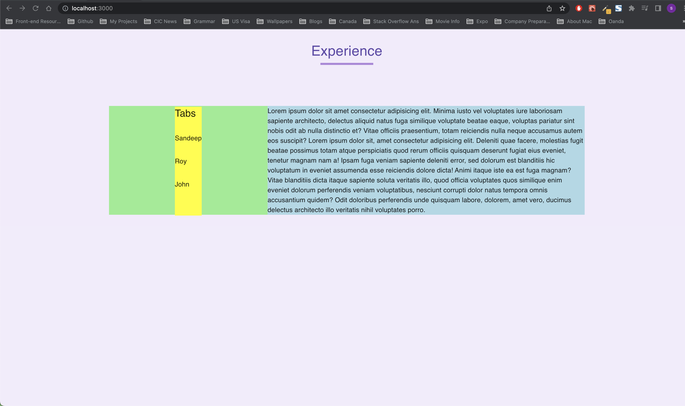
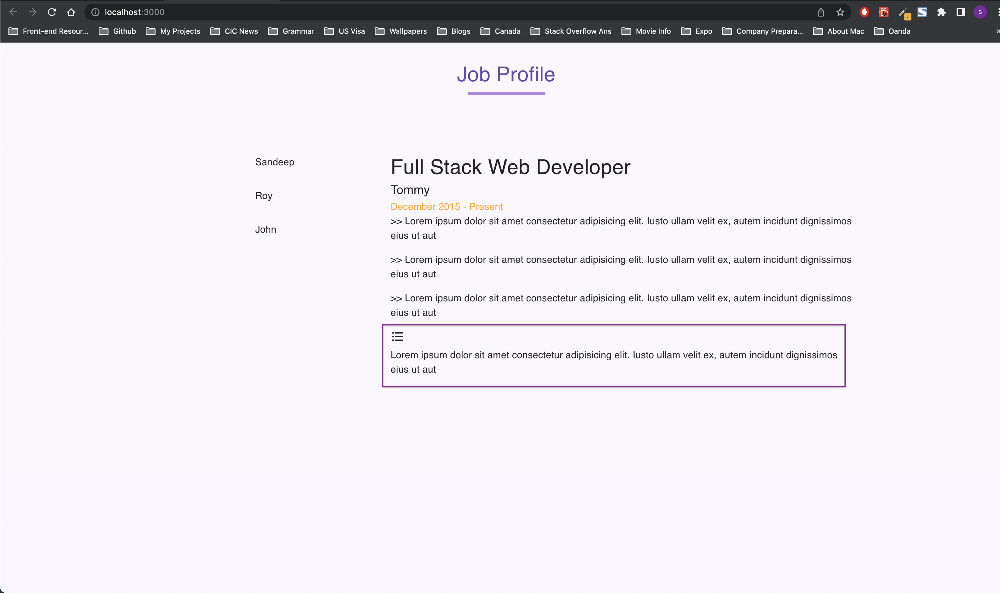
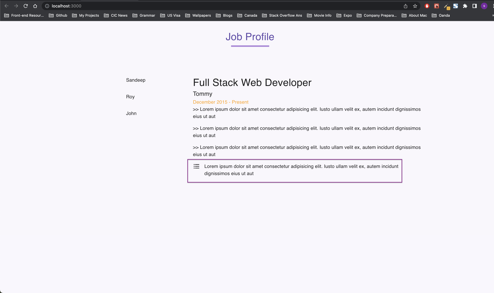

# Project details

- How to underline text using pseudo selector?
- How to align grid items (rowSpacing shouldn't affect the heading)
- How to use `<Grid item container direction = 'row'/>` to put it's child items in same row

### How to underline text using pseudo selector?

This can be done in two ways

- using css prop `text-decoration: underline;` [refer w3school](https://www.w3schools.com/cssref/pr_text_text-decoration.asp)
- using pseudo selector `::after`[Codepen example](https://codepen.io/elb96/pen/aXKXBx)

In this project we are underlining heading.

```js
    headingText: {
      '&:after': {
        content: '" "',
        width: '100%',
        height: '0.3rem',
        position: 'absolute', // to support that effect for image
        top: '4.8rem',
        margin: '0 auto',
        left: 0,
        right: 0,
        width: '8%',
        // background: 'green',
        background: (theme) => theme.palette.primary.main,
      },
    },
```

### How to align grid items (rowSpacing shouldn't affect the heading)

If you want some `<Grid item>` to be excluded from it's container's (it's parent `<Grid container>`'s) rowSpacing, then don't include that paricular item in `<Grid item>` (`<Typography variant="h5">Tabs</Typography>` in this example)

I wanted each item (Sandeep, Roy, John) to be some space apart, so I applied `rowSpacing` to container. This made first item Sandeep also to go down a little bit. Same happens if I add `Tabs` heading at the top of `Sandeep` and it goes down a little bit. I wanted `Tabs` to stay at the top and my rowSpacing in container should not affect the `Tabs`. So I can just put `Tabs` separately and not include in `<Grid item>` as shown below.

```js
<Grid
  container
  // justifyContent="space-around"
  rowSpacing={4}
  direction="column"
  alignItems="flex-start"
  sx={{
    background: 'yellow',
    height: '100%',
    width: 'fit-content',
    marginTop: '0.14rem',
  }}
>
  {/* Not wrapping this in grid item as this should stay on top */}
  {/* rowSpacing={4} will only apply for items enclosed in <Grid item /> below */}
  <Typography variant="h5">Tabs</Typography>
  {/* Tabs */}
  <Grid item>
    <Typography>Sandeep</Typography>
  </Grid>
  <Grid item>
    <Typography>Roy</Typography>
  </Grid>
  <Grid item>
    <Typography>John</Typography>
  </Grid>
</Grid>
```



Note that, if you remove margin top on container it will still work. I guess this is the best thing to do.


### How to use `<Grid item container/>` to put it's child items in same row

I had this problem where, if I need a `Grid` parent to be **both item and container** then I had a problem where
If I did `<Grid item container/>` then the child `<Grid item>` will come in columns even after adding `direction = row` like this
`<Grid item container direction = 'row'/>`. In this case, **if we need children of parent `<Grid item container/>` to be in same row then add sx and sm props to children `<Grid item/>`**

##### Without xs on `<Grid item>`



```js
<Grid item container>
  <Grid item>
    <FormatListBulletedIcon />
  </Grid>
  <Grid item>
    <Typography>
      Lorem ipsum dolor sit amet consectetur adipisicing elit. Iusto ullam velit
      ex, autem incidunt dignissimos eius ut aut
    </Typography>
  </Grid>
</Grid>
```

##### With xs on `<Grid item xs={0.6}>`



```js
<Grid item container>
  <Grid item xs={0.6}>
    <FormatListBulletedIcon />
  </Grid>
  <Grid item xs={11}>
    <Typography>
      Lorem ipsum dolor sit amet consectetur adipisicing elit. Iusto ullam velit
      ex, autem incidunt dignissimos eius ut aut
    </Typography>
  </Grid>
</Grid>
```
