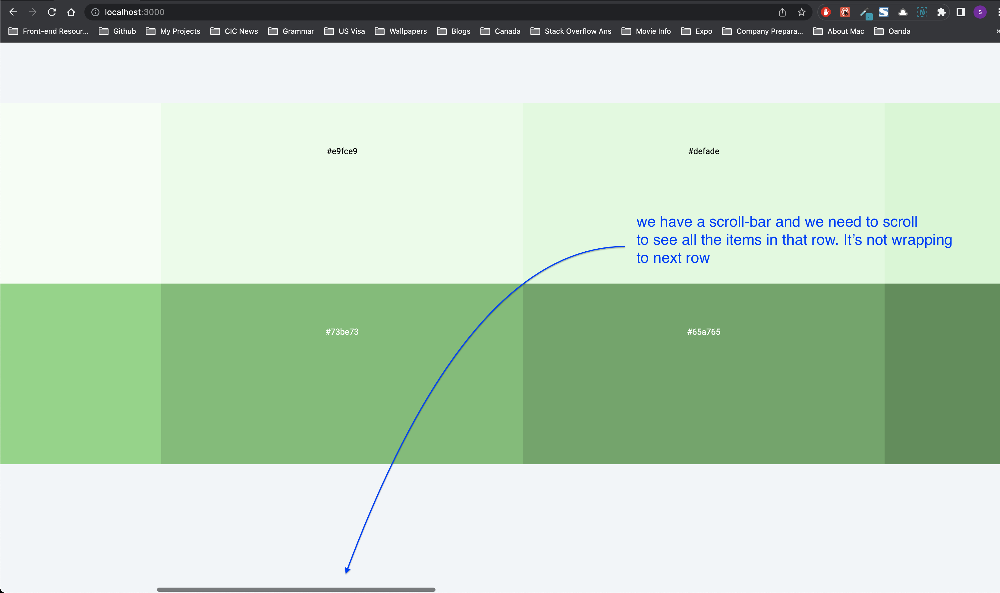
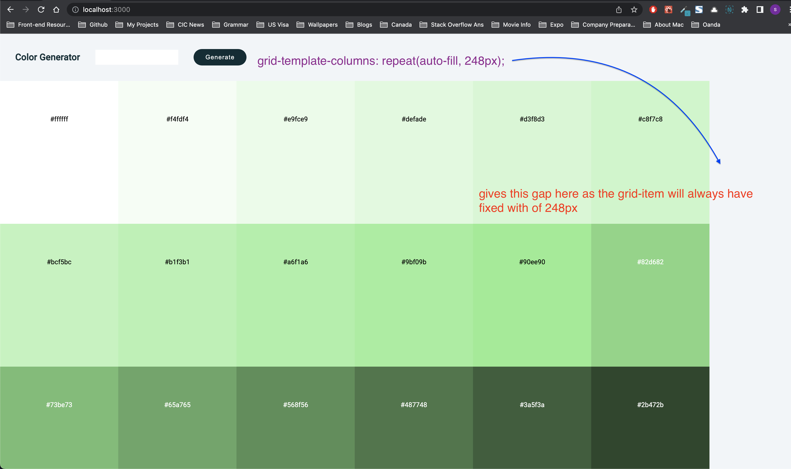
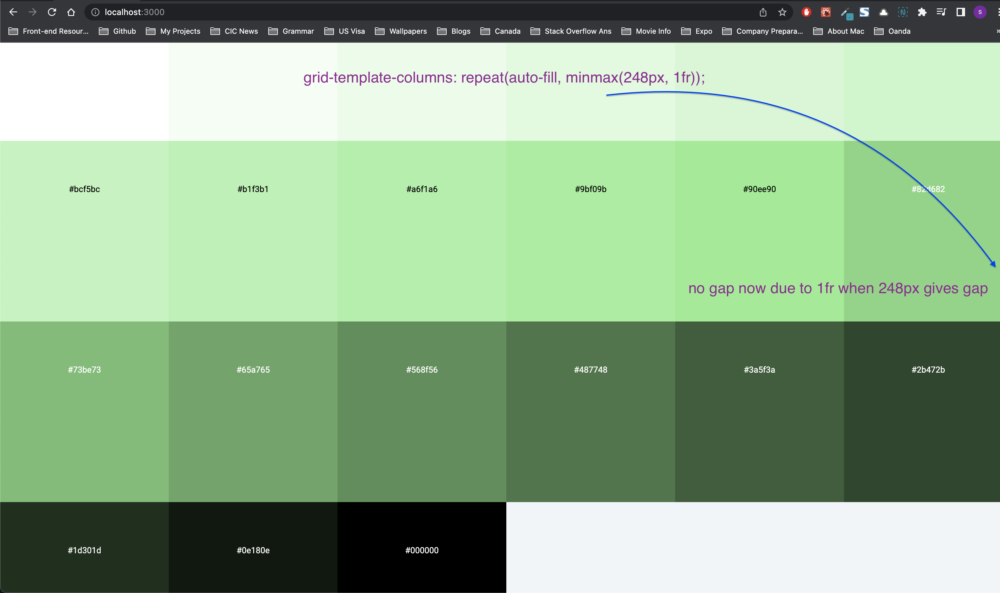

# Project details

- When to use type vs interface (**TODO**)
- How to get and use interface of some unknown object?
- Try, catch and finally (we haven't used finally in our app but just did some research on that so adding it here)
- Using type of interface (please refer question 1)
- CSS Grid container
- Setting global + local state for (copy to clipboard functionality)

### How to get and use interface of some unknown object?

We can cmd + click on Values and it shows the class. In that class, copy everything except the constructor and make that as the interfacee in your usage

```js
const handleSubmit = (e: React.FormEvent) => {
  e.preventDefault()
  let colors
  try {
    colors = new Values('sdafsd').all(10) // We can cmd+click on Values
    console.log('Got the color')
  } catch (error) {
    colors = new Values('red').all(10)
    console.log('Didnt get the color so showing red as default')
  }
  console.log(colors)
  setAllColors(colors)
}
```

---

### Try, catch and finally (we haven't used finally in our app but just did some research on that so adding it here)

[StackOverflow](https://stackoverflow.com/a/52845435/10824697)

## [Codepen](https://codepen.io/sandeepamarnath/pen/poKyNee?editors=0012)

---

### Using type of interface (please refer question 1)

**TODO** - Even though we can use both type and interface interchangably, we need to answer the differences between type and interface in 1st question which is a TODO for now. Once we cover Max's tutorial on TS, then we add answer to 1st question.

```js
// We can either define type or interface

// prop type
// type SingleColorProps = {
//   color:Colors
// }

// prop interface
interface SingleColorProps {
  color: Colors;
}

function SingleColor({ color }: SingleColorProps) {
  // return jsx
}
```

---

### CSS Grid container

I have commented flexbox here and made my `color-container` as CSS Grid. The challenge was to get each color (grid item) to be of certain with and height and many of such grid items should occupy the screen width.

I was able to do it by using
`grid-template-columns: repeat(auto-fill, minmax(238px, 1fr));`

[StackOverflow answer](https://stackoverflow.com/a/43664701/10824697)

This above line helps us in moving some items to next row (wrapping) when screen-size is reduced.

`minmax` takes whichever is maximum at any point. Each item takes minimum of 238px and when more space is available, instead of leaving the gap on screen, `1fr` will fill that gap so we won't have any gaps on screen.

```css
.color-container {
  /* Commenting out display : flex as the last row will align to center as well  */

  /* CSS FLEXBOX */

  /* display: flex;
  flex-wrap: wrap;
  margin: 0 auto; */

  /* CSS GRID */
  display: grid;
  grid-template-columns: repeat(auto-fill, minmax(238px, 1fr));
  grid-auto-rows: 300px;
}
```

On the other hand, if you do

`grid-template-columns: repeat(4, 100px);`, then that means, we are saying repeat `100px` 4 times (so we get 4 columns) each column width being 100px.

If we don't know how many number of times we need to repeat (we don't know how many columns must be present), but we know each column to be of certain width (eg, 238px) then we can use auto-fill

`grid-template-columns: repeat(auto-fill, minmax(238px, 1fr));`

The other thing auto-fill does is, it wraps the grid-items to next rows automatically. Let's say if we manually define something like this. You can see that if we manually say how many columns it should take then it won't wrap to next row. We instead get a scroll bar horizontally

`grid-template-columns: repeat(10, 600px);`



With `grid-template-columns: repeat(auto-fill, minmax(248px, 1fr));` we get



With `grid-template-columns: repeat(auto-fill, minmax(238px, 1fr));` we get 1fr to fill the gap maintaining 238px minumum and when there's a gap like above image then we get 1fr which will fill the gap, so we get below like this which we need



---

### Setting global + local state for (copy to clipboard functionality)

We had our app running with this feature

- User clicks a color and it gets copied to clipboard giving this message `Copied to Clipboard`
- This message stays for 3 seconds, and when user clicks multiple colors at the same time, the user will see `Copied to Clipboard` message on multiple colors which is not a good user experience even though only latest color is copied

So what are we trying to achieve?

- When user clicks on multiple colors, we need

  - Only latest color to be copied (which is already the case)
  - Also, we need only the message `'Copied to Clipboard'` to be displayed on the latest and should stay for 3 seconds. Before 3 seconds, if other color is clicked then this message should disappear from current color and must be displayed in latest clicked color and should stay there for 3 seconds.

- We are achieving this with `copiableIndex` state

```js
/* App.tsx */

const [copiableIndex, setCopiableIndex] = (useState < number) | (null > null)

{
  allColors.map((color, index) => {
    return (
      <SingleColor
        color={color}
        key={index}
        index={index}
        setCopiableIndex={setCopiableIndex}
        copiable={index === copiableIndex ? true : false}
      />
    )
  })
}

/* SingleColor.tsx */

// Here we are also using the local state setCopied to keep the message for 3 seconds

// So with the help of both local and global state (local -> copied state and global -> copiableIndex) we are able to achieve this

const [copied, setCopied] = useState(false)

useEffect(() => {
  if (copied) {
    const timeout = setTimeout(() => {
      setCopied(false)
    }, 3000)
    return () => clearTimeout(timeout)
  }
}, [copied])

// JSX
return (
  // local + global state
  // copiable && copied && 'Copied to Clipboard'
  // ...
  <p style={{ color: color.type === 'shade' ? 'white' : 'black' }}>
    {copiable && copied && 'Copied to Clipboard'}
  </p>
  // ...
)
```
